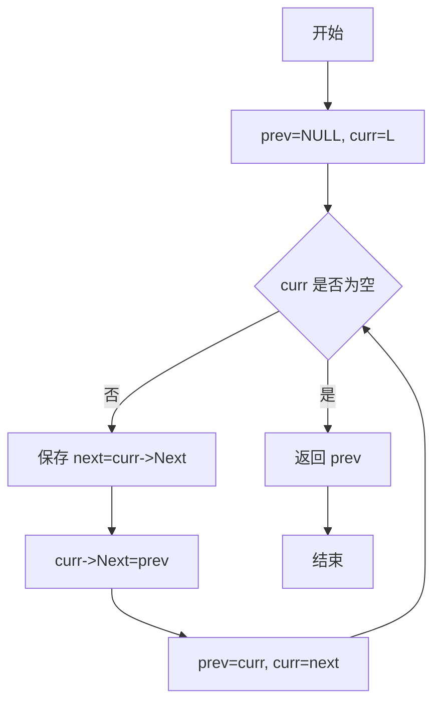
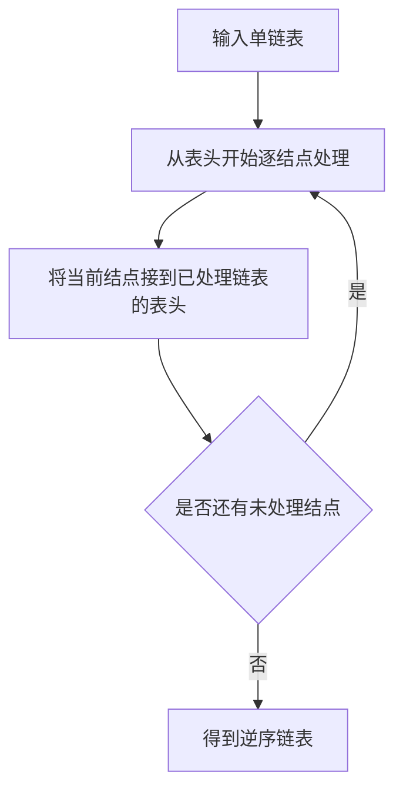

## 6-1 单链表逆转

- **分值：** 20分

## 题目描述

本题要求实现一个函数，将给定的单链表逆转。

## 函数接口定义
```perl
# Perl 用哈希/数组引用模拟题目中的结点和容器类型。
use strict;
use warnings;

# reverse 与 Perl 内置函数同名，调用时使用 &reverse($head)。

sub new_node {
    my ( $data, $next ) = @_;
    return { data => $data, next => $next };
}
sub reverse;
```

其中`List`结构定义如下：

```perl
# List 是链表头结点的哈希引用；空链表用 undef 表示。
# 结点字段为 data 和 next。
```

`L`是给定单链表，函数`Reverse`要返回被逆转后的链表。

## 裁判测试程序样例
```perl
# 裁判样例：输入格式与原题一致，链表结点使用哈希引用表示。
use strict;
use warnings;

sub read_list {
    my ( $n, @values ) = @_;
    my ( $head, $tail );
    for my $value (@values[ 0 .. $n - 1 ]) {
        my $node = new_node( $value, undef );
        if ($head) { $tail->{next} = $node }
        else       { $head = $node }
        $tail = $node;
    }
    return $head;
}

sub print_list {
    my ($head) = @_;
    my @values;
    while ($head) {
        push @values, $head->{data};
        $head = $head->{next};
    }
    print join( ' ', @values ), "\n";
}

sub main {
    my @input = split /\s+/, join '', <STDIN>;
    return unless @input;
    my $n = shift @input;
    my $old_head = read_list( $n, @input );
    my $new_head = &reverse($old_head);
    print_list($old_head);
    print_list($new_head);
}
main();
```

## 输入样例
```text
5
1 3 4 5 2
```

## 输出样例
```text
1
2 5 4 3 1
```

## 函数部分

```perl
# 三指针依次保存后继、反转指向并向后移动，原地完成逆转。
sub reverse {
    my ($head) = @_;
    my ( $previous, $current ) = ( undef, $head );
    while ($current) {
        my $next = $current->{next};
        $current->{next} = $previous;
        ( $previous, $current ) = ( $current, $next );
    }
    return $previous;
}
```

## 解题思路

使用三个指针从头到尾遍历链表：`prev` 指向已经逆转的部分，`curr` 指向当前结点，`next` 暂存当前结点的后继。每次先保存后继，再把当前结点指向 `prev`，随后三个指针依次向后移动。遍历结束时，`prev` 就是逆转后的表头。时间复杂度为 `O(n)`，空间复杂度为 `O(1)`。

## 代码流程说明

1. 初始化 `prev = NULL`，`curr = L`。
2. 当 `curr` 不为空时，保存 `curr->Next`。
3. 将 `curr->Next` 改为 `prev`，完成当前指针的逆转。
4. 令 `prev = curr`、`curr = next`，继续处理下一个结点。
5. `curr` 为空时返回 `prev`。

## 代码流程图



## 解题流程图


