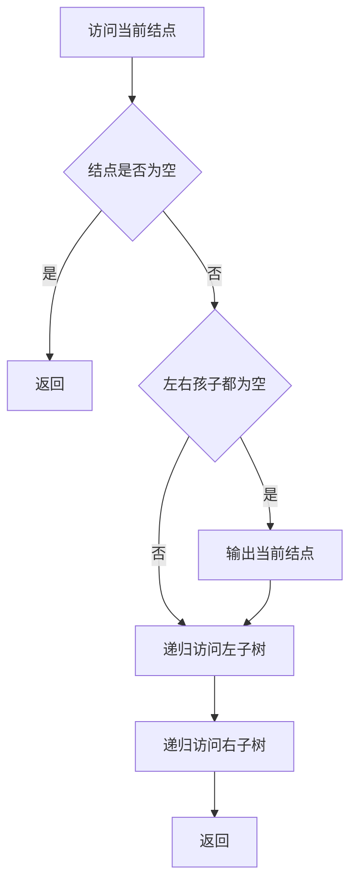
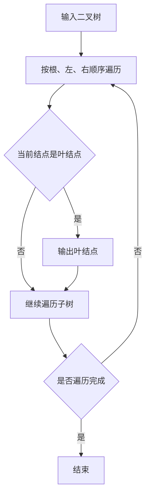

## 6-11 先序输出叶结点

- **分值：** 15分

## 题目描述

本题要求按照先序遍历的顺序输出给定二叉树的叶结点。

## 函数接口定义
```perl
# Perl 用哈希/数组引用模拟题目中的结点和容器类型。
use strict;
use warnings;

sub new_node {
    my ( $data, $left, $right ) = @_;
    return { data => $data, left => $left, right => $right };
}
sub preorder_print_leaves;
```

其中`BinTree`结构定义如下：

```perl
# BinTree 是二叉树根结点的哈希引用；字段为 data、left 和 right。
```

函数`PreorderPrintLeaves`应按照先序遍历的顺序输出给定二叉树`BT`的叶结点，格式为一个空格跟着一个字符。

## 裁判测试程序样例
```perl
# 裁判样例：用与图片相同的二叉树调用叶结点遍历函数。
use strict;
use warnings;

sub main {
    my $tree = new_node(
        'A',
        new_node( 'B', new_node('D'), new_node( 'F', new_node('E'), undef ) ),
        new_node( 'C', new_node( 'G', undef, new_node('H') ), new_node('I') )
    );
    print 'Leaf nodes are:';
    preorder_print_leaves($tree);
    print "\n";
}
main();
```

## 输出样例


```text
Leaf nodes are: D E H I
```

## 函数部分

```perl
# 先序顺序是根、左、右；只有左右孩子都为空时才输出当前结点。
sub preorder_print_leaves {
    my ($root) = @_;
    return unless $root;
    print " $root->{data}" if !$root->{left} && !$root->{right};
    preorder_print_leaves( $root->{left} );
    preorder_print_leaves( $root->{right} );
}
```

## 解题思路

按先序顺序访问二叉树，即“根、左、右”。访问当前结点时，若其左右孩子都为空，则它是叶结点，输出其数据；否则继续递归访问左右子树。每个结点只访问一次，时间复杂度为 `O(n)`，递归栈空间复杂度为 `O(h)`。

## 代码流程说明

1. 当前指针为空时返回。
2. 判断当前结点是否同时没有左右孩子，是则输出一个前导空格和结点数据。
3. 递归处理左子树，再递归处理右子树，从而保证叶结点输出符合先序顺序。

## 代码流程图



## 解题流程图


