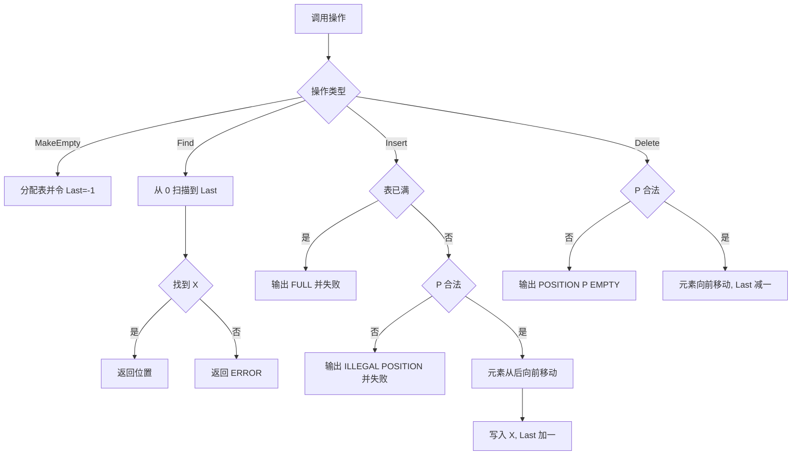
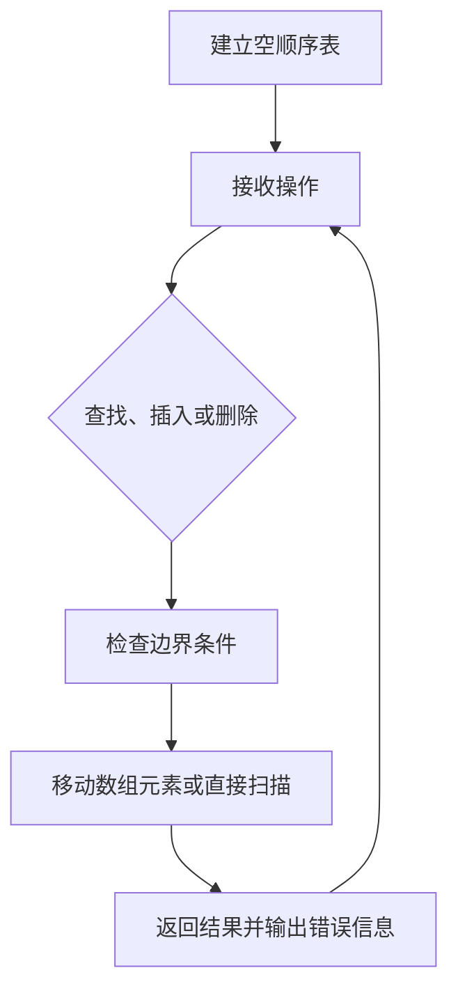

## 6-2 顺序表操作集

- **分值：** 20分

## 题目描述

本题要求实现顺序表的操作集。

## 函数接口定义
```perl
# Perl 用哈希/数组引用模拟题目中的结点和容器类型。
use strict;
use warnings;

# delete 与 Perl 内置关键字同名，调用时使用 &delete($table, $position)。
sub make_empty;
sub find;
sub insert;
sub delete;
```

其中`List`结构定义如下：

```perl
# List 是包含 data 数组和 max_size 字段的哈希引用，位置从 0 开始。
```

各个操作函数的定义为：

`List MakeEmpty()`：创建并返回一个空的线性表；

`Position Find( List L, ElementType X )`：返回线性表中X的位置。若找不到则返回ERROR；

`bool Insert( List L, ElementType X, Position P )`：将X插入在位置P并返回true。若空间已满，则打印“FULL”并返回false；否则，如果参数P指向非法位置，则打印“ILLEGAL POSITION”并返回false；

`bool Delete( List L, Position P )`：将位置P的元素删除并返回true。若参数P指向非法位置，则打印“POSITION P EMPTY”（其中P是参数值）并返回false。

## 裁判测试程序样例
```perl
# 裁判样例：按原题格式分三段读取插入、查找和删除操作。
use strict;
use warnings;

sub main {
    my @input = split /\s+/, join '', <STDIN>;
    return unless @input;
    my $at = 0;
    my $list = make_empty();
    my $n = $input[ $at++ ];
    for ( 1 .. $n ) {
        my $value = $input[ $at++ ];
        print " Insertion Error: $value is not in.\n"
          unless insert( $list, $value, 0 );
    }
    $n = $input[ $at++ ];
    for ( 1 .. $n ) {
        my $value = $input[ $at++ ];
        my $position = find( $list, $value );
        if ( $position == -1 ) {
            print "Finding Error: $value is not in.\n";
        }
        else { print "$value is at position $position.\n" }
    }
    $n = $input[ $at++ ];
    for ( 1 .. $n ) {
        my $position = $input[ $at++ ];
        print " Deletion Error.\n" unless &delete( $list, $position );
        print " Insertion Error: 0 is not in.\n"
          unless insert( $list, 0, $position );
    }
}
main();
```

## 输入样例
```text
6
1 2 3 4 5 6
3
6 5 1
2
-1 6
```

## 输出样例
```text
FULL Insertion Error: 6 is not in.
Finding Error: 6 is not in.
5 is at position 0.
1 is at position 4.
POSITION -1 EMPTY Deletion Error.
FULL Insertion Error: 0 is not in.
POSITION 6 EMPTY Deletion Error.
FULL Insertion Error: 0 is not in.
```

## 函数部分

```perl
# 插入先检查容量和位置，再用 splice 移动元素；删除同样用 splice 移除元素。
sub make_empty { return { data => [], max_size => 5 } }

sub find {
    my ( $table, $value ) = @_;
    for my $i ( 0 .. $#{ $table->{data} } ) {
        return $i if $table->{data}[$i] == $value;
    }
    return -1;
}

sub insert {
    my ( $table, $value, $position ) = @_;
    if ( @{ $table->{data} } >= $table->{max_size} ) { print 'FULL'; return 0 }
    if ( $position < 0 || $position > @{ $table->{data} } ) {
        print 'ILLEGAL POSITION';
        return 0;
    }
    splice @{ $table->{data} }, $position, 0, $value;
    return 1;
}

sub delete {
    my ( $table, $position ) = @_;
    if ( $position < 0 || $position >= @{ $table->{data} } ) {
        print "POSITION $position EMPTY";
        return 0;
    }
    splice @{ $table->{data} }, $position, 1;
    return 1;
}
```

## 解题思路

顺序表用 `Last` 记录最后一个有效元素的下标，空表时令 `Last = -1`。查找从下标 0 线性扫描；插入时先判断容量和位置合法性，再从后向前移动元素；删除时从被删位置开始，将后续元素依次前移。插入和删除都必须按照对应方向移动，避免覆盖尚未处理的数据。

## 代码流程说明

1. `MakeEmpty` 分配表结构并把 `Last` 初始化为 `-1`。
2. `Find` 遍历 `[0, Last]`，找到 `X` 返回下标，否则返回 `ERROR`。
3. `Insert` 先判断是否满表，再判断 `P` 是否在 `[0, Last + 1]`；从 `Last` 到 `P` 逆序移动，写入 `X` 并更新 `Last`。
4. `Delete` 判断 `P` 是否在 `[0, Last]`；将 `P` 后面的元素前移，最后减小 `Last`。

## 代码流程图



## 解题流程图


