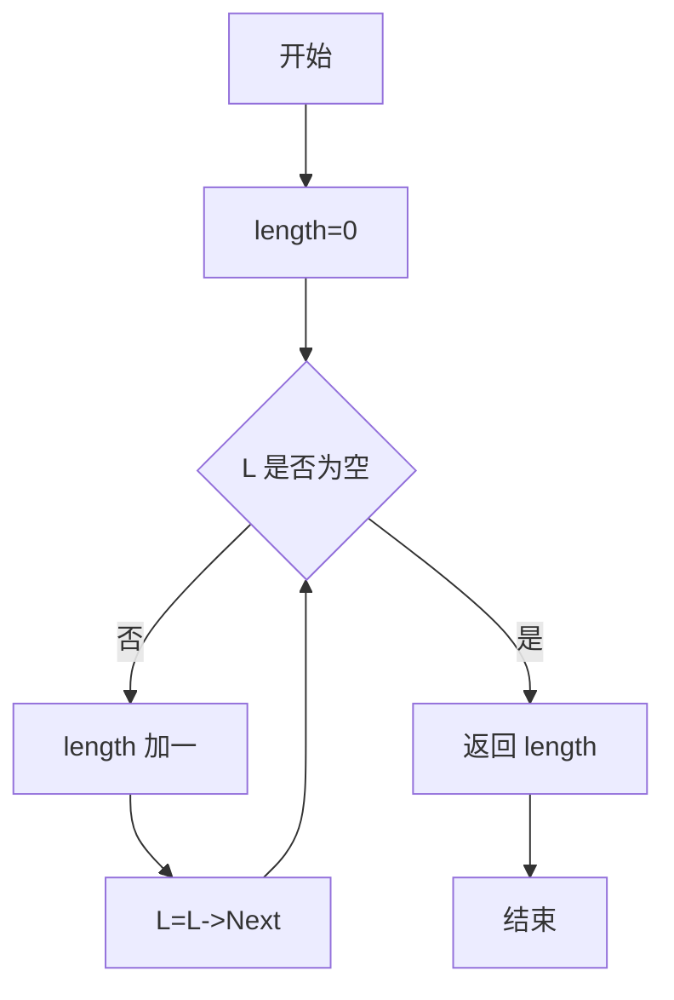
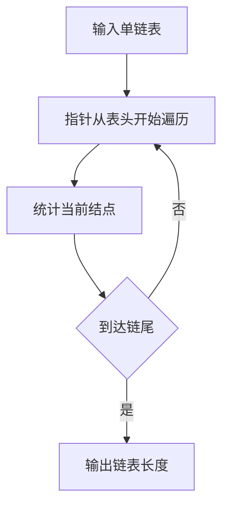

## 6-3 求链式表的表长

- **分值：** 10分

## 题目描述

本题要求实现一个函数，求链式表的表长。

## 函数接口定义
```python
from dataclasses import dataclass


@dataclass
class Node:
    data: int
    next: "Node | None" = None


def length(head: Node | None) -> int: ...
```

其中`List`结构定义如下：

```python
from dataclasses import dataclass


@dataclass
class Node:
    data: int
    next: "Node | None" = None


def length(head: Node | None) -> int: ...
```

`L`是给定单链表，函数`Length`要返回链式表的长度。

## 裁判测试程序样例
```python
def main():
    # 裁判端构造链表后调用 length(head)。
    pass


if __name__ == "__main__":
    main()
```

## 输入样例
```text
1 3 4 5 2 -1
```

## 输出样例
```text
5
```

## 函数部分

```python
def length(head: Node | None) -> int:
    """沿 next 指针走到 None，计数器就是链表长度。"""
    count = 0
    while head is not None:
        count += 1
        head = head.next
    return count
```

## 解题思路

链表没有连续的下标，长度只能通过遍历结点统计。设置计数器 `length`，从表头开始，每访问一个结点就加 1，直到指针为空。空链表不会进入循环，因此返回 0。

## 代码流程说明

1. 将计数器初始化为 0。
2. 判断当前指针是否为空；不为空则计数并移动到下一个结点。
3. 当前指针为空时，返回计数器。

## 代码流程图



## 解题流程图


