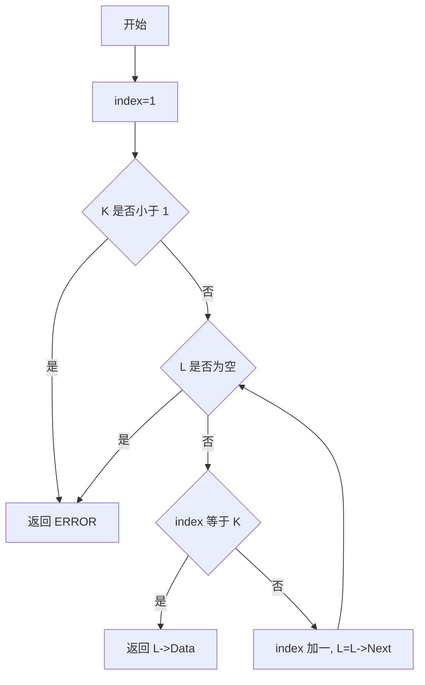
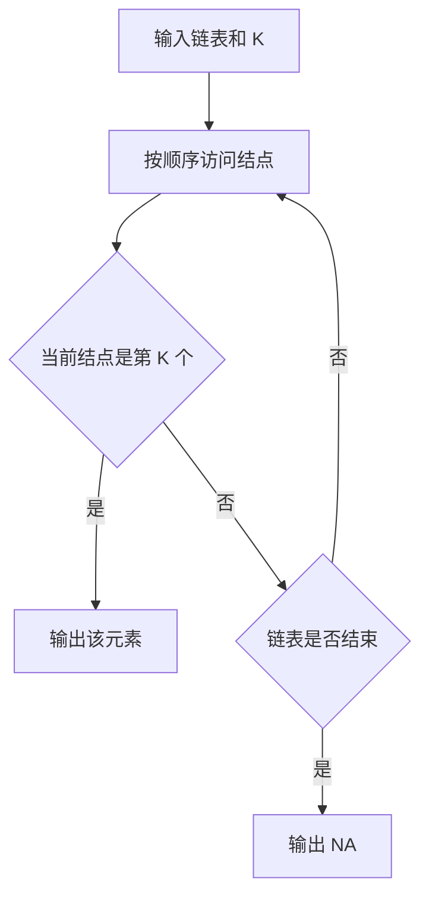

## 6-4 链式表的按序号查找

- **分值：** 10分

## 题目描述

本题要求实现一个函数，找到并返回链式表的第K个元素。

## 函数接口定义
```python
from dataclasses import dataclass


@dataclass
class Node:
    data: int
    next: "Node | None" = None


def find_kth(head: Node | None, k: int) -> int | None: ...
```

其中`List`结构定义如下：

```python
from dataclasses import dataclass


@dataclass
class Node:
    data: int
    next: "Node | None" = None


def find_kth(head: Node | None, k: int) -> int | None: ...
```

`L`是给定单链表，函数`FindKth`要返回链式表的第`K`个元素。如果该元素不存在，则返回`ERROR`。

## 裁判测试程序样例
```python
def main():
    # 裁判端构造链表后调用 find_kth(head, k)，None 对应 ERROR。
    pass


if __name__ == "__main__":
    main()
```

## 输入样例
```text
1 3 4 5 2 -1
6
3 6 1 5 4 2
```

## 输出样例
```text
4 NA 1 2 5 3
```

## 函数部分

```python
def find_kth(head: Node | None, k: int) -> int | None:
    """题目位置从 1 开始，越过表尾则返回 None。"""
    if k < 1:
        return None
    position = 1
    while head is not None:
        if position == k:
            return head.data
        position += 1
        head = head.next
    return None
```

## 解题思路

题目中的结点序号从 1 开始。使用指针遍历链表，同时用 `index` 记录当前结点序号；当 `index == K` 时返回该结点的数据。如果指针先到达空值，说明链表长度不足 `K`，返回 `ERROR`。

## 代码流程说明

1. 将当前序号设为 1，并检查 `K` 是否为合法序号。
2. 遍历链表，比较当前序号与 `K`。
3. 相等时返回当前结点数据；否则序号加一并移动指针。
4. 遍历结束仍未命中时返回 `ERROR`。

## 代码流程图



## 解题流程图


