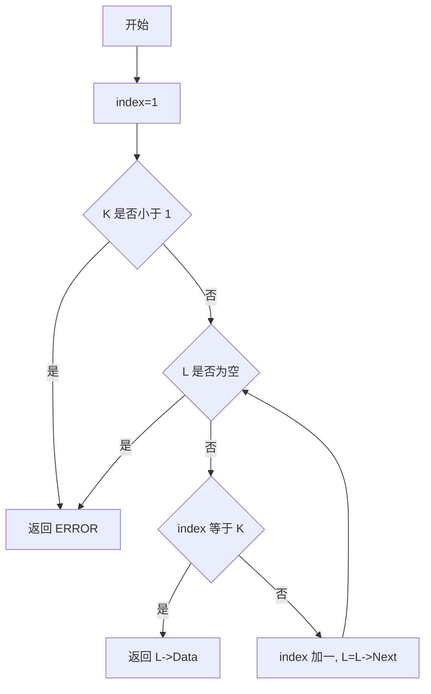
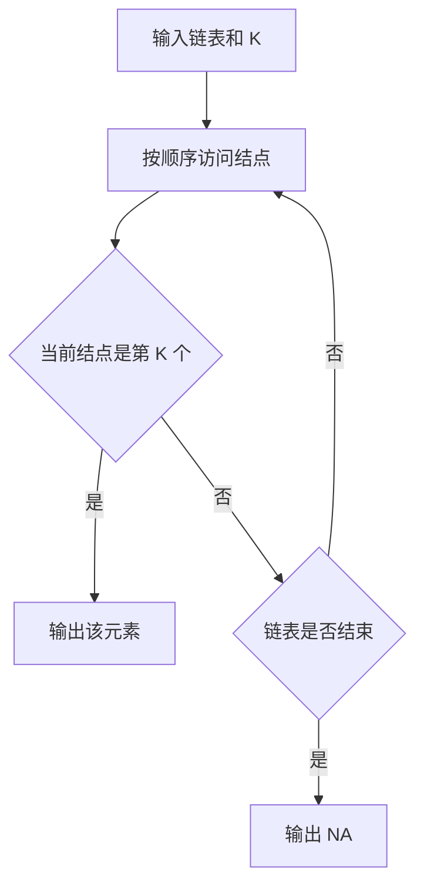

## 6-4 链式表的按序号查找

- **分值：** 10分

## 题目描述

本题要求实现一个函数，找到并返回链式表的第K个元素。

## 函数接口定义
```perl
# Perl 用哈希/数组引用模拟题目中的结点和容器类型。
use strict;
use warnings;

sub new_node {
    my ( $data, $next ) = @_;
    return { data => $data, next => $next };
}
sub find_kth;
```

其中`List`结构定义如下：

```perl
# List 是链表头结点的哈希引用；结点字段为 data 和 next。
```

`L`是给定单链表，函数`FindKth`要返回链式表的第`K`个元素。如果该元素不存在，则返回`ERROR`。

## 裁判测试程序样例
```perl
# 裁判样例：先读取以 -1 结尾的链表，再读取 K 的查询个数和各个 K。
use strict;
use warnings;

sub read_list {
    my ( $head, $tail );
    while (<STDIN>) {
        for my $value ( split ) {
            last if $value == -1;
            my $node = new_node( $value, undef );
            if ($head) { $tail->{next} = $node }
            else       { $head = $node }
            $tail = $node;
        }
    }
    return $head;
}

sub main {
    # 为便于按阶段读取，这里一次读取全部 token。
    my @input = split /\s+/, join '', <STDIN>;
    return unless @input;
    my $at = 0;
    my ( $head, $tail );
    while ( $input[$at] != -1 ) {
        my $node = new_node( $input[ $at++ ], undef );
        if ($head) { $tail->{next} = $node }
        else       { $head = $node }
        $tail = $node;
    }
    ++$at;
    my $n = $input[ $at++ ];
    for ( 1 .. $n ) {
        my $value = find_kth( $head, $input[ $at++ ] );
        print defined($value) ? "$value " : 'NA ';
    }
}
main();
```

## 输入样例
```text
1 3 4 5 2 -1
6
3 6 1 5 4 2
```

## 输出样例
```text
4 NA 1 2 5 3
```

## 函数部分

```perl
# 从表头按 1-based 位置计数，命中 k 时返回 data，越过表尾返回 undef。
sub find_kth {
    my ( $head, $k ) = @_;
    return undef if $k < 1;
    my $position = 1;
    while ($head) {
        return $head->{data} if $position == $k;
        ++$position;
        $head = $head->{next};
    }
    return undef;
}
```

## 解题思路

题目中的结点序号从 1 开始。使用指针遍历链表，同时用 `index` 记录当前结点序号；当 `index == K` 时返回该结点的数据。如果指针先到达空值，说明链表长度不足 `K`，返回 `ERROR`。

## 代码流程说明

1. 将当前序号设为 1，并检查 `K` 是否为合法序号。
2. 遍历链表，比较当前序号与 `K`。
3. 相等时返回当前结点数据；否则序号加一并移动指针。
4. 遍历结束仍未命中时返回 `ERROR`。

## 代码流程图



## 解题流程图


