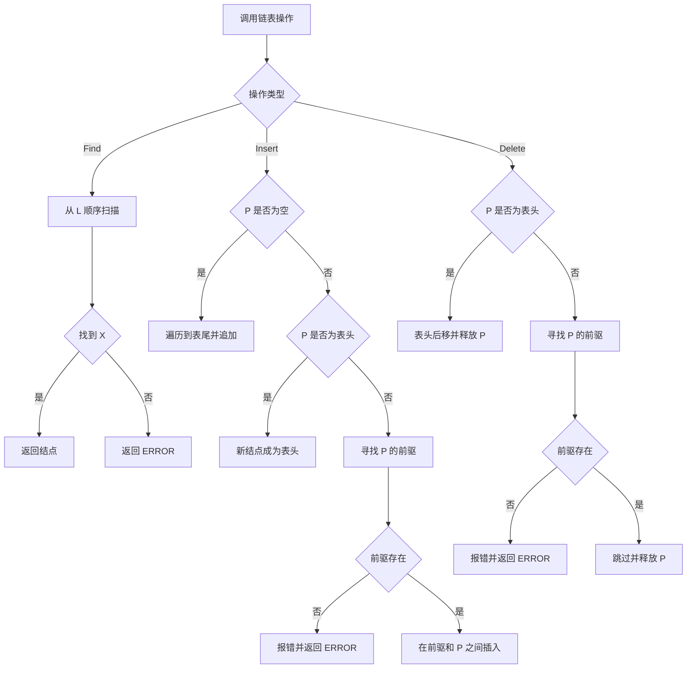
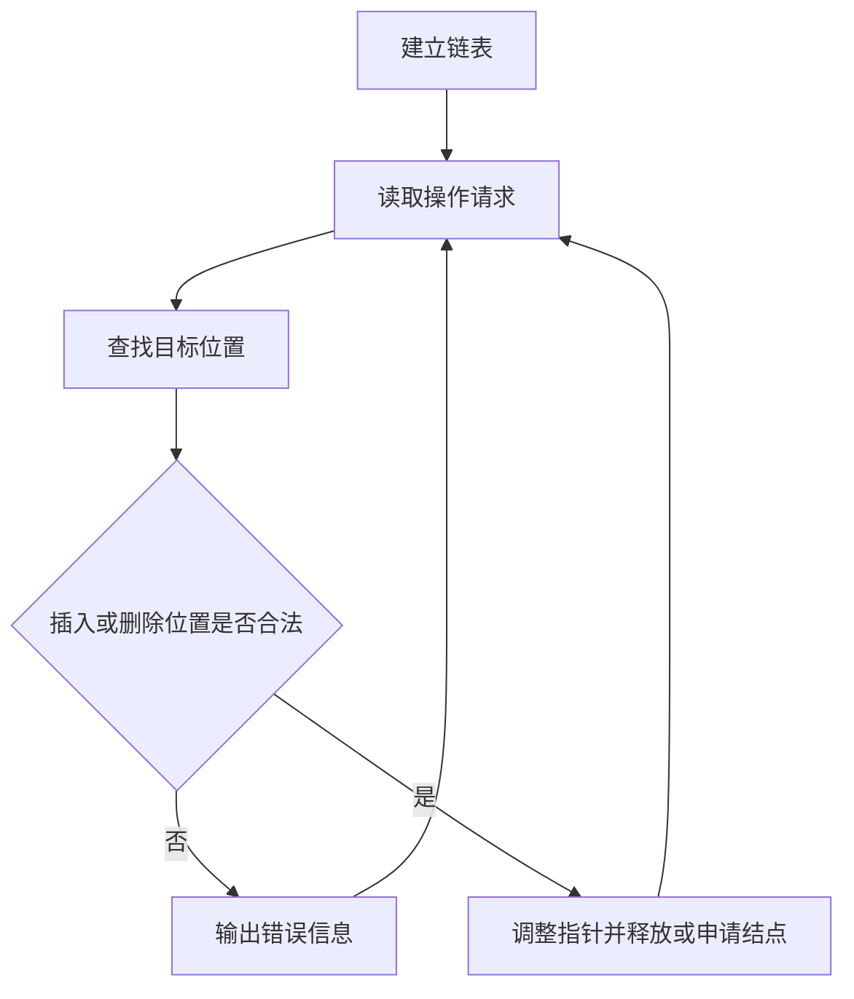

## 6-5 链式表操作集

- **分值：** 20分

## 题目描述

本题要求实现链式表的操作集。

## 函数接口定义
```perl
# Perl 用哈希/数组引用模拟题目中的结点和容器类型。
use strict;
use warnings;

# delete 与 Perl 内置关键字同名，调用时使用 &delete($head, $position)。

sub new_node {
    my ( $data, $next ) = @_;
    return { data => $data, next => $next };
}
sub find;
sub insert;
sub delete;
```

其中`List`结构定义如下：

```perl
# List 和 Position 都使用链表结点哈希引用；空指针用 undef 表示。
```

各个操作函数的定义为：

`Position Find( List L, ElementType X )`：返回线性表中首次出现X的位置。若找不到则返回ERROR；

`List Insert( List L, ElementType X, Position P )`：将X插入在位置P指向的结点之前，返回链表的表头。如果参数P指向非法位置，则打印“Wrong Position for Insertion”，返回ERROR；

`List Delete( List L, Position P )`：将位置P的元素删除并返回链表的表头。若参数P指向非法位置，则打印“Wrong Position for Deletion”并返回ERROR。

## 裁判测试程序样例
```perl
# 裁判样例：按原题格式执行查找、删除和插入测试。
use strict;
use warnings;

sub main {
    my @input = split /\s+/, join '', <STDIN>;
    return unless @input;
    my $at = 0;
    my ( $head, $n, $value, $position );
    $n = $input[ $at++ ];
    for ( 1 .. $n ) {
        $value = $input[ $at++ ];
        $head = insert( $head, $value, $head );
        print "Wrong Answer\n" unless $head;
    }
    $n = $input[ $at++ ];
    for ( 1 .. $n ) {
        $value = $input[ $at++ ];
        $position = find( $head, $value );
        if ( !$position ) {
            print "Finding Error: $value is not in.\n";
        }
        else {
            $head = &delete( $head, $position );
            print "$value is found and deleted.\n";
            print "Wrong Answer or Empty List.\n" unless $head;
        }
    }
    $head = insert( $head, $value, undef );
    if ($head) { print "$value is inserted as the last element.\n" }
    else       { print "Wrong Answer\n" }

    # 用一个不属于链表的结点测试非法位置。
    my $fake = new_node( 0, undef );
    my $tmp = insert( $head, $value, $fake );
    print "Wrong Answer\n" if $tmp;
    $tmp = &delete( $head, $fake );
    print "Wrong Answer\n" if $tmp;
    for ( my $node = $head; $node; $node = $node->{next} ) {
        print "$node->{data} ";
    }
}
main();
```

## 输入样例
```text
6
12 2 4 87 10 2
4
2 12 87 5
```

## 输出样例
```text
2 is found and deleted.
12 is found and deleted.
87 is found and deleted.
Finding Error: 5 is not in.
5 is inserted as the last element.
Wrong Position for Insertion
Wrong Position for Deletion
10 4 2 5
```

## 函数部分

```perl
# Find 顺序扫描；Insert 验证位置后接入新结点；Delete 找前驱后跳过目标。
sub find {
    my ( $head, $value ) = @_;
    while ($head) {
        return $head if $head->{data} == $value;
        $head = $head->{next};
    }
    return undef;
}

sub insert {
    my ( $head, $value, $position ) = @_;
    if ( !defined $position ) {
        my $node = new_node( $value, undef );
        return $node unless $head;
        my $tail = $head;
        $tail = $tail->{next} while $tail->{next};
        $tail->{next} = $node;
        return $head;
    }
    if ( !$head ) {
        print "Wrong Position for Insertion\n";
        return undef;
    }
    my $node = new_node( $value, undef );
    if ( $position == $head ) {
        $node->{next} = $head;
        return $node;
    }
    my $previous = $head;
    $previous = $previous->{next}
      while $previous->{next}
      && $previous->{next} != $position;
    if ( defined($position)
        && ( !$previous->{next} || $previous->{next} != $position ) )
    {
        print "Wrong Position for Insertion\n";
        return undef;
    }
    $node->{next}     = $position;
    $previous->{next} = $node;
    return $head;
}

sub delete {
    my ( $head, $position ) = @_;
    if ( !$head || !defined $position ) {
        print "Wrong Position for Deletion\n";
        return undef;
    }
    return $head->{next} if $head == $position;
    my $previous = $head;
    $previous = $previous->{next}
      while $previous->{next} && $previous->{next} != $position;
    if ( !$previous->{next} || $previous->{next} != $position ) {
        print "Wrong Position for Deletion\n";
        return undef;
    }
    $previous->{next} = $position->{next};
    return $head;
}
```

## 解题思路

链表不带头结点，因此插入或删除表头时需要单独更新表头指针。`Find` 直接顺序扫描；`Insert` 根据 `P` 的取值分别处理表头、表尾和中间位置，并先确认 `P` 确实属于当前链表；`Delete` 通过寻找前驱结点把目标结点跳过后释放。非法位置统一输出题目规定的信息并返回 `ERROR`。

## 代码流程说明

1. `Find` 从 `L` 开始扫描，首次匹配即返回结点指针。
2. `Insert`：`P == L` 时插入表头，`P == NULL` 时遍历到表尾，其他情况寻找 `P` 的前驱后插入。
3. `Delete`：`P == L` 时删除表头，其他情况寻找前驱并调整链接；找不到前驱则报错。
4. 成功修改链表后返回新的或原来的表头。

## 代码流程图



## 解题流程图


