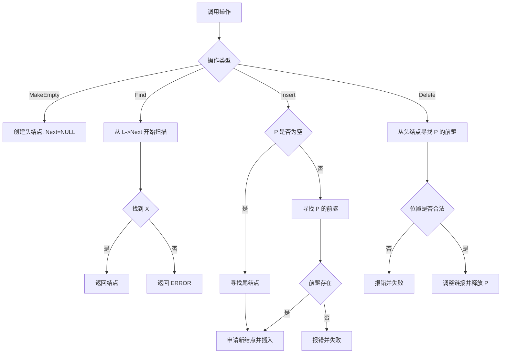
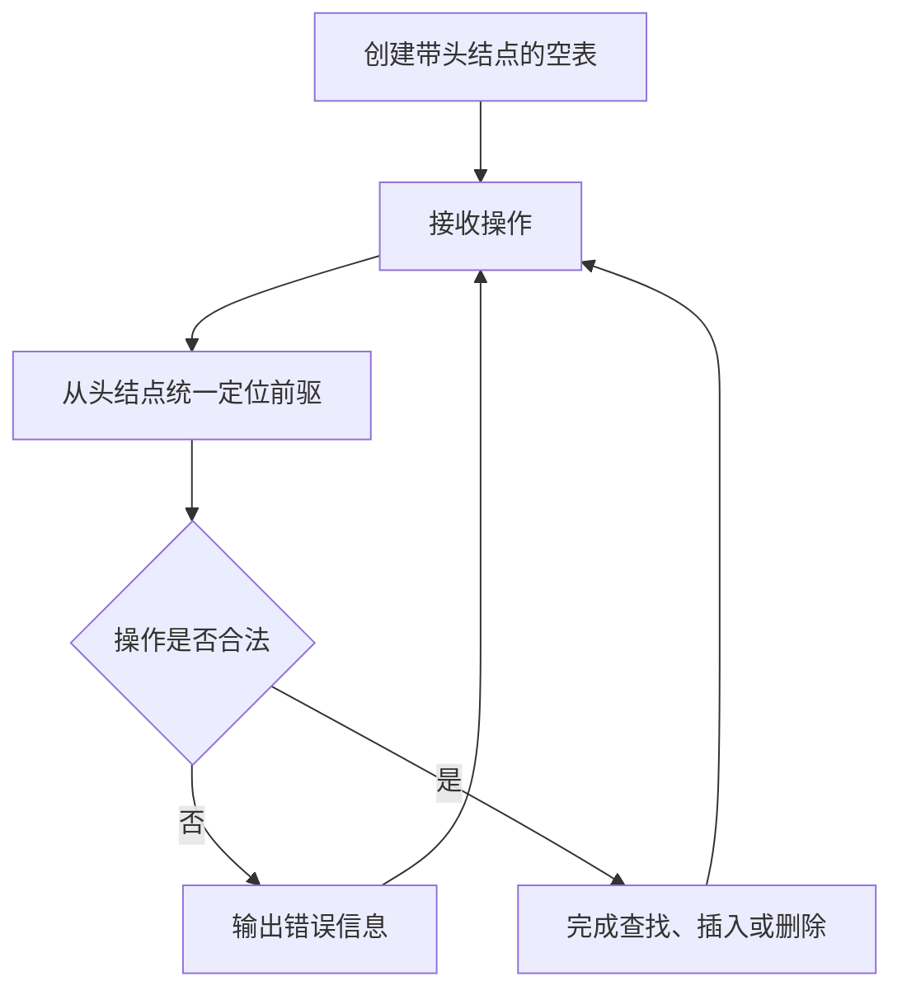

## 6-6 带头结点的链式表操作集

- **分值：** 20分

## 题目描述

本题要求实现带头结点的链式表操作集。

## 函数接口定义
```perl
# Perl 用哈希/数组引用模拟题目中的结点和容器类型。
use strict;
use warnings;

sub new_node {
    my ( $data, $next ) = @_;
    return { data => $data, next => $next };
}
sub make_empty;
sub find;
sub insert;
sub delete;
```

其中`List`结构定义如下：

```perl
# List 和 Position 都使用链表结点哈希引用；头结点本身不存有效数据。
```

各个操作函数的定义为：

`List MakeEmpty()`：创建并返回一个空的线性表；

`Position Find( List L, ElementType X )`：返回线性表中X的位置。若找不到则返回ERROR；

`bool Insert( List L, ElementType X, Position P )`：将X插入在位置P指向的结点之前，返回true。如果参数P指向非法位置，则打印“Wrong Position for Insertion”，返回false；

`bool Delete( List L, Position P )`：将位置P的元素删除并返回true。若参数P指向非法位置，则打印“Wrong Position for Deletion”并返回false。

## 裁判测试程序样例
```perl
# 裁判样例：头结点始终存在，按原题格式执行操作。
use strict;
use warnings;

sub main {
    my @input = split /\s+/, join '', <STDIN>;
    return unless @input;
    my $at = 0;
    my $list = make_empty();
    my ( $n, $value, $position );
    $n = $input[ $at++ ];
    for ( 1 .. $n ) {
        $value = $input[ $at++ ];
        print "Wrong Answer\n" unless insert( $list, $value, $list->{next} );
    }
    $n = $input[ $at++ ];
    for ( 1 .. $n ) {
        $value = $input[ $at++ ];
        $position = find( $list, $value );
        if ( !$position ) {
            print "Finding Error: $value is not in.\n";
        }
        else {
            &delete( $list, $position );
            print "$value is found and deleted.\n";
        }
    }
    my $ok = insert( $list, $value, undef );
    print $ok ? "$value is inserted as the last element.\n" : "Wrong Answer\n";
    my $fake = new_node( 0, undef );
    print "Wrong Answer\n" if insert( $list, $value, $fake );
    print "Wrong Answer\n" if &delete( $list, $fake );
    for ( my $node = $list->{next}; $node; $node = $node->{next} ) {
        print "$node->{data} ";
    }
}
main();
```

## 输入样例
```text
6
12 2 4 87 10 2
4
2 12 87 5
```

## 输出样例
```text
2 is found and deleted.
12 is found and deleted.
87 is found and deleted.
Finding Error: 5 is not in.
5 is inserted as the last element.
Wrong Position for Insertion
Wrong Position for Deletion
10 4 2 5
```

## 函数部分

```perl
# 头结点统一处理表头，插入/删除只需寻找前驱，不改变外部表头。
sub make_empty { return new_node( 0, undef ) }

sub find {
    my ( $head, $value ) = @_;
    my $current = $head->{next};
    while ($current) {
        return $current if $current->{data} == $value;
        $current = $current->{next};
    }
    return undef;
}

sub insert {
    my ( $head, $value, $position ) = @_;
    my $previous = $head;
    if ( defined $position ) {
        $previous = $previous->{next}
          while $previous->{next} && $previous->{next} != $position;
        unless ( $previous->{next} && $previous->{next} == $position ) {
            print "Wrong Position for Insertion\n";
            return 0;
        }
    }
    else { $previous = $previous->{next} while $previous->{next} }
    $previous->{next} = new_node( $value, $position );
    return 1;
}

sub delete {
    my ( $head, $position ) = @_;
    unless ( defined $position ) {
        print "Wrong Position for Deletion\n";
        return 0;
    }
    my $previous = $head;
    $previous = $previous->{next}
      while $previous->{next} && $previous->{next} != $position;
    unless ( $previous->{next} && $previous->{next} == $position ) {
        print "Wrong Position for Deletion\n";
        return 0;
    }
    $previous->{next} = $position->{next};
    return 1;
}
```

## 解题思路

头结点本身不存储有效数据，只负责统一处理表头位置。所有查找都从 `L->Next` 开始；插入和删除都从头结点开始寻找目标位置的前驱，因此不需要为删除首元结点额外修改表头。`P == NULL` 时按题意将元素插入表尾。

## 代码流程说明

1. `MakeEmpty` 分配头结点并令其 `Next` 为空。
2. `Find` 跳过头结点，从第一个有效结点开始查找。
3. `Insert`：指定 `P` 时寻找其前驱；`P == NULL` 时寻找最后一个结点；申请新结点并接入前驱之后。
4. `Delete` 从头结点寻找 `P` 的前驱，确认位置合法后调整链接并释放 `P`。

## 代码流程图



## 解题流程图


