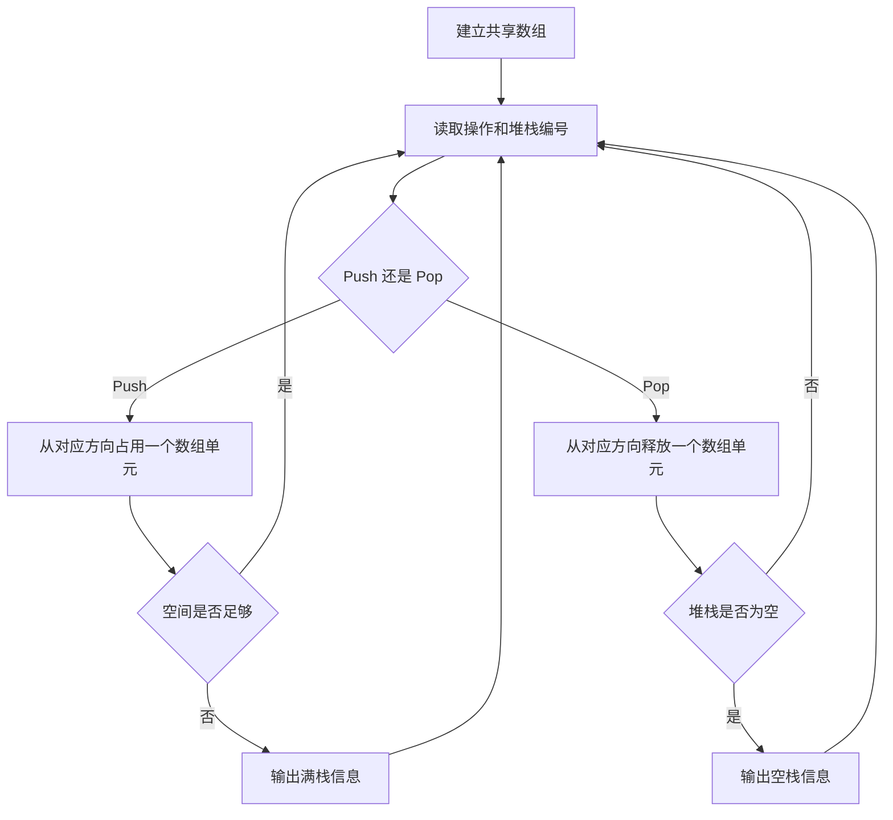

## 6-7 在一个数组中实现两个堆栈

- **分值：** 20分

## 题目描述

本题要求在一个数组中实现两个堆栈。

## 函数接口定义
```python
class Stack:
    """栈 1 从左向右增长，栈 2 从右向左增长，共享同一数组。"""

    def __init__(self, max_size: int) -> None:
        self.data = [0] * max_size
        self.top1 = -1
        self.top2 = max_size


def create_stack(max_size: int) -> Stack: ...
def push(stack: Stack, value: int, tag: int) -> bool: ...
def pop(stack: Stack, tag: int) -> int | None: ...
```

其中`Tag`是堆栈编号，取1或2；`MaxSize`堆栈数组的规模；`Stack`结构定义如下：

```python
class Stack:
    """栈 1 从左向右增长，栈 2 从右向左增长，共享同一数组。"""

    def __init__(self, max_size: int) -> None:
        self.data = [0] * max_size
        self.top1 = -1
        self.top2 = max_size


def create_stack(max_size: int) -> Stack: ...
def push(stack: Stack, value: int, tag: int) -> bool: ...
def pop(stack: Stack, tag: int) -> int | None: ...
```

注意：如果堆栈已满，`Push`函数必须输出“Stack Full”并且返回false；如果某堆栈是空的，则`Pop`函数必须输出“Stack Tag Empty”（其中Tag是该堆栈的编号），并且返回ERROR。

## 裁判测试程序样例
```python
def main():
    # 裁判端调用 create_stack/push/pop；None 对应原题 ERROR。
    pass


if __name__ == "__main__":
    main()
```

## 输入样例
```text
5
Push 1 1
Pop 2
Push 2 11
Push 1 2
Push 2 12
Pop 1
Push 2 13
Push 2 14
Push 1 3
Pop 2
End
```

## 输出样例
```text
Stack 2 Empty
Stack 2 is Empty!
Stack Full
Stack 1 is Full!
Pop from Stack 1: 1
Pop from Stack 2: 13 12 11
```

## 函数部分

```python
def create_stack(max_size: int) -> Stack:
    return Stack(max_size)


def push(stack: Stack, value: int, tag: int) -> bool:
    """两端栈顶相邻时没有空槽可用。"""
    if stack.top1 + 1 == stack.top2:
        return False
    if tag == 1:
        stack.top1 += 1
        stack.data[stack.top1] = value
    else:
        stack.top2 -= 1
        stack.data[stack.top2] = value
    return True


def pop(stack: Stack, tag: int) -> int | None:
    if tag == 1:
        if stack.top1 == -1:
            return None
        value = stack.data[stack.top1]
        stack.top1 -= 1
        return value
    if stack.top2 == len(stack.data):
        return None
    value = stack.data[stack.top2]
    stack.top2 += 1
    return value
```

## 解题思路

让两个堆栈共享同一个数组：堆栈 1 从下标 0 向右增长，堆栈 2 从下标 `MaxSize - 1` 向左增长。初始时 `Top1 = -1`、`Top2 = MaxSize`；当 `Top1 + 1 == Top2` 时，两边栈顶相邻，数组没有剩余空间。这样可以动态共享未使用的空间。

## 代码流程说明

1. `CreateStack` 分配栈结构和数组，初始化两个栈顶。
2. `Push` 先检查两个栈顶是否相邻；未满时根据 `Tag` 移动对应栈顶并保存元素。
3. `Pop` 根据 `Tag` 检查对应堆栈是否为空；非空时取出栈顶元素并移动栈顶。
4. 满栈或空栈时输出规定信息，并返回相应失败值。

## 代码流程图

```mermaid
flowchart TD
    A[调用 Push 或 Pop] --> B{操作类型}
    B -- Push --> C{Top1+1 是否等于 Top2}
    C -- 是 --> D[输出 Stack Full, 返回 false]
    C -- 否 --> E{Tag=1}
    E -- 是 --> F[Top1 右移并入栈]
    E -- 否 --> G[Top2 左移并入栈]
    B -- Pop --> H{Tag=1}
    H -- 是 --> I{Top1 是否为 -1}
    H -- 否 --> J{Top2 是否为 MaxSize}
    I -- 是 --> K[输出 Stack 1 Empty]
    I -- 否 --> L[取出 Data[Top1], Top1 左移]
    J -- 是 --> M[输出 Stack 2 Empty]
    J -- 否 --> N[取出 Data[Top2], Top2 右移]
```

## 解题流程图


