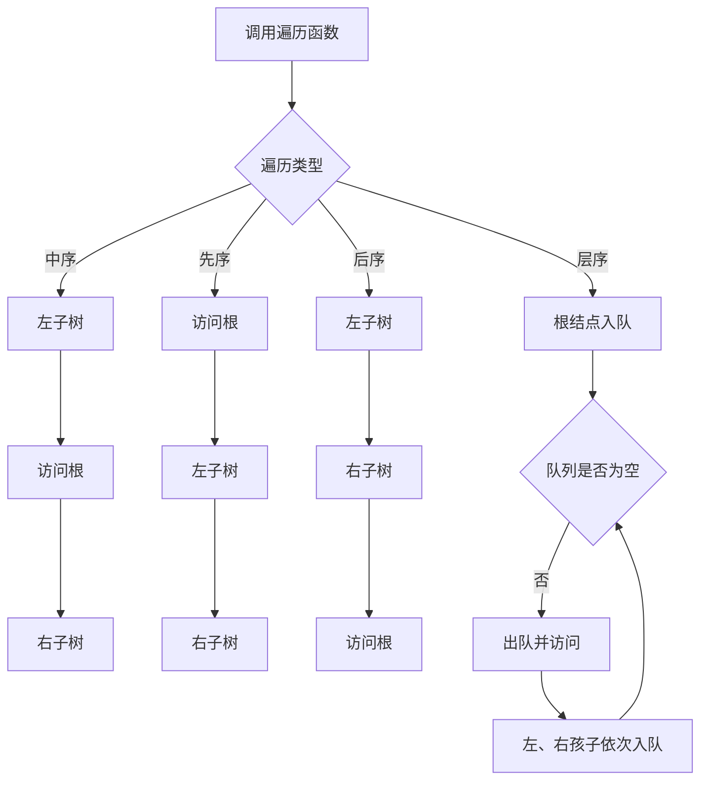
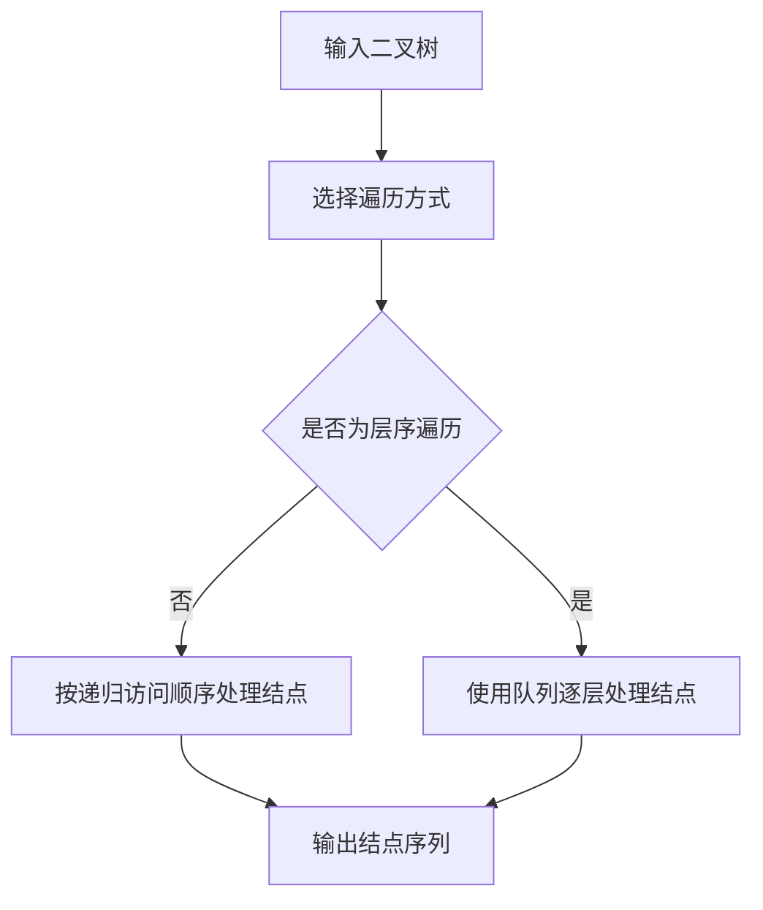

## 6-9 二叉树的遍历

- **分值：** 25分

## 题目描述

本题要求给定二叉树的4种遍历。

## 函数接口定义
```perl
# Perl 用哈希/数组引用模拟题目中的结点和容器类型。
use strict;
use warnings;

sub new_node {
    my ( $data, $left, $right ) = @_;
    return { data => $data, left => $left, right => $right };
}
sub inorder;
sub preorder;
sub postorder;
sub levelorder;
```

其中`BinTree`结构定义如下：

```perl
# BinTree 是二叉树根结点的哈希引用；字段为 data、left 和 right。
```

要求4个函数分别按照访问顺序打印出结点的内容，格式为一个空格跟着一个字符。

## 裁判测试程序样例
```perl
# 裁判样例：构造图片中的二叉树并调用四种遍历函数。
use strict;
use warnings;

sub main {
    my $tree = new_node(
        'A',
        new_node( 'B', new_node('D'), new_node( 'F', new_node('E'), undef ) ),
        new_node( 'C', new_node( 'G', undef, new_node('H') ), new_node('I') )
    );
    print 'Inorder:';    inorder($tree);    print "\n";
    print 'Preorder:';   preorder($tree);   print "\n";
    print 'Postorder:';  postorder($tree);  print "\n";
    print 'Levelorder:'; levelorder($tree); print "\n";
}
main();
```

## 输出样例


```text
Inorder: D B E F A G H C I
Preorder: A B D F E C G H I
Postorder: D E F B H G I C A
Levelorder: A B C D F G I E H
```

## 函数部分

```perl
# DFS 递归实现前三种遍历；层序遍历使用数组队列和头下标。
sub inorder {
    my ($root) = @_;
    return unless $root;
    inorder( $root->{left} );
    print " $root->{data}";
    inorder( $root->{right} );
}

sub preorder {
    my ($root) = @_;
    return unless $root;
    print " $root->{data}";
    preorder( $root->{left} );
    preorder( $root->{right} );
}

sub postorder {
    my ($root) = @_;
    return unless $root;
    postorder( $root->{left} );
    postorder( $root->{right} );
    print " $root->{data}";
}

sub levelorder {
    my ($root) = @_;
    my @queue  = $root ? ($root) : ();
    my $head   = 0;
    while ( $head < @queue ) {
        my $node = $queue[ $head++ ];
        print " $node->{data}";
        push @queue, $node->{left}  if $node->{left};
        push @queue, $node->{right} if $node->{right};
    }
}
```

## 解题思路

中序、先序和后序遍历都使用递归，区别只在于访问根结点的时机：中序是“左、根、右”，先序是“根、左、右”，后序是“左、右、根”。层序遍历需要借助队列，先访问根结点，再按从左到右的顺序将孩子结点入队。四种遍历的时间复杂度均为 `O(n)`；前三种的递归栈空间为 `O(h)`，层序遍历的队列空间为 `O(n)`。

## 代码流程说明

1. 递归遍历遇到空树立即返回。
2. 中序、先序、后序函数分别在不同位置打印当前结点数据。
3. 层序遍历先将根结点入队，循环取出队首并打印。
4. 每次取出一个结点后，依次将其左、右孩子入队，队列为空时结束。

## 代码流程图



## 解题流程图


