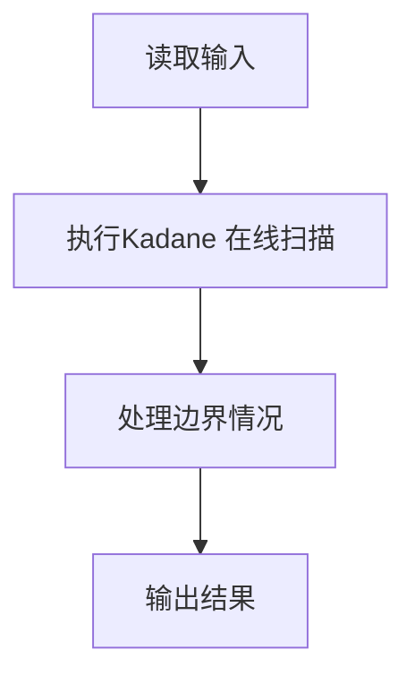
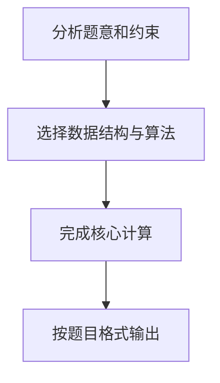

## 7-1 最大子列和问题

- **分值：** 20分

## 题目描述

给定K个整数组成的序列{ N_1, N_2, ..., N_K }，“连续子列”被定义为{ N_i, N_{i+1}, ..., N_j }，其中 1 \le i \le j \le K。“最大子列和”则被定义为所有连续子列元素的和中最大者。例如给定序列{ -2, 11, -4, 13, -5, -2 }，其连续子列{ 11, -4, 13 }有最大的和20。现要求你编写程序，计算给定整数序列的最大子列和。

本题旨在测试各种不同的算法在各种数据情况下的表现。各组测试数据特点如下：

- 数据1：与样例等价，测试基本正确性；
- 数据2：10<sup>2</sup>个随机整数；
- 数据3：10<sup>3</sup>个随机整数；
- 数据4：10<sup>4</sup>个随机整数；
- 数据5：10<sup>5</sup>个随机整数；

## 输入格式

输入第1行给出正整数K (\le 100000)；第2行给出K个整数，其间以空格分隔。

## 输出格式

在一行中输出最大子列和。如果序列中所有整数皆为负数，则输出0。

## 输入样例

```text
6
-2 11 -4 13 -5 -2
```

## 输出样例

```text
20
```

## 测试数据说明

本题旨在测试各种不同的算法在各种数据情况下的表现。各组测试数据特点如下：

| 测试点 | 数据规模 | 测试目的 |
|---|---|---|
| 数据 1 | 与样例等价 | 测试基本正确性 |
| 数据 2 | 10² 个随机整数 | 小数据基础算法 |
| 数据 3 | 10³ 个随机整数 | 中等规模 |
| 数据 4 | 10⁴ 个随机整数 | 较大规模 |
| 数据 5 | 10⁵ 个随机整数 | 最大规模，时间复杂度需 ≤ O(n log n) |

## 算法复杂度参考

| 算法 | 时间复杂度 | 空间复杂度 | 是否能通过所有测试点 |
|---|---|---|---|
| 暴力三重循环 | O(n³) | O(1) | ❌ 大数据超时 |
| 暴力二重循环 | O(n²) | O(1) | ❌ 大数据超时 |
| 分治法 | O(n log n) | O(log n) | ✅ |
| **在线处理（Kadane 算法）** | **O(n)** | **O(1)** | ✅ **推荐** |

## 核心思路（在线处理法）

维护两个变量：

- `ThisSum`：以当前位置结尾的连续子列的最大和
- `MaxSum`：全程记录到的最大值

遍历每个元素时：

1. 将当前元素加到 `ThisSum`
2. 若 `ThisSum < 0`，则说明前面的子列只会拖累后续，重置 `ThisSum = 0`
3. 若 `ThisSum > MaxSum`，更新 `MaxSum = ThisSum`

## 解题思路

本题采用Kadane 在线扫描，围绕题目给出的数据结构和约束完成核心计算，并处理边界情况。

## 代码流程说明

1. 读取题目规定的输入数据。
2. 使用Kadane 在线扫描完成主要处理。
3. 处理边界情况并整理结果。
4. 按指定格式输出结果。

## 代码实现


```perl
# Kadane 在线扫描：维护以当前位置结尾的最优和。
use strict;
use warnings;

my $input = do { local $/; <STDIN> // '' };
my @data  = grep { length } split /\s+/, $input;
exit unless @data;

my $n = $data[0];
my ( $current, $best ) = ( 0, 0 );
for my $i ( 1 .. $n ) {
    my $value = $data[$i];
    $current = 0 if $current + $value < 0;
    $current += $value if $current + $value >= 0;
    $best = $current   if $current > $best;
}
print "$best\n";
```

## 代码流程图



## 解题流程图


