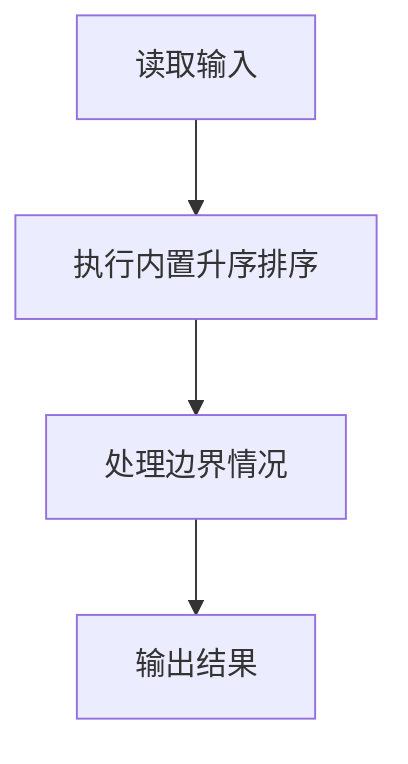
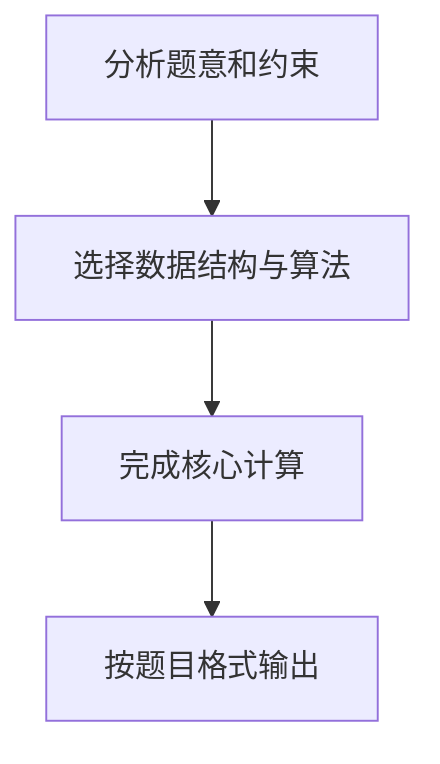

## 7-12 排序

- **分值：** 25分

## 题目描述

给定 n 个（长整型范围内的）整数，要求输出从小到大排序后的结果。

本题旨在测试各种不同的排序算法在各种数据情况下的表现。各组测试数据特点如下：

<li>数据1：只有1个元素；
<li>数据2：11个不相同的整数，测试基本正确性；
<li>数据3：10<sup>3</sup>个随机整数；
<li>数据4：10<sup>4</sup>个随机整数；
<li>数据5：10<sup>5</sup>个随机整数；
<li>数据6：10<sup>5</sup>个顺序整数；
<li>数据7：10<sup>5</sup>个逆序整数；
<li>数据8：10<sup>5</sup>个基本有序的整数；
<li>数据9：10<sup>5</sup>个随机正整数，每个数字不超过1000。

## 输入格式

输入第一行给出正整数 n（\le 10^5），随后一行给出 n 个（长整型范围内的）整数，其间以空格分隔。

## 输出格式

在一行中输出从小到大排序后的结果，数字间以 1 个空格分隔，行末不得有多余空格。

## 输入样例
```text
11
4 981 10 -17 0 -20 29 50 8 43 -5
```

## 输出样例
```text
-20 -17 -5 0 4 8 10 29 43 50 981
```

## 解题思路

本题采用 Perl 内置排序，围绕题目给出的数据结构和约束完成核心计算，并处理边界情况。

## 代码流程说明

1. 读取题目规定的输入数据。
2. 使用内置排序完成主要处理。
3. 处理边界情况并整理结果。
4. 按指定格式输出结果。

## 代码实现


```perl
# 直接排序输入的 N 个整数，再用 join 统一输出空格格式。
use strict;
use warnings;

my $input  = do { local $/; <STDIN> // '' };
my @values = grep { length } split /\s+/, $input;
exit unless @values;
my $n = shift @values;
splice @values, $n if @values > $n;
@values = sort { $a <=> $b } @values;
print join( ' ', @values ), "\n";
```

## 代码流程图



## 解题流程图


