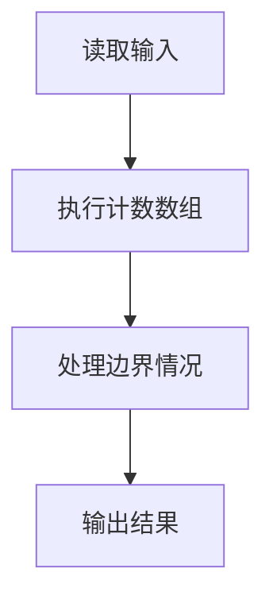
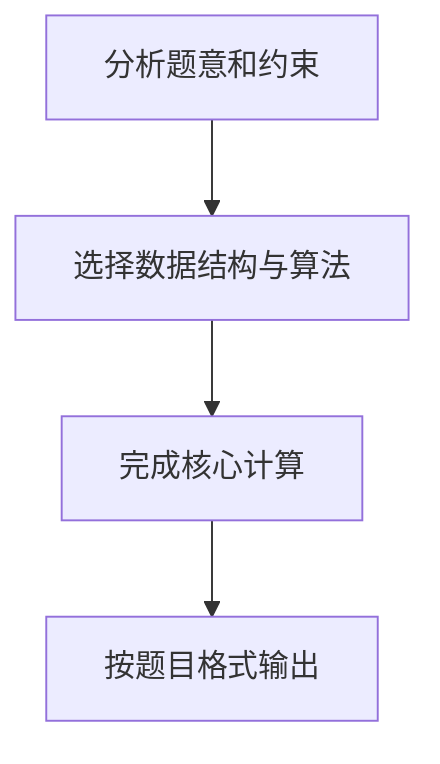

## 7-13 统计工龄

- **分值：** 20分

## 题目描述

给定公司 n 名员工的工龄，要求按工龄增序输出每个工龄段有多少员工。

## 输入格式

输入首先给出正整数 n（\le 10^5），即员工总人数；随后给出 n 个整数，即每个员工的工龄，范围在 [0, 50]。

## 输出格式

按工龄的递增顺序输出每个工龄的员工个数，格式为：“工龄:人数”。每项占一行。如果人数为 0 则不输出该项。

## 输入样例
```text
8
10 2 0 5 7 2 5 2
```

## 输出样例
```text
0:1
2:3
5:2
7:1
10:1

```

## 解题思路

本题采用计数数组，围绕题目给出的数据结构和约束完成核心计算，并处理边界情况。

## 代码流程说明

1. 读取题目规定的输入数据。
2. 使用计数数组完成主要处理。
3. 处理边界情况并整理结果。
4. 按指定格式输出结果。

## 代码实现


```python
"""工龄范围固定为 0~50，计数数组能在线统计并按年龄顺序输出。"""


def main():
    import sys
    values = list(map(int, sys.stdin.buffer.read().split()))
    if not values:
        return
    count = [0] * 51
    for age in values[1:1 + values[0]]:
        count[age] += 1
    print("\n".join(f"{age}:{number}" for age, number in enumerate(count) if number))


if __name__ == "__main__":
    main()
```

## 代码流程图



## 解题流程图


