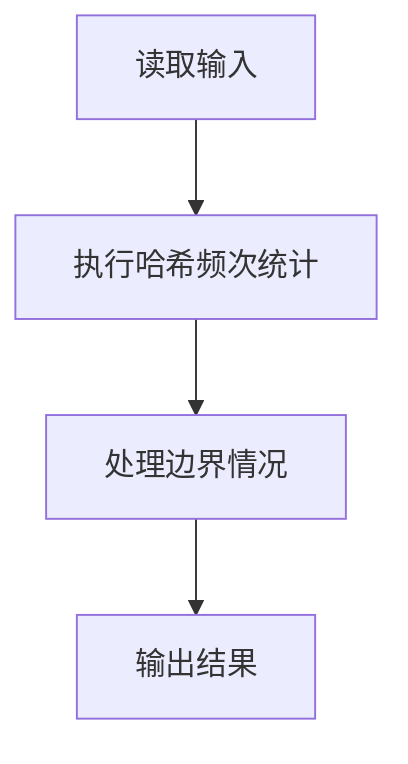
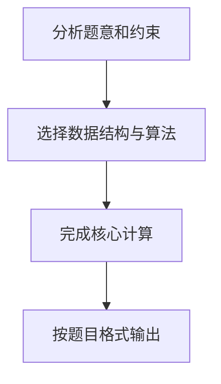

## 7-14 电话聊天狂人

- **分值：** 25分

## 题目描述

给定大量手机用户通话记录，找出其中通话次数最多的聊天狂人。

## 输入格式

输入首先给出正整数N（≤ 10^5），为通话记录条数。随后N行，每行给出一条通话记录。简单起见，这里只列出拨出方和接收方的11位数字构成的手机号码，其中以空格分隔。

## 输出格式

在一行中给出聊天狂人的手机号码及其通话次数，其间以空格分隔。如果这样的人不唯一，则输出狂人中最小的号码及其通话次数，并且附加给出并列狂人的人数。

## 输入样例
```text
4
13005711862 13588625832
13505711862 13088625832
13588625832 18087925832
15005713862 13588625832
```

## 输出样例
```text
13588625832 3
```

## 解题思路

本题采用哈希频次统计，围绕题目给出的数据结构和约束完成核心计算，并处理边界情况。

## 代码流程说明

1. 读取题目规定的输入数据。
2. 使用哈希频次统计完成主要处理。
3. 处理边界情况并整理结果。
4. 按指定格式输出结果。

## 代码实现


```perl
# 哈希统计号码出现次数，再按次数最大、号码最小选择答案。
use strict;
use warnings;

my $input  = do { local $/; <STDIN> // '' };
my @tokens = grep { length } split /\s+/, $input;
exit unless @tokens;
my $n = shift @tokens;
my %count;
for my $i ( 0 .. 2 * $n - 1 ) { ++$count{ $tokens[$i] } }
my $maximum = 0;
for my $number ( keys %count ) {
    $maximum = $count{$number} if $count{$number} > $maximum;
}
my @winners = sort grep { $count{$_} == $maximum } keys %count;
my @output  = ( $winners[0], $maximum );
push @output, scalar @winners if @winners > 1;
print join( ' ', @output ), "\n";
```

## 代码流程图



## 解题流程图


