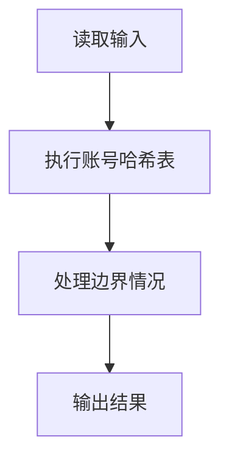
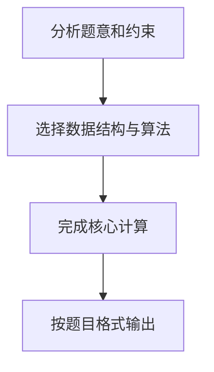

## 7-15 QQ帐户的申请与登陆

- **分值：** 25分

## 题目描述

实现QQ新帐户申请和老帐户登陆的简化版功能。最大挑战是：据说现在的QQ号码已经有10位数了。

## 输入格式

输入首先给出一个正整数N（\le 10^5），随后给出N行指令。每行指令的格式为：“命令符（空格）QQ号码（空格）密码”。其中命令符为“N”（代表New）时表示要新申请一个QQ号，后面是新帐户的号码和密码；命令符为“L”（代表Login）时表示是老帐户登陆，后面是登陆信息。QQ号码为一个不超过10位、但大于1000（据说QQ老总的号码是1001）的整数。密码为不小于6位、不超过16位、且不包含空格的字符串。

## 输出格式

针对每条指令，给出相应的信息：

1）若新申请帐户成功，则输出“New: OK”；<br>
2）若新申请的号码已经存在，则输出“ERROR: Exist”；<br>
3）若老帐户登陆成功，则输出“Login: OK”；<br>
4）若老帐户QQ号码不存在，则输出“ERROR: Not Exist”；<br>
5）若老帐户密码错误，则输出“ERROR: Wrong PW”。

## 输入样例
```text
5
L 1234567890 myQQ@qq.com
N 1234567890 myQQ@qq.com
N 1234567890 myQQ@qq.com
L 1234567890 myQQ@qq
L 1234567890 myQQ@qq.com
```

## 输出样例
```text
ERROR: Not Exist
New: OK
ERROR: Exist
ERROR: Wrong PW
Login: OK
```

## 解题思路

本题采用账号哈希表，围绕题目给出的数据结构和约束完成核心计算，并处理边界情况。

## 代码流程说明

1. 读取题目规定的输入数据。
2. 使用账号哈希表完成主要处理。
3. 处理边界情况并整理结果。
4. 按指定格式输出结果。

## 代码实现


```python
"""字典保存 QQ 号和密码，分别处理注册重复、登录不存在和密码错误。"""


def main():
    import sys
    lines = sys.stdin.buffer.read().decode().splitlines()
    if not lines:
        return
    account_count = int(lines[0])
    accounts = {}
    output = []
    for line in lines[1:1 + account_count]:
        command, number, password = line.split()
        if command == "N":
            if number in accounts:
                output.append("ERROR: Exist")
            else:
                accounts[number] = password
                output.append("New: OK")
        elif number not in accounts:
            output.append("ERROR: Not Exist")
        elif accounts[number] != password:
            output.append("ERROR: Wrong PW")
        else:
            output.append("Login: OK")
    print("\n".join(output))


if __name__ == "__main__":
    main()
```

## 代码流程图



## 解题流程图


