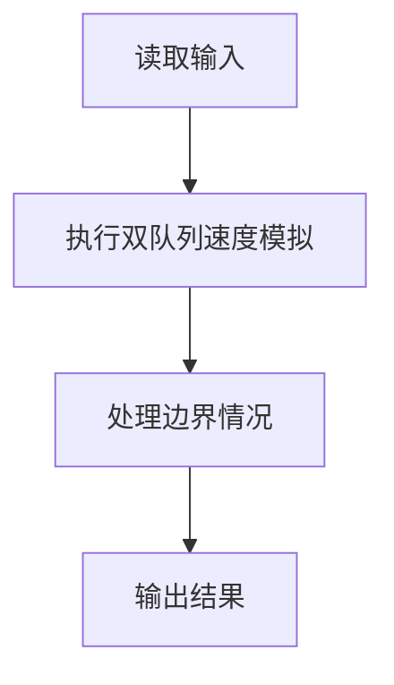
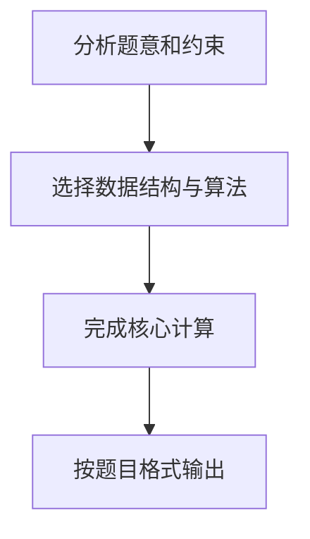

## 7-18 银行业务队列简单模拟

- **分值：** 25分

## 题目描述

设某银行有A、B两个业务窗口，且处理业务的速度不一样，其中A窗口处理速度是B窗口的2倍 —— 即当A窗口每处理完2个顾客时，B窗口处理完1个顾客。给定到达银行的顾客序列，请按业务完成的顺序输出顾客序列。假定不考虑顾客先后到达的时间间隔，并且当不同窗口同时处理完2个顾客时，A窗口顾客优先输出。

## 输入格式

输入为一行正整数，其中第1个数字N(\le1000)为顾客总数，后面跟着N位顾客的编号。编号为奇数的顾客需要到A窗口办理业务，为偶数的顾客则去B窗口。数字间以空格分隔。

## 输出格式

按业务处理完成的顺序输出顾客的编号。数字间以空格分隔，但最后一个编号后不能有多余的空格。

## 输入样例
```text
8 2 1 3 9 4 11 13 15
```

## 输出样例
```text
1 3 2 9 11 4 13 15
```

## 解题思路

本题采用双队列速度模拟，围绕题目给出的数据结构和约束完成核心计算，并处理边界情况。

## 代码流程说明

1. 读取题目规定的输入数据。
2. 使用双队列速度模拟完成主要处理。
3. 处理边界情况并整理结果。
4. 按指定格式输出结果。

## 代码实现


```perl
# 奇数进入 A 队列、偶数进入 B 队列；每轮 A 服务两人、B 服务一人。
use strict;
use warnings;

my $input  = do { local $/; <STDIN> // '' };
my @values = grep { length } split /\s+/, $input;
exit unless @values;
my $n = shift @values;
my ( @odd,      @even );
my ( $odd_head, $even_head ) = ( 0, 0 );
for my $value ( @values[ 0 .. $n - 1 ] ) {
    push @{ ( $value % 2 ) ? \@odd : \@even }, $value;
}
my @result;
while ( $odd_head < @odd || $even_head < @even ) {
    for ( 1 .. 2 ) {
        last if $odd_head >= @odd;
        push @result, $odd[ $odd_head++ ];
    }
    push @result, $even[ $even_head++ ] if $even_head < @even;
}
print join( ' ', @result ), "\n";
```

## 代码流程图



## 解题流程图


