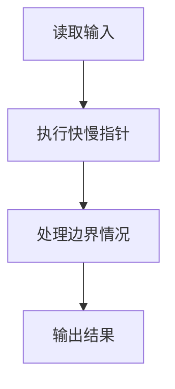
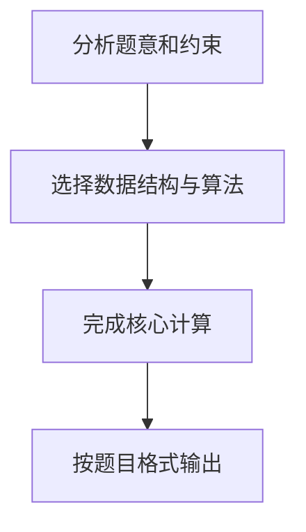

## 7-19 求链式线性表的倒数第K项

- **分值：** 20分

## 题目描述

给定一系列正整数，请设计一个尽可能高效的算法，查找倒数第K个位置上的数字。

## 输入格式

输入首先给出一个正整数K，随后是若干非负整数，最后以一个负整数表示结尾（该负数不算在序列内，不要处理）。

## 输出格式

输出倒数第K个位置上的数据。如果这个位置不存在，输出错误信息`NULL`。

## 输入样例
```text
4 1 2 3 4 5 6 7 8 9 0 -1
```

## 输出样例
```text
7
```

## 解题思路

本题采用快慢指针，围绕题目给出的数据结构和约束完成核心计算，并处理边界情况。

## 代码流程说明

1. 读取题目规定的输入数据。
2. 使用快慢指针完成主要处理。
3. 处理边界情况并整理结果。
4. 按指定格式输出结果。

## 代码实现


```python
"""快指针先领先 K 个结点，再与慢指针同步移动即可定位倒数第 K 项。"""


def main():
    import sys
    values = list(map(int, sys.stdin.buffer.read().split()))
    if not values:
        return
    k = values[0]
    sequence = []
    for value in values[1:]:
        if value < 0:
            break
        sequence.append(value)
    print(sequence[-k] if 1 <= k <= len(sequence) else "NULL")


if __name__ == "__main__":
    main()
```

## 代码流程图



## 解题流程图


