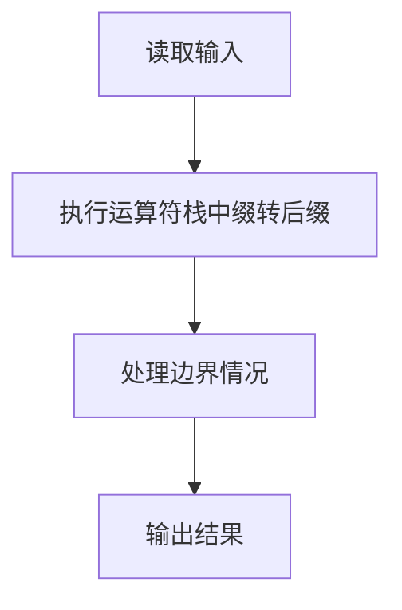
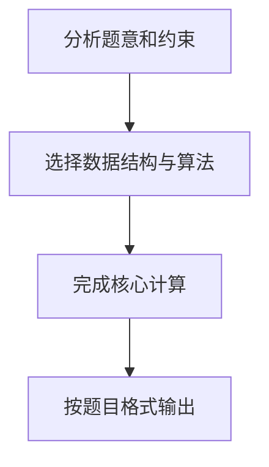

## 7-20 表达式转换

- **分值：** 25分

## 题目描述

算术表达式有前缀表示法、中缀表示法和后缀表示法等形式。日常使用的算术表达式是采用中缀表示法，即二元运算符位于两个运算数中间。请设计程序将中缀表达式转换为后缀表达式。

## 输入格式

输入在一行中给出不含空格的中缀表达式，可包含`+`、`-`、`*`、`/`以及左右括号`()`，表达式不超过20个字符。

## 输出格式

在一行中输出转换后的后缀表达式，要求不同对象（运算数、运算符号）之间以空格分隔，但结尾不得有多余空格。

## 输入样例
```text
2+3*(7-4)+8/4
```

## 输出样例
```text
2 3 7 4 - * + 8 4 / +
```

## 解题思路

本题采用运算符栈中缀转后缀，围绕题目给出的数据结构和约束完成核心计算，并处理边界情况。

## 代码流程说明

1. 读取题目规定的输入数据。
2. 使用运算符栈中缀转后缀完成主要处理。
3. 处理边界情况并整理结果。
4. 按指定格式输出结果。

## 代码实现


```perl
# 运算符栈实现中缀转后缀；数字和一元负号作为一个操作数输出。
use strict;
use warnings;

my $expression = <STDIN> // '';
chomp $expression;
exit unless length $expression;
my %priority = ( '+' => 1, '-' => 1, '*' => 2, '/' => 2 );
my ( @operators, @output );
my $i = 0;
while ( $i < length $expression ) {
    my $char     = substr( $expression, $i, 1 );
    my $previous = $i ? substr( $expression, $i - 1, 1 ) : '';
    my $unary = ( $char eq '+' || $char eq '-' ) && ( !$i || $previous eq '(' );
    if ( $char =~ /[0-9.]|[+-]/ && ( $char =~ /[0-9.]/ || $unary ) ) {
        my $token = $char eq '+' ? '' : $char;
        ++$i;
        while ( $i < length $expression
            && substr( $expression, $i, 1 ) =~ /[0-9.]/ )
        {
            $token .= substr( $expression, $i++, 1 );
        }
        push @output, $token;
        next;
    }
    if    ( $char eq '(' ) { push @operators, $char }
    elsif ( $char eq ')' ) {
        push @output, pop @operators while @operators && $operators[-1] ne '(';
        pop @operators if @operators;
    }
    elsif ( exists $priority{$char} ) {
        push @output, pop @operators
          while @operators
          && $operators[-1] ne '('
          && $priority{ $operators[-1] } >= $priority{$char};
        push @operators, $char;
    }
    ++$i;
}
push @output, pop @operators while @operators;
print join( ' ', @output ), "\n";
```

## 代码流程图



## 解题流程图


