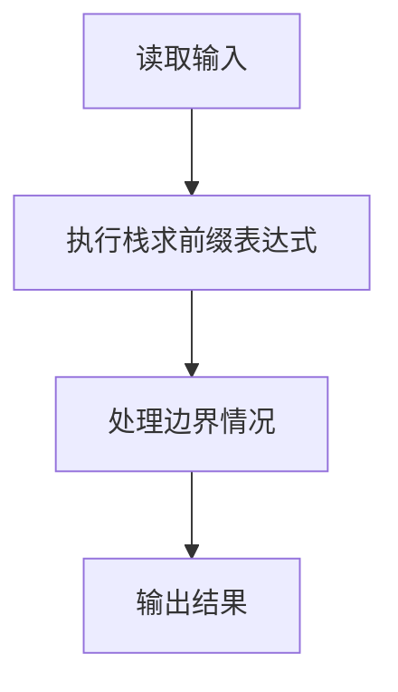
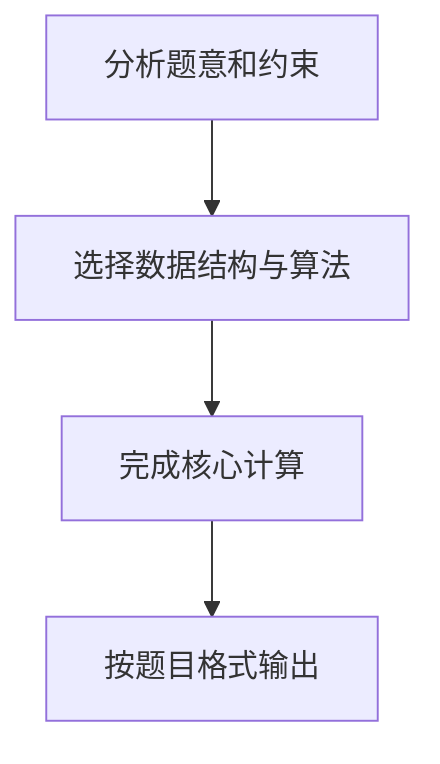

## 7-21 求前缀表达式的值

- **分值：** 25分

## 题目描述

算术表达式有前缀表示法、中缀表示法和后缀表示法等形式。前缀表达式指二元运算符位于两个运算数之前，例如`2+3*(7-4)+8/4`的前缀表达式是：`+ + 2 * 3 - 7 4 / 8 4`。请设计程序计算前缀表达式的结果值。

## 输入格式

输入在一行内给出不超过30个字符的前缀表达式，只包含`+`、`-`、`*`、`/`以及运算数，不同对象（运算数、运算符号）之间以空格分隔。

## 输出格式

输出前缀表达式的运算结果，保留小数点后1位，或错误信息`ERROR`。

## 输入样例
```text
+ + 2 * 3 - 7 4 / 8 4
```

## 输出样例
```text
13.0
```

## 解题思路

本题采用栈求前缀表达式，围绕题目给出的数据结构和约束完成核心计算，并处理边界情况。

## 代码流程说明

1. 读取题目规定的输入数据。
2. 使用栈求前缀表达式完成主要处理。
3. 处理边界情况并整理结果。
4. 按指定格式输出结果。

## 代码实现


```perl
# 前缀表达式从右向左求值；栈不足、除零或多余操作数均为 ERROR。
use strict;
use warnings;

my $input  = do { local $/; <STDIN> // '' };
my @tokens = grep { length } split /\s+/, $input;
my @stack;
my $error = 0;
TOKEN: for my $token ( reverse @tokens ) {
    if ( $token =~ /^[+\-*\/]$/ ) {
        if ( @stack < 2 ) { $error = 1; last TOKEN }
        my ( $left, $right ) = ( pop @stack, pop @stack );
        if ( $token eq '/' && $right == 0 ) { $error = 1; last TOKEN }
        my $value =
            $token eq '+' ? $left + $right
          : $token eq '-' ? $left - $right
          : $token eq '*' ? $left * $right
          :                 $left / $right;
        push @stack, $value;
    }
    elsif ( $token =~ /^[-+]?\d+(?:\.\d+)?$/ ) { push @stack, 0 + $token }
    else                                       { $error = 1; last TOKEN }
}
my $answer = !$error && @stack == 1 ? sprintf( '%.1f', $stack[0] ) : 'ERROR';
print "$answer\n";
```

## 代码流程图



## 解题流程图


