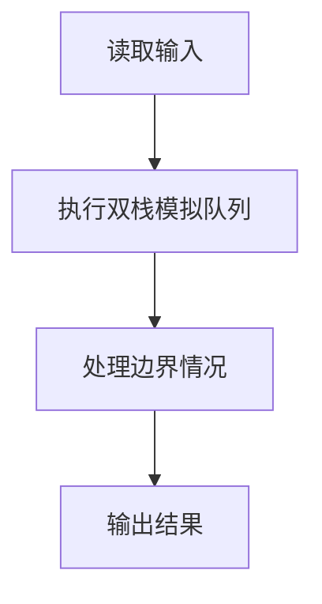
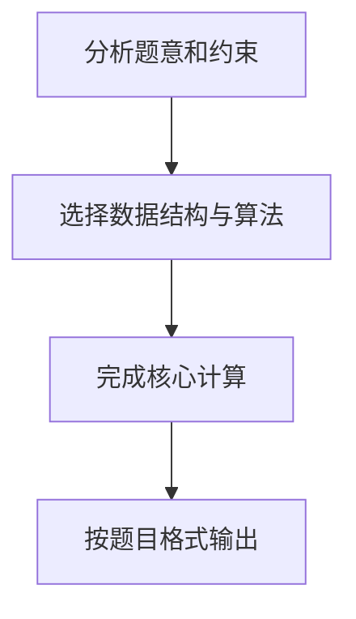

## 7-22 堆栈模拟队列

- **分值：** 25分

## 题目描述

设已知有两个堆栈S1和S2，请用这两个堆栈模拟出一个队列Q。

所谓用堆栈模拟队列，实际上就是通过调用堆栈的下列操作函数：

- `is_full(stack)`：判断堆栈是否已满；
- `is_empty(stack)`：判断堆栈是否为空；
- `push(stack, item)`：将元素压入堆栈；
- `pop(stack)`：删除并返回栈顶元素。

实现队列的操作，即入队 `add_queue(item)` 和出队 `delete_queue()`。

## 输入格式

输入首先给出两个正整数`N1`和`N2`，表示堆栈`S1`和`S2`的最大容量。随后给出一系列的队列操作：`A  item`表示将`item`入列（这里假设`item`为整型数字）；`D`表示出队操作；`T`表示输入结束。

## 输出格式

对输入中的每个`D`操作，输出相应出队的数字，或者错误信息`ERROR:Empty`。如果入队操作无法执行，也需要输出`ERROR:Full`。每个输出占1行。

## 输入样例
```text
3 2
A 1 A 2 A 3 A 4 A 5 D A 6 D A 7 D A 8 D D D D T
```

## 输出样例
```text
ERROR:Full
1
ERROR:Full
2
3
4
7
8
ERROR:Empty
```

## 解题思路

本题采用双栈模拟队列，围绕题目给出的数据结构和约束完成核心计算，并处理边界情况。

## 代码流程说明

1. 读取题目规定的输入数据。
2. 使用双栈模拟队列完成主要处理。
3. 处理边界情况并整理结果。
4. 按指定格式输出结果。

## 代码实现


```perl
# 两个栈实现队列；出队栈为空时倒序搬运入队栈，保持先进先出。
use strict;
use warnings;

my $input  = do { local $/; <STDIN> // '' };
my @tokens = grep { length } split /\s+/, $input;
exit if @tokens < 2;
my ( $first,       $second ) = @tokens[ 0, 1 ];
my ( $in_capacity, $out_capacity ) =
  $first <= $second ? ( $first, $second ) : ( $second, $first );
my ( @incoming, @outgoing, @output );
my $pos = 2;

while ( $pos < @tokens ) {
    my $operation = $tokens[ $pos++ ];
    last if $operation eq 'T';
    if ( $operation eq 'A' ) {
        my $item = $tokens[ $pos++ ];
        if    ( @incoming < $in_capacity ) { push @incoming, $item }
        elsif ( !@outgoing ) {
            @outgoing = reverse @incoming;
            @incoming = ($item);
        }
        else { push @output, 'ERROR:Full' }
    }
    elsif ( $operation eq 'D' ) {
        if ( !@outgoing && @incoming ) {
            @outgoing = reverse @incoming;
            @incoming = ();
        }
        push @output, @outgoing ? pop(@outgoing) : 'ERROR:Empty';
    }
}
print join( "\n", @output ), "\n" if @output;
```

## 代码流程图



## 解题流程图


