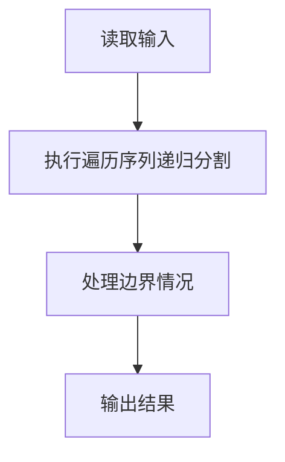
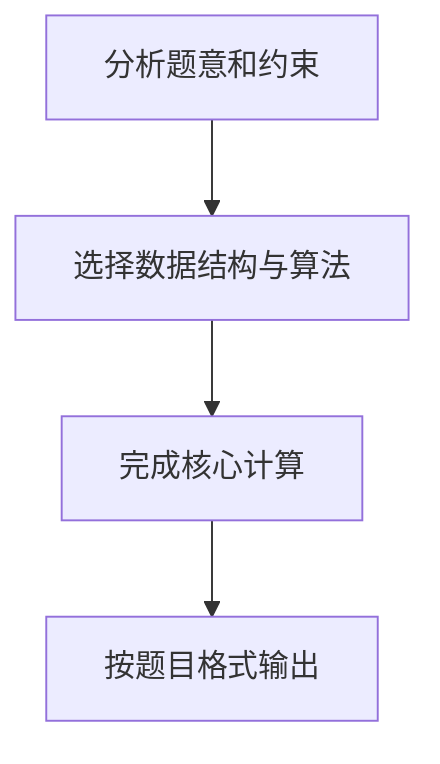

## 7-23 还原二叉树

- **分值：** 25分

## 题目描述

给定一棵二叉树的前序遍历序列和中序遍历序列，要求计算该二叉树的高度。

## 输入格式

输入首先给出正整数 n（\le50），为树中结点总数。随后 2 行先后给出前序和中序遍历序列，均是长度为 n 的不包含重复英文字母（区别大小写）的字符串。

## 输出格式

输出为一个整数，即该二叉树的高度。

## 输入样例
```text
9
ABDFGHIEC
FDHGIBEAC
```

## 输出样例
```text
5
```

## 解题思路

本题采用遍历序列递归分割，围绕题目给出的数据结构和约束完成核心计算，并处理边界情况。

## 代码流程说明

1. 读取题目规定的输入数据。
2. 使用遍历序列递归分割完成主要处理。
3. 处理边界情况并整理结果。
4. 按指定格式输出结果。

## 代码实现


```python
"""前序首元素为根，在中序中定位根切分子树，递归计算树高。"""


def height(preorder, inorder):
    if not preorder:
        return 0
    middle = inorder.index(preorder[0])
    return 1 + max(
        height(preorder[1:middle + 1], inorder[:middle]),
        height(preorder[middle + 1:], inorder[middle + 1:]),
    )


def main():
    import sys
    data = sys.stdin.read().split()
    if data:
        print(height(data[1], data[2]))


if __name__ == "__main__":
    main()
```

## 代码流程图



## 解题流程图


