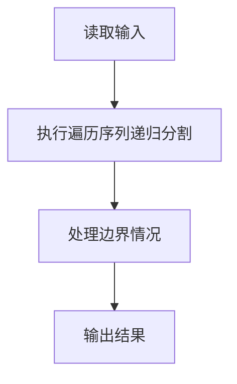
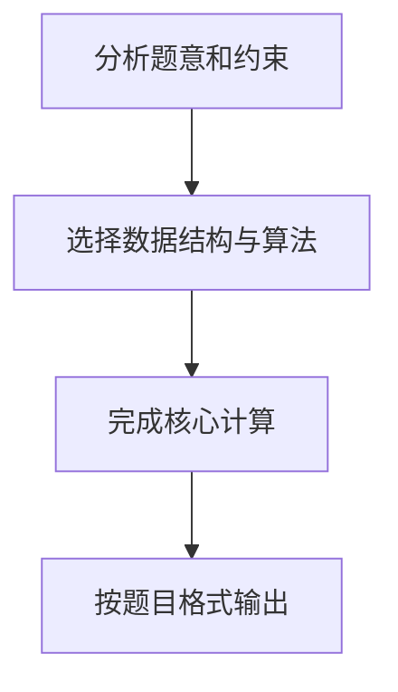

## 7-23 还原二叉树

- **分值：** 25分

## 题目描述

给定一棵二叉树的前序遍历序列和中序遍历序列，要求计算该二叉树的高度。

## 输入格式

输入首先给出正整数 n（≤50），为树中结点总数。随后 2 行先后给出前序和中序遍历序列，均是长度为 n 的不包含重复英文字母（区别大小写）的字符串。

## 输出格式

输出为一个整数，即该二叉树的高度。

## 输入样例
```text
9
ABDFGHIEC
FDHGIBEAC
```

## 输出样例
```text
5
```

## 解题思路

本题采用遍历序列递归分割，围绕题目给出的数据结构和约束完成核心计算，并处理边界情况。

## 代码流程说明

1. 读取题目规定的输入数据。
2. 使用遍历序列递归分割完成主要处理。
3. 处理边界情况并整理结果。
4. 按指定格式输出结果。

## 代码实现


```perl
# 前序首元素是根，在中序中定位根并切分左右子树，递归计算树高。
use strict;
use warnings;

my $input = do { local $/; <STDIN> // '' };
my @data  = grep { length } split /\s+/, $input;
exit unless @data;

sub height_range {
    my ( $preorder, $inorder, $pre_left, $in_left, $size ) = @_;
    return 0 if $size <= 0;
    my $root   = $preorder->[$pre_left];
    my $middle = 0;
    ++$middle
      while $middle < $size && $inorder->[ $in_left + $middle ] ne $root;
    my $left_size  = $middle;
    my $right_size = $size - $left_size - 1;
    my $left_height =
      height_range( $preorder, $inorder, $pre_left + 1, $in_left, $left_size );
    my $right_height = height_range(
        $preorder, $inorder,
        $pre_left + $left_size + 1,
        $in_left + $left_size + 1, $right_size
    );
    return 1 + ( $left_height > $right_height ? $left_height : $right_height );
}

sub height {
    my ( $preorder, $inorder ) = @_;
    return height_range( $preorder, $inorder, 0, 0, scalar @{$preorder} );
}
shift @data;
my @preorder = split //, $data[0];
my @inorder  = split //, $data[1];
print height( \@preorder, \@inorder ), "\n";
```

## 代码流程图



## 解题流程图


