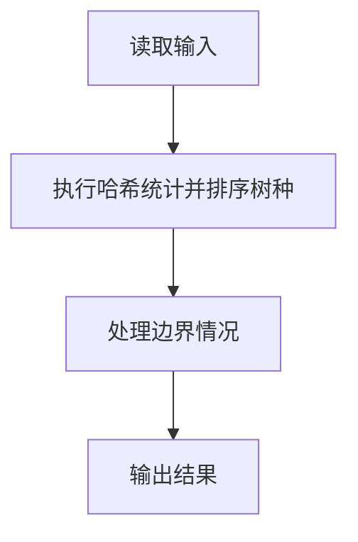
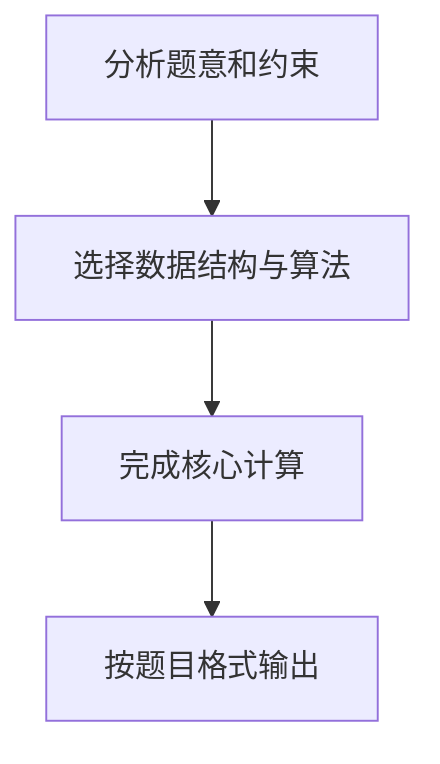

## 7-24 树种统计

- **分值：** 25分

## 题目描述

随着卫星成像技术的应用，自然资源研究机构可以识别每一棵树的种类。请编写程序帮助研究人员统计每种树的数量，计算每种树占总数的百分比。

## 输入格式

输入首先给出正整数 n（\le 10^5），随后 n 行，每行给出卫星观测到的一棵树的种类名称。种类名称由不超过 30 个英文字母和空格组成（大小写有区分）。

## 输出格式

按字典序递增输出各种树的种类名称及其所占总数的百分比，其间以空格分隔，保留小数点后 4 位。

## 输入样例
```text
29
Red Alder
Ash
Aspen
Basswood
Ash
Beech
Yellow Birch
Ash
Cherry
Cottonwood
Ash
Cypress
Red Elm
Gum
Hackberry
White Oak
Hickory
Pecan
Hard Maple
White Oak
Soft Maple
Red Oak
Red Oak
White Oak
Poplan
Sassafras
Sycamore
Black Walnut
Willow
```

## 输出样例
```text
Ash 13.7931%
Aspen 3.4483%
Basswood 3.4483%
Beech 3.4483%
Black Walnut 3.4483%
Cherry 3.4483%
Cottonwood 3.4483%
Cypress 3.4483%
Gum 3.4483%
Hackberry 3.4483%
Hard Maple 3.4483%
Hickory 3.4483%
Pecan 3.4483%
Poplan 3.4483%
Red Alder 3.4483%
Red Elm 3.4483%
Red Oak 6.8966%
Sassafras 3.4483%
Soft Maple 3.4483%
Sycamore 3.4483%
White Oak 10.3448%
Willow 3.4483%
Yellow Birch 3.4483%
```

**鸣谢青岛大学周强老师修正题面！**

## 解题思路

本题采用哈希统计并排序树种，围绕题目给出的数据结构和约束完成核心计算，并处理边界情况。

## 代码流程说明

1. 读取题目规定的输入数据。
2. 使用哈希统计并排序树种完成主要处理。
3. 处理边界情况并整理结果。
4. 按指定格式输出结果。

## 代码实现


```python
"""字典计数后按树种字典序输出百分比，避免排序全部观测记录。"""


def main():
    import sys
    from collections import Counter
    lines = sys.stdin.buffer.read().decode().splitlines()
    if not lines:
        return
    n = int(lines[0])
    count = Counter(lines[1:1 + n])
    print("\n".join(f"{name} {count[name] * 100 / n:.4f}%" for name in sorted(count)))


if __name__ == "__main__":
    main()
```

## 代码流程图



## 解题流程图


