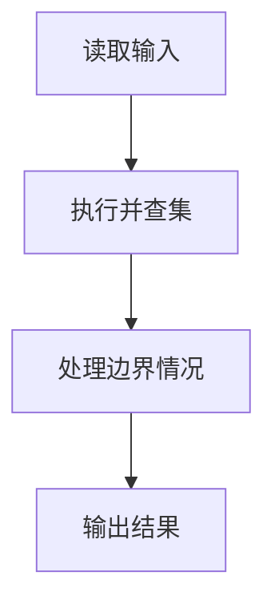
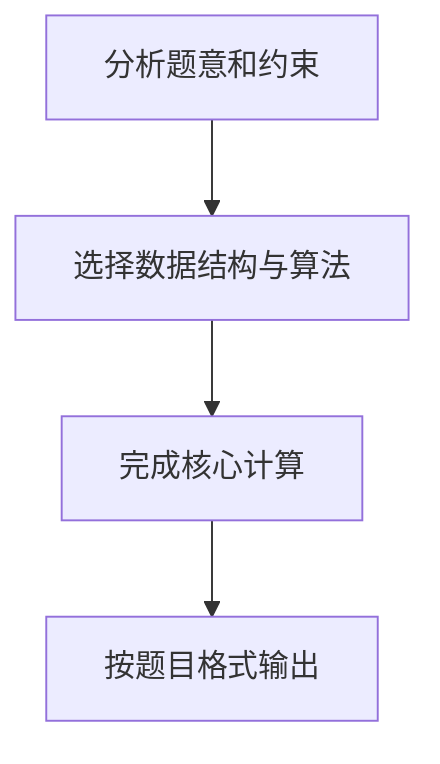

## 7-25 朋友圈

- **分值：** 25分

## 题目描述

某学校有N个学生，形成M个俱乐部。每个俱乐部里的学生有着一定相似的兴趣爱好，形成一个朋友圈。一个学生可以同时属于若干个不同的俱乐部。根据“我的朋友的朋友也是我的朋友”这个推论可以得出，如果A和B是朋友，且B和C是朋友，则A和C也是朋友。请编写程序计算最大朋友圈中有多少人。

## 输入格式

输入的第一行包含两个正整数N（\le30000）和M（\le1000），分别代表学校的学生总数和俱乐部的个数。后面的M行每行按以下格式给出1个俱乐部的信息，其中学生从1~N编号：

`第i个俱乐部的人数Mi（空格）学生1（空格）学生2 … 学生Mi`

## 输出格式

输出给出一个整数，表示在最大朋友圈中有多少人。

## 输入样例
```text
7 4
3 1 2 3
2 1 4
3 5 6 7
1 6
```

## 输出样例
```text
4
```

## 解题思路

本题采用并查集，围绕题目给出的数据结构和约束完成核心计算，并处理边界情况。

## 代码流程说明

1. 读取题目规定的输入数据。
2. 使用并查集完成主要处理。
3. 处理边界情况并整理结果。
4. 按指定格式输出结果。

## 代码实现


```python
"""并查集维护所有俱乐部的连通关系，最后取最大集合的大小。"""


def main():
    import sys
    values = list(map(int, sys.stdin.buffer.read().split()))
    if not values:
        return
    n, club_count = values[:2]
    parent = list(range(n + 1))
    size = [1] * (n + 1)

    def find(x):
        while parent[x] != x:
            parent[x] = parent[parent[x]]
            x = parent[x]
        return x

    def union(a, b):
        a, b = find(a), find(b)
        if a == b:
            return
        if size[a] < size[b]:
            a, b = b, a
        parent[b] = a
        size[a] += size[b]

    pos = 2
    for _ in range(club_count):
        count = values[pos]
        pos += 1
        members = values[pos:pos + count]
        pos += count
        for member in members[1:]:
            union(members[0], member)
    print(max(size[find(student)] for student in range(1, n + 1)))


if __name__ == "__main__":
    main()
```

## 代码流程图



## 解题流程图


