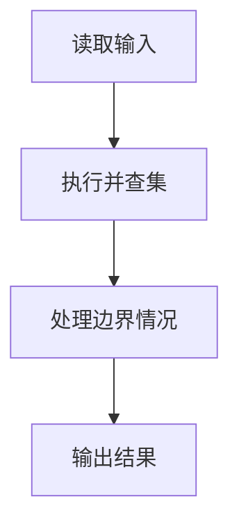
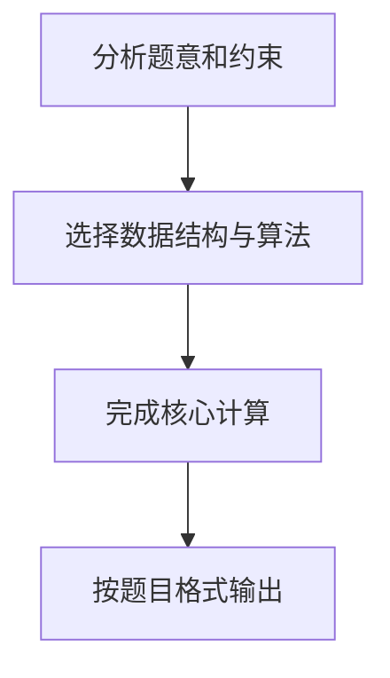

## 7-25 朋友圈

- **分值：** 25分

## 题目描述

某学校有N个学生，形成M个俱乐部。每个俱乐部里的学生有着一定相似的兴趣爱好，形成一个朋友圈。一个学生可以同时属于若干个不同的俱乐部。根据“我的朋友的朋友也是我的朋友”这个推论可以得出，如果A和B是朋友，且B和C是朋友，则A和C也是朋友。请编写程序计算最大朋友圈中有多少人。

## 输入格式

输入的第一行包含两个正整数N（\le30000）和M（\le1000），分别代表学校的学生总数和俱乐部的个数。后面的M行每行按以下格式给出1个俱乐部的信息，其中学生从1~N编号：

`第i个俱乐部的人数Mi（空格）学生1（空格）学生2 … 学生Mi`

## 输出格式

输出给出一个整数，表示在最大朋友圈中有多少人。

## 输入样例
```text
7 4
3 1 2 3
2 1 4
3 5 6 7
1 6
```

## 输出样例
```text
4
```

## 解题思路

本题采用并查集，围绕题目给出的数据结构和约束完成核心计算，并处理边界情况。

## 代码流程说明

1. 读取题目规定的输入数据。
2. 使用并查集完成主要处理。
3. 处理边界情况并整理结果。
4. 按指定格式输出结果。

## 代码实现


```perl
# 并查集维护俱乐部的连通关系，按集合大小合并并取最大集合。
use strict;
use warnings;

my $input  = do { local $/; <STDIN> // '' };
my @values = grep { length } split /\s+/, $input;
exit unless @values;
my ( $n, $club_count ) = @values[ 0, 1 ];
my @parent = 0 .. $n;
my @size   = (1) x ( $n + 1 );

sub find {
    my ($x) = @_;
    $parent[$x] = find( $parent[$x] ) if $parent[$x] != $x;
    return $parent[$x];
}

sub union {
    my ( $a, $b ) = ( find( $_[0] ), find( $_[1] ) );
    return if $a == $b;
    ( $a, $b ) = ( $b, $a ) if $size[$a] < $size[$b];
    $parent[$b] = $a;
    $size[$a] += $size[$b];
}
my $pos = 2;
for ( 1 .. $club_count ) {
    my $count   = $values[ $pos++ ];
    my @members = @values[ $pos .. $pos + $count - 1 ];
    $pos += $count;
    union( $members[0], $_ ) for @members[ 1 .. $#members ];
}
my $answer = 0;
for my $student ( 1 .. $n ) {
    my $root = find($student);
    $answer = $size[$root] if $size[$root] > $answer;
}
print "$answer\n";
```

## 代码流程图



## 解题流程图


