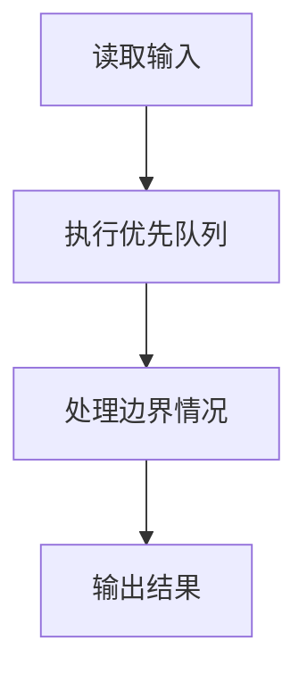
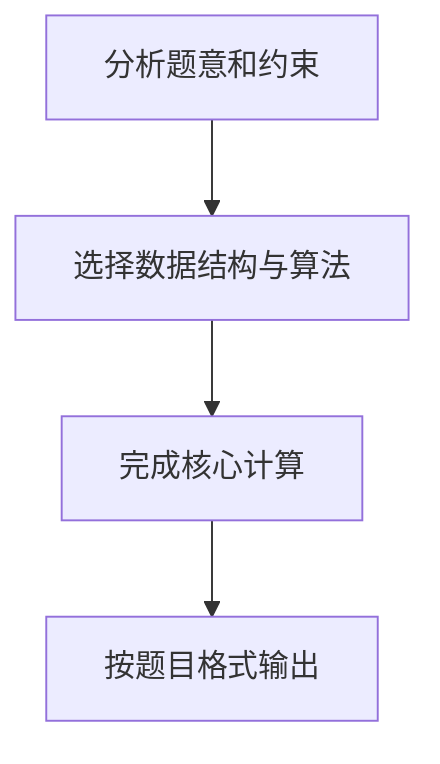

## 7-26 Windows消息队列

- **分值：** 25分

## 题目描述

消息队列是 Windows 系统的基础。对于每个进程，系统维护一个消息队列。如果在进程中有特定事件发生，如点击鼠标、文字改变等，系统将把这个消息连同表示此消息优先级高低的正整数（称为优先级值）加到队列当中。同时，如果队列不是空的，这一进程循环地从队列中按照优先级获取消息。请注意优先级值低意味着优先级高。请编辑程序模拟消息队列，将消息加到队列中以及从队列中获取消息。

## 输入格式

输入第 1 行给出正整数 n（≤ 10^5），随后 n 行，每行给出一个指令——`GET` 或 `PUT`，分别表示从队列中取出消息或将消息添加到队列中。如果指令是 `PUT`，后面就有一个消息名称、以及一个正整数表示消息的优先级，此数越小表示优先级越高。消息名称是长度不超过 10 个字符且不含空格的字符串；题目保证队列中消息的优先级无重复，且输入至少有一个 `GET`。

## 输出格式

对于每个 `GET` 指令，在一行中输出消息队列中优先级最高的消息的名称和参数。如果消息队列中没有消息，输出 `EMPTY QUEUE!`。对于 `PUT` 指令则没有输出。

## 输入样例
```text
9
PUT msg1 5
PUT msg2 4
GET
PUT msg3 2
PUT msg4 4
GET
GET
GET
GET
```

## 输出样例
```text
msg2
msg3
msg4
msg1
EMPTY QUEUE!
```

## 解题思路

本题采用优先队列，围绕题目给出的数据结构和约束完成核心计算，并处理边界情况。

## 代码流程说明

1. 读取题目规定的输入数据。
2. 使用优先队列完成主要处理。
3. 处理边界情况并整理结果。
4. 按指定格式输出结果。

## 代码实现


```perl
# 自定义最小堆按优先级取消息；优先级相同时按消息名排序。
use strict;
use warnings;

my $input  = do { local $/; <STDIN> // '' };
my @tokens = grep { length } split /\s+/, $input;
exit unless @tokens;
my @heap;
my @output;
my $pos = 1;

sub heap_push {
    my ($item) = @_;
    push @heap, $item;
    my $i = $#heap;
    while ( $i > 0 ) {
        my $parent = int( ( $i - 1 ) / 2 );
        last
          if $heap[$parent][0] < $item->[0]
          || ( $heap[$parent][0] == $item->[0]
            && $heap[$parent][1] le $item->[1] );
        $heap[$i] = $heap[$parent];
        $i = $parent;
    }
    $heap[$i] = $item;
}

sub heap_pop {
    my $result = $heap[0];
    my $last   = pop @heap;
    return $result unless @heap;
    my $i = 0;
    while (1) {
        my $left = 2 * $i + 1;
        last if $left >= @heap;
        my $right = $left + 1;
        my $child = $right < @heap
          && (
            $heap[$right][0] < $heap[$left][0]
            || (   $heap[$right][0] == $heap[$left][0]
                && $heap[$right][1] lt $heap[$left][1] )
          ) ? $right : $left;
        last
          if $last->[0] < $heap[$child][0]
          || ( $last->[0] == $heap[$child][0]
            && $last->[1] le $heap[$child][1] );
        $heap[$i] = $heap[$child];
        $i = $child;
    }
    $heap[$i] = $last;
    return $result;
}
for ( 1 .. $tokens[0] ) {
    my $command = $tokens[ $pos++ ];
    if ( $command eq 'PUT' ) {
        heap_push( [ 0 + $tokens[ $pos + 1 ], $tokens[$pos] ] );
        $pos += 2;
    }
    elsif (@heap) { push @output, heap_pop()->[1] }
    else          { push @output, 'EMPTY QUEUE!' }
}
print join( "\n", @output ), "\n" if @output;
```

## 代码流程图



## 解题流程图


