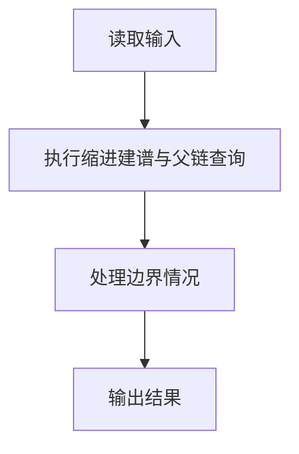
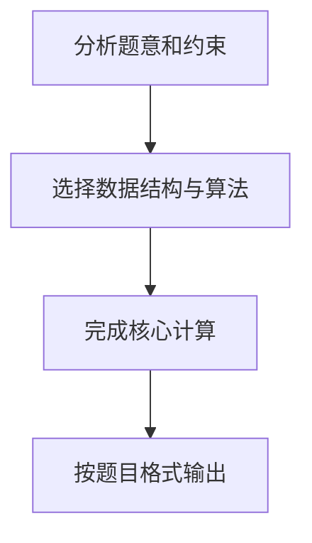

## 7-27 家谱处理

- **分值：** 30分

## 题目描述

人类学研究对于家族很感兴趣，于是研究人员搜集了一些家族的家谱进行研究。实验中，使用计算机处理家谱。为了实现这个目的，研究人员将家谱转换为文本文件。下面为家谱文本文件的实例：

```text
LaoLi
  DaLi
    XiaoMing
    XiaoHong
  ErLi
    MeiMei
```

家谱文本文件中，每一行包含一个人的名字。第一行中的名字是这个家族最早的祖先。家谱仅包含最早祖先的后代，而他们的丈夫或妻子不出现在家谱中。每个人的子女比父母多缩进 2 个空格。以上述家谱文本文件为例，`LaoLi` 是这个家族最早的祖先，他有两个孩子 `DaLi` 和 `ErLi`，`DaLi` 有两个孩子 `XiaoMing` 和 `XiaoHong`，`ErLi` 只有一个孩子 `MeiMei`。

在实验中，研究人员还收集了家庭文件，并提取了家谱中有关两个人关系的陈述语句。下面为家谱中关系的陈述语句实例：

```text
LaoLi is the parent of DaLi （老李与大李是父子关系）
DaLi is a sibling of ErLi  （大李与二李是兄弟姊妹关系）
MeiMei is a descendant of DaLi （梅梅是大李的后代）
```

研究人员需要判断每个陈述语句是真还是假，请编写程序帮助研究人员判断。

## 输入格式

输入第 1 行给出 2 个正整数 n（2\le n\le 100）和 m（\le 100），其中 n 为家谱中名字的数量，m 为家谱中陈述语句的数量。

接下来输入的每行不超过 70 个字符。名字的字符串由不超过 10 个英文字母组成。在家谱中的第一行给出的名字前没有缩进空格。家谱中的其他名字至少缩进 2 个空格，即他们是家谱中最早祖先（第一行给出的名字）的后代，且如果家谱中一个名字前缩进 k 个空格，则下一行中名字至多缩进 k+2 个空格。

在一个家谱中同样的名字不会出现两次，且家谱中没有出现的名字不会出现在陈述语句中。每句陈述语句格式如下（括号内为解释文字，不是格式的一部分），其中 `X` 和 `Y` 为家谱中的不同名字：
```text
X is a child of Y （X是Y的孩子）
X is the parent of Y （X是Y的父母）
X is a sibling of Y （X是Y的兄弟姊妹）
X is a descendant of Y （X是Y的后代）
X is an ancestor of Y （X是Y的祖先）
```

## 输出格式

对于测试用例中的每句陈述语句，如果陈述为真，在一行中输出 `True`；如果陈述为假，在一行中输出 `False`。

## 输入样例
```text
6 5
LaoLi
  DaLi
    XiaoMing
    XiaoHong
  ErLi
    MeiMei
DaLi is a child of LaoLi
DaLi is an ancestor of XiaoHong
DaLi is a sibling of ErLi
ErLi is the parent of XiaoMing
LaoLi is a descendant of XiaoHong
```

## 输出样例
```text
True
True
True
False
False
```

## 解题思路

本题采用缩进建谱与父链查询，围绕题目给出的数据结构和约束完成核心计算，并处理边界情况。

## 代码流程说明

1. 读取题目规定的输入数据。
2. 使用缩进建谱与父链查询完成主要处理。
3. 处理边界情况并整理结果。
4. 按指定格式输出结果。

## 代码实现


```python
"""按缩进深度构建父子关系，查询时沿 parent 链向上追溯。"""


def main():
    import sys
    lines = sys.stdin.read().splitlines()
    if not lines:
        return
    n, query_count = map(int, lines[0].split())
    names, parents, last_at_depth = [], [], {}
    for line in lines[1:1 + n]:
        name = line.lstrip()
        depth = (len(line) - len(name)) // 2
        parent = last_at_depth.get(depth - 1, -1)
        names.append(name)
        parents.append(parent)
        last_at_depth[depth] = len(names) - 1
        for old_depth in list(last_at_depth):
            if old_depth > depth:
                del last_at_depth[old_depth]

    index = {name: i for i, name in enumerate(names)}
    output = []
    for statement in lines[1 + n:1 + n + query_count]:
        words = statement.split()
        x, y = words[0], words[-1]
        relation = " ".join(words[1:-1])
        a, b = index[x], index[y]
        if relation == "is a child of":
            result = parents[a] == b
        elif relation == "is the parent of":
            result = parents[b] == a
        elif relation == "is a sibling of":
            result = a != b and parents[a] == parents[b]
        else:
            start = a if relation == "is a descendant of" else b
            target = b if start == a else a
            result = False
            current = parents[start]
            while current != -1:
                if current == target:
                    result = True
                    break
                current = parents[current]
        output.append(str(result))
    print("\n".join(output))


if __name__ == "__main__":
    main()
```

## 代码流程图



## 解题流程图


