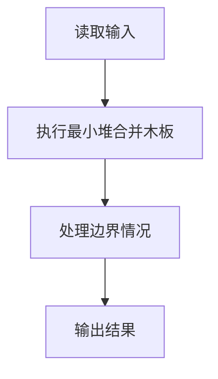
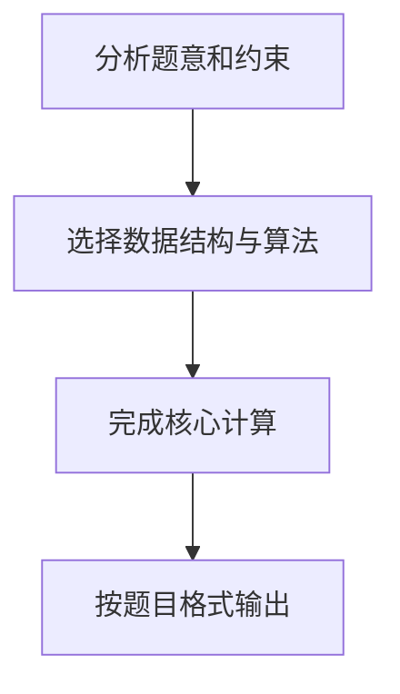

## 7-29 修理牧场

- **分值：** 25分

## 题目描述

农夫要修理牧场的一段栅栏，他测量了栅栏，发现需要 n 块木头，每块木头长度为整数 l_i 个长度单位，于是他购买了一条很长的、能锯成 n 块的木头，即该木头的长度是 l_i 的总和。

但是农夫自己没有锯子，请人锯木的酬金跟这段木头的长度成正比。为简单起见，不妨就设酬金等于所锯木头的长度。例如，要将长度为 20 的木头锯成长度为 8、7 和 5 的三段，第一次锯木头花费 20，将木头锯成 12 和 8；第二次锯木头花费 12，将长度为 12 的木头锯成 7 和 5，总花费为 32。如果第一次将木头锯成 15 和 5，则第二次锯木头花费 15，总花费为 35（大于 32）。

请编写程序帮助农夫计算将木头锯成 n 块的最少花费。

## 输入格式

输入首先给出正整数 n（≤ 10^4），表示要将木头锯成 n 块。第二行给出 n 个正整数（≤ 50），表示每段木块的长度。

## 输出格式

输出一个整数，即将木头锯成 n 块的最少花费。

## 输入样例
```text
8
4 5 1 2 1 3 1 1
```

## 输出样例
```text
49
```

## 解题思路

本题采用最小堆合并木板，围绕题目给出的数据结构和约束完成核心计算，并处理边界情况。

## 代码流程说明

1. 读取题目规定的输入数据。
2. 使用最小堆合并木板完成主要处理。
3. 处理边界情况并整理结果。
4. 按指定格式输出结果。

## 代码实现


```perl
# 最优合并：每次合并当前最短两段，最小堆保证 Huffman 贪心最优。
use strict;
use warnings;

my $input  = do { local $/; <STDIN> // '' };
my @values = grep { length } split /\s+/, $input;
exit unless @values;
my $n    = shift @values;
my @heap = @values[ 0 .. $n - 1 ];

sub push_heap {
    my ($x) = @_;
    push @heap, $x;
    my $i = $#heap;
    while ( $i && $heap[ int( ( $i - 1 ) / 2 ) ] > $x ) {
        $heap[$i] = $heap[ int( ( $i - 1 ) / 2 ) ];
        $i = int( ( $i - 1 ) / 2 );
    }
    $heap[$i] = $x;
}

sub pop_heap {
    my $result = $heap[0];
    my $last   = pop @heap;
    return $result unless @heap;
    my $i = 0;
    while ( 2 * $i + 1 < @heap ) {
        my $child = 2 * $i + 1;
        ++$child if $child + 1 < @heap && $heap[ $child + 1 ] < $heap[$child];
        last     if $last <= $heap[$child];
        $heap[$i] = $heap[$child];
        $i = $child;
    }
    $heap[$i] = $last;
    return $result;
}
@heap = sort { $a <=> $b } @heap;
my $total = 0;
while ( @heap > 1 ) {
    my $merged = pop_heap() + pop_heap();
    $total += $merged;
    push_heap($merged);
}
print "$total\n";
```

## 代码流程图



## 解题流程图


