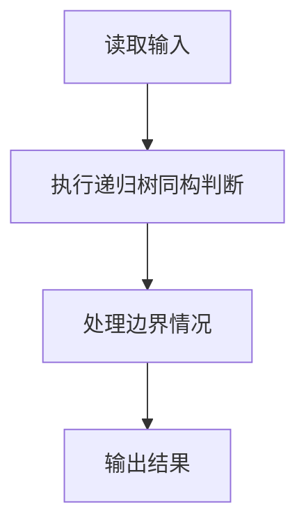
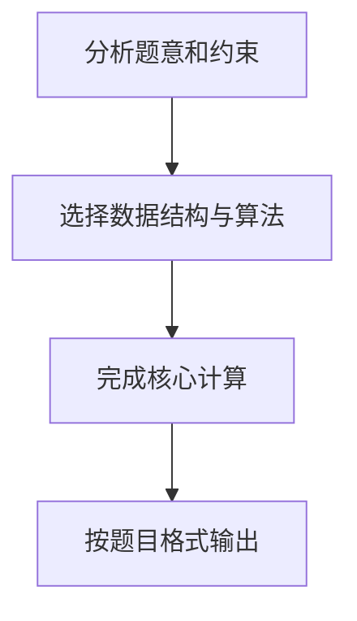

## 7-3 树的同构

- **分值：** 25分

## 题目描述

给定两棵树  T_1 和 T_2。如果 T_1 可以通过若干次左右孩子互换就变成 T_2，则我们称两棵树是“同构”的。例如图1给出的两棵树就是同构的，因为我们把其中一棵树的结点A、B、G的左右孩子互换后，就得到另外一棵树。而图2就不是同构的。

| 图1 | 图2 |
| :--: | :--: |
|  |  |

现给定两棵树，请你判断它们是否是同构的。

## 输入格式

输入给出2棵二叉树的信息。对于每棵树，首先在一行中给出一个非负整数 n (\le 10)，即该树的结点数（此时假设结点从 0 到 n -1 编号）；随后 n 行，第 i 行对应编号第 i 个结点，给出该结点中存储的 1 个英文大写字母、其左孩子结点的编号、右孩子结点的编号。如果孩子结点为空，则在相应位置上给出 “-”。给出的数据间用一个空格分隔。注意：题目保证每个结点中存储的字母是不同的。

## 输出格式

如果两棵树是同构的，输出“Yes”，否则输出“No”。

## 输入样例1（对应图1）
```text
8
A 1 2
B 3 4
C 5 -
D - -
E 6 -
G 7 -
F - -
H - -
8
G - 4
B 7 6
F - -
A 5 1
H - -
C 0 -
D - -
E 2 -
```

## 输出样例1
```text
Yes
```

## 输入样例2（对应图2）
```text
8
B 5 7
F - -
A 0 3
C 6 -
H - -
D - -
G 4 -
E 1 -
8
D 6 -
B 5 -
E - -
H - -
C 0 2
G - 3
F - -
A 1 4
```

## 输出样例2
```text
No
```

## 解题思路

本题采用递归树同构判断，围绕题目给出的数据结构和约束完成核心计算，并处理边界情况。

## 代码流程说明

1. 读取题目规定的输入数据。
2. 使用递归树同构判断完成主要处理。
3. 处理边界情况并整理结果。
4. 按指定格式输出结果。

## 代码实现


```python
"""由入度找到根，再递归比较结点值和左右子树结构。"""


def main():
    import sys
    tokens = sys.stdin.buffer.read().decode().split()
    if not tokens:
        return
    pos = 0

    def read_tree():
        nonlocal pos
        n = int(tokens[pos])
        pos += 1
        nodes = []
        has_parent = [False] * n
        for _ in range(n):
            value, left, right = tokens[pos:pos + 3]
            pos += 3
            left = -1 if left == "-" else int(left)
            right = -1 if right == "-" else int(right)
            nodes.append((value, left, right))
            if left != -1:
                has_parent[left] = True
            if right != -1:
                has_parent[right] = True
        root = next((i for i, flag in enumerate(has_parent) if not flag), -1)
        return nodes, root

    first, root_first = read_tree()
    second, root_second = read_tree()

    def same(index_a, index_b):
        if index_a == -1 or index_b == -1:
            return index_a == index_b
        value_a, left_a, right_a = first[index_a]
        value_b, left_b, right_b = second[index_b]
        return value_a == value_b and same(left_a, left_b) and same(right_a, right_b)

    print("Yes" if same(root_first, root_second) else "No")


if __name__ == "__main__":
    main()
```

## 代码流程图



## 解题流程图


