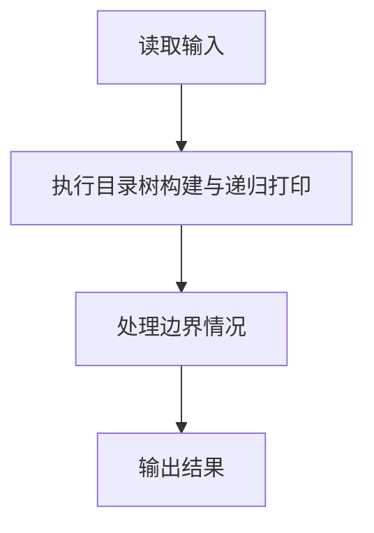
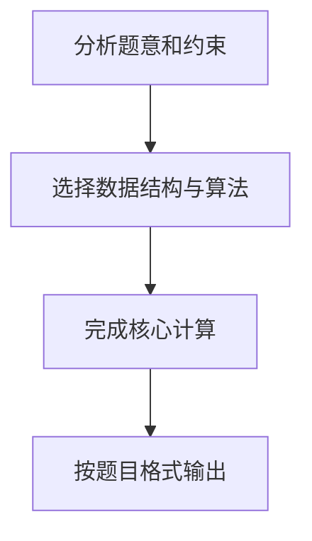

## 7-30 目录树

- **分值：** 30分

## 题目描述

在ZIP归档文件中，保留着所有压缩文件和目录的相对路径和名称。当使用WinZIP等GUI软件打开ZIP归档文件时，可以从这些信息中重建目录的树状结构。请编写程序实现目录的树状结构的重建工作。

## 输入格式

输入首先给出正整数N（≤ 10^4），表示ZIP归档文件中的文件和目录的数量。随后N行，每行有如下格式的文件或目录的相对路径和名称（每行不超过260个字符）：

- 路径和名称中的字符仅包括英文字母（区分大小写）；
- 符号“\”仅作为路径分隔符出现；
- 目录以符号“\”结束；
- 不存在重复的输入项目；
- 整个输入大小不超过2MB。

## 输出格式

假设所有的路径都相对于root目录。从root目录开始，在输出时每个目录首先输出自己的名字，然后以字典序输出所有子目录，然后以字典序输出所有文件。注意，在输出时，应根据目录的相对关系使用空格进行缩进，每级目录或文件比上一级多缩进2个空格。

## 输入样例
```text
7
b
c\
ab\cd
a\bc
ab\d
a\d\a
a\d\z\
```

## 输出样例
```text
root
  a
    d
      z
      a
    bc
  ab
    cd
    d
  c
  b
```

## 解题思路

本题采用目录树构建与递归打印，围绕题目给出的数据结构和约束完成核心计算，并处理边界情况。

## 代码流程说明

1. 读取题目规定的输入数据。
2. 使用目录树构建与递归打印完成主要处理。
3. 处理边界情况并整理结果。
4. 按指定格式输出结果。

## 代码实现


```perl
# 嵌套哈希构建目录树，递归时先输出排序后的目录，再输出排序后的文件。
use strict;
use warnings;

my $input = do { local $/; <STDIN> // '' };
my @lines = split /\n/, $input;
exit unless @lines;
my $n    = shift @lines;
my $root = { directories => {}, files => [] };
for my $path ( @lines[ 0 .. $n - 1 ] ) {
    my $is_directory = $path =~ /\\$/;
    my @parts        = grep { length } split /\\/, $path;
    next unless @parts;
    my $current = $root;
    for my $i ( 0 .. $#parts - 1 ) {
        $current->{directories}{ $parts[$i] } //=
          { directories => {}, files => [] };
        $current = $current->{directories}{ $parts[$i] };
    }
    if ($is_directory) {
        $current->{directories}{ $parts[-1] } //=
          { directories => {}, files => [] };
    }
    else { push @{ $current->{files} }, $parts[-1] }
}
my @output = ('root');

sub emit {
    my ( $node, $depth ) = @_;
    my $indent = '  ' x $depth;
    for my $name ( sort keys %{ $node->{directories} } ) {
        push @output, $indent . $name;
        emit( $node->{directories}{$name}, $depth + 1 );
    }
    push @output, map { $indent . $_ } sort @{ $node->{files} };
}
emit( $root, 1 );
print join( "\n", @output ), "\n";
```

## 代码流程图



## 解题流程图


