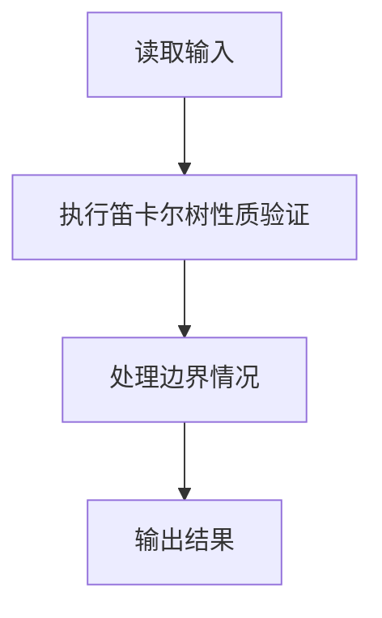
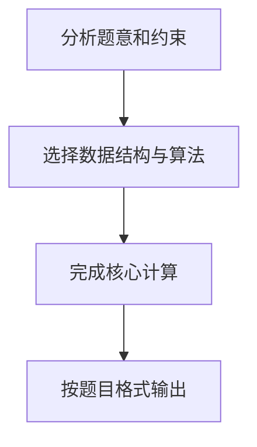

## 7-31 笛卡尔树

- **分值：** 25分

## 题目描述

笛卡尔树是一种特殊的二叉树，其结点包含两个关键字 k_1 和 k_2。首先笛卡尔树是关于 k_1 的二叉查找树，即结点左子树的所有 k_1 值都比该结点的 k_1 值小，右子树则大。其次所有结点的 k_2 关键字满足优先队列（不妨设为最小堆）的顺序要求，即该结点的 k_2 值比其子树中所有结点的 k_2 值小。给定一棵二叉树，请判断该树是否笛卡尔树。

## 输入格式

输入首先给出正整数 n（\le 1000），为树中结点的个数。随后 n 行，每行给出一个结点的信息，包括：结点的 k_1 值、k_2 值、左孩子结点编号、右孩子结点编号。设结点从0~(n-1)顺序编号。若某结点不存在孩子结点，则该位置给出 -1。

## 输出格式

输出`YES`如果该树是一棵笛卡尔树；否则输出`NO`。

## 输入样例1
```text
6
8 27 5 1
9 40 -1 -1
10 20 0 3
12 21 -1 4
15 22 -1 -1
5 35 -1 -1
```

## 输出样例1
```text
YES
```

## 输入样例2
```text
6
8 27 5 1
9 40 -1 -1
10 20 0 3
12 11 -1 4
15 22 -1 -1
50 35 -1 -1
```

## 输出样例2
```text
NO
```

## 解题思路

1. **找根结点**：用一个数组标记每个结点是否作为某个结点的孩子出现过，没有作为孩子出现过的结点即为根。如果根不唯一或不存在，则不是树。
2. **验证 BST 性质**：对 `k1` 进行中序遍历，遍历序列必须严格递增（注意题目要求左子树值严格小于根，右子树值严格大于根）。
3. **验证最小堆性质**：遍历每个结点，若其 `k2` 值大于左孩子或右孩子的 `k2` 值，则不满足最小堆性质。

三个条件全部满足才是笛卡尔树。

## 代码流程说明

1. 读取题目规定的输入数据。
2. 使用笛卡尔树性质验证完成主要处理。
3. 处理边界情况并整理结果。
4. 按指定格式输出结果。

## 代码实现


```python
"""唯一根 + k1 中序严格递增 + k2 最小堆三项检查共同定义笛卡尔树。"""


def main():
    import sys
    values = list(map(int, sys.stdin.buffer.read().split()))
    if not values:
        return
    n = values[0]
    if n == 0:
        print("YES")
        return
    nodes = []
    has_parent = [False] * n
    pos = 1
    for _ in range(n):
        k1, k2, left, right = values[pos:pos + 4]
        pos += 4
        nodes.append((k1, k2, left, right))
        if left != -1:
            has_parent[left] = True
        if right != -1:
            has_parent[right] = True
    roots = [i for i, used in enumerate(has_parent) if not used]
    if len(roots) != 1:
        print("NO")
        return

    inorder = []
    visited = set()

    def visit(node):
        if node == -1 or node in visited:
            return
        visited.add(node)
        visit(nodes[node][2])
        inorder.append(nodes[node][0])
        visit(nodes[node][3])

    visit(roots[0])
    valid = len(visited) == n and all(a < b for a, b in zip(inorder, inorder[1:]))
    for _, key, left, right in nodes:
        for child in (left, right):
            if child != -1 and key > nodes[child][1]:
                valid = False
    print("YES" if valid else "NO")


if __name__ == "__main__":
    main()
```

## 代码流程图



## 解题流程图


