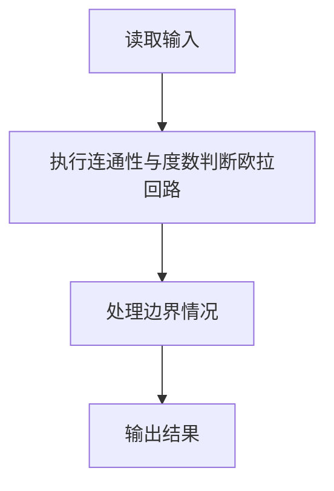
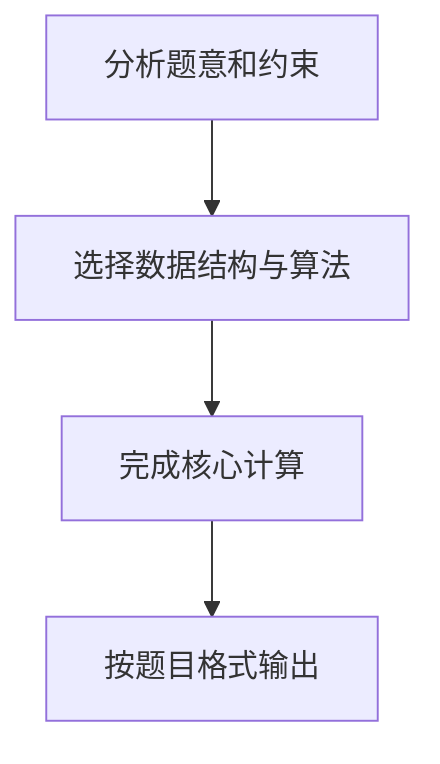

## 7-32 哥尼斯堡的“七桥问题”

- **分值：** 25分

## 题目描述

哥尼斯堡是位于普累格河上的一座城市，它包含两个岛屿及连接它们的七座桥，如下图所示。


可否走过这样的七座桥，而且每桥只走过一次？瑞士数学家欧拉(Leonhard Euler，1707—1783)最终解决了这个问题，并由此创立了拓扑学。

这个问题如今可以描述为判断欧拉回路是否存在的问题。欧拉回路是指不令笔离开纸面，可画过图中每条边仅一次，且可以回到起点的一条回路。现给定一个无向图，问是否存在欧拉回路？

## 输入格式

输入第一行给出两个正整数，分别是节点数 n （1\le n\le 1000）和边数 m；随后的 m 行对应 m 条边，每行给出一对正整数，分别是该条边直接连通的两个节点的编号（节点从1到 n 编号）。

## 输出格式

若欧拉回路存在则输出 1，否则输出 0。

## 输入样例1
```text
6 10
1 2
2 3
3 1
4 5
5 6
6 4
1 4
1 6
3 4
3 6
```

## 输出样例1
```text
1
```

## 输入样例2
```text
5 8
1 2
1 3
2 3
2 4
2 5
5 3
5 4
3 4
```

## 输出样例2
```text
0
```

## 解题思路

本题采用连通性与度数判断欧拉回路，围绕题目给出的数据结构和约束完成核心计算，并处理边界情况。

## 代码流程说明

1. 读取题目规定的输入数据。
2. 使用连通性与度数判断欧拉回路完成主要处理。
3. 处理边界情况并整理结果。
4. 按指定格式输出结果。

## 代码实现


```python
"""欧拉回路要求非孤立顶点连通且所有顶点度数为偶数；并查集完成连通性检查。"""


def main():
    import sys
    values = list(map(int, sys.stdin.buffer.read().split()))
    if not values:
        return
    n, m = values[:2]
    parent = list(range(n + 1))
    degree = [0] * (n + 1)

    def find(x):
        while parent[x] != x:
            parent[x] = parent[parent[x]]
            x = parent[x]
        return x

    def union(a, b):
        a, b = find(a), find(b)
        if a != b:
            parent[b] = a

    pos = 2
    for _ in range(m):
        u, v = values[pos:pos + 2]
        pos += 2
        degree[u] += 1
        degree[v] += 1
        union(u, v)

    active = [i for i in range(1, n + 1) if degree[i]]
    connected = not active or len({find(i) for i in active}) == 1
    print(1 if connected and all(value % 2 == 0 for value in degree[1:]) else 0)


if __name__ == "__main__":
    main()
```

## 代码流程图



## 解题流程图


