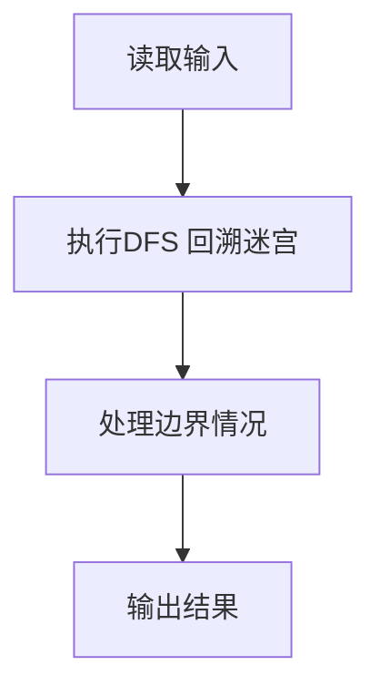
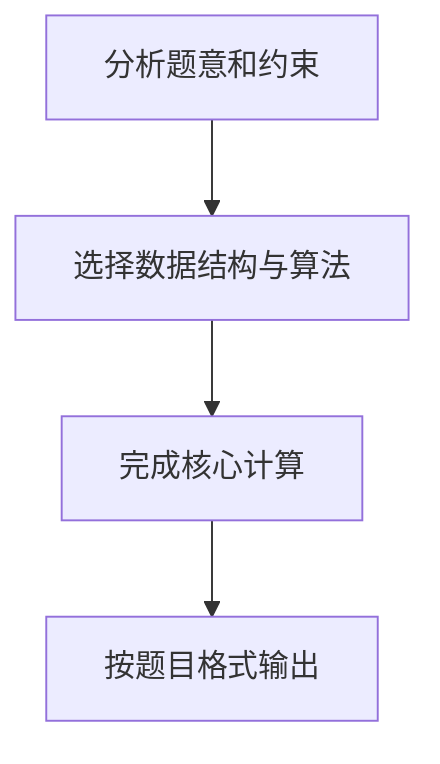

## 7-33 地下迷宫探索

- **分值：** 30分

## 题目描述

地道战是在抗日战争时期，在华北平原上抗日军民利用地道打击日本侵略者的作战方式。地道网是房连房、街连街、村连村的地下工事，如下图所示。


我们在回顾前辈们艰苦卓绝的战争生活的同时，真心钦佩他们的聪明才智。在现在和平发展的年代，对多数人来说，探索地下通道或许只是一种娱乐或者益智的游戏。本实验案例以探索地下通道迷宫作为内容。

假设有一个地下通道迷宫，它的通道都是直的，而通道所有交叉点（包括通道的端点）上都有一盏灯和一个开关。请问你如何从某个起点开始在迷宫中点亮所有的灯并回到起点？


## 输入格式

输入第一行给出三个正整数，分别表示地下迷宫的节点数N（1<N≤ 1000，表示通道所有交叉点和端点）、边数M（≤ 3000，表示通道数）和探索起始节点编号S（节点从1到N编号）。随后的M行对应M条边（通道），每行给出一对正整数，分别是该条边直接连通的两个节点的编号。

## 输出格式

若可以点亮所有节点的灯，则输出从S开始并以S结束的包含所有节点的序列，序列中相邻的节点一定有边（通道）；否则虽然不能点亮所有节点的灯，但还是输出点亮部分灯的节点序列，最后输出0，此时表示迷宫不是连通图。

由于深度优先遍历的节点序列是不唯一的，为了使得输出具有唯一的结果，我们约定以节点小编号优先的次序访问（点灯）。在点亮所有可以点亮的灯后，以原路返回的方式回到起点。

## 输入样例1
```text
6 8 1
1 2
2 3
3 4
4 5
5 6
6 4
3 6
1 5
```

## 输出样例1
```text
1 2 3 4 5 6 5 4 3 2 1
```

## 输入样例2
```text
6 6 6
1 2
1 3
2 3
5 4
6 5
6 4
```

## 输出样例2
```text
6 4 5 4 6 0
```

## 解题思路

本题采用DFS 回溯迷宫，围绕题目给出的数据结构和约束完成核心计算，并处理边界情况。

## 代码流程说明

1. 读取题目规定的输入数据。
2. 使用DFS 回溯迷宫完成主要处理。
3. 处理边界情况并整理结果。
4. 按指定格式输出结果。

## 代码实现


```perl
# 邻接表升序排列后 DFS；进入和回溯都记录结点，形成完整探索路径。
use strict;
use warnings;

my $input = do { local $/; <STDIN> // '' };
my @data  = grep { length } split /\s+/, $input;
exit unless @data;
my ( $n, $m, $start ) = @data[ 0 .. 2 ];
my @graph = map { [] } 0 .. $n;
my $pos   = 3;
for ( 1 .. $m ) {
    my ( $u, $v ) = @data[ $pos, $pos + 1 ];
    $pos += 2;
    push @{ $graph[$u] }, $v;
    push @{ $graph[$v] }, $u;
}
$_ = [ sort { $a <=> $b } @{$_} ] for @graph;
my @visited = (0) x ( $n + 1 );
my @path;

sub dfs {
    my ($node) = @_;
    $visited[$node] = 1;
    push @path, $node;
    for my $next ( @{ $graph[$node] } ) {
        unless ( $visited[$next] ) { dfs($next); push @path, $node }
    }
}
dfs($start);
push @path, 0 if grep { !$_ } @visited[ 1 .. $n ];
print join( ' ', @path ), "\n";
```

## 代码流程图



## 解题流程图


