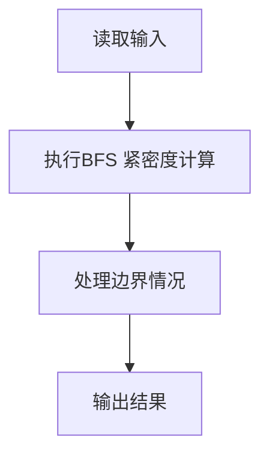
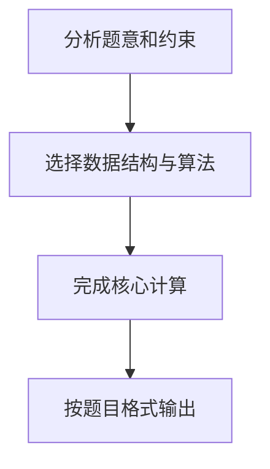

## 7-36 社交网络图中结点的“重要性”计算

- **分值：** 30分

## 题目描述

在社交网络中，个人或单位（结点）之间通过某些关系（边）联系起来。他们受到这些关系的影响，这种影响可以理解为网络中相互连接的结点之间蔓延的一种相互作用，可以增强也可以减弱。而结点根据其所处的位置不同，其在网络中体现的重要性也不尽相同。

“紧密度中心性”是用来衡量一个结点到达其它结点的“快慢”的指标，即一个有较高中心性的结点比有较低中心性的结点能够更快地（平均意义下）到达网络中的其它结点，因而在该网络的传播过程中有更重要的价值。在有 n 个结点的网络中，结点 v_i 的“紧密度中心性” Cc(v_i) 数学上定义为 v_i 到其余所有结点 v_j (j\ne i) 的最短距离 d(v_i, v_j) 的平均值的倒数：


对于非连通图，所有结点的紧密度中心性都是 0。

给定一个无权的无向图以及其中的一组结点，计算这组结点中每个结点的紧密度中心性。

## 输入格式

输入第一行给出两个正整数 n 和 m，其中 n（\le 10^3）是图中结点个数，顺便假设结点从 1 到 n 编号；m（\le 10^4）是边的条数。随后的 m 行中，每行给出一条边的信息，即该边连接的两个结点编号，中间用空格分隔。最后一行给出需要计算紧密度中心性的这组结点的个数 k（\le 100）以及 k 个结点编号，用空格分隔。

## 输出格式

按照 `Cc(i)=x.xx` 的格式输出 k 个给定结点的紧密度中心性，每个输出占一行，结果保留到小数点后 2 位。

## 输入样例
```text
9 14
1 2
1 3
1 4
2 3
3 4
4 5
4 6
5 6
5 7
5 8
6 7
6 8
7 8
7 9
3 3 4 9
```

## 输出样例
```text
Cc(3)=0.47
Cc(4)=0.62
Cc(9)=0.35
```

## 解题思路

本题采用BFS 紧密度计算，围绕题目给出的数据结构和约束完成核心计算，并处理边界情况。

## 代码流程说明

1. 读取题目规定的输入数据。
2. 使用BFS 紧密度计算完成主要处理。
3. 处理边界情况并整理结果。
4. 按指定格式输出结果。

## 代码实现


```python
"""BFS 求距离总和，按 (n-1)/sum(distance) 计算紧密度中心性。"""


def main():
    import sys
    from collections import deque
    data = list(map(int, sys.stdin.buffer.read().split()))
    if not data:
        return
    n, m = data[:2]
    graph = [[] for _ in range(n + 1)]
    pos = 2
    for _ in range(m):
        u, v = data[pos:pos + 2]
        pos += 2
        graph[u].append(v)
        graph[v].append(u)
    query_count = data[pos]
    queries = data[pos + 1:pos + 1 + query_count]
    output = []
    for start in queries:
        distance = [-1] * (n + 1)
        distance[start] = 0
        queue = deque([start])
        while queue:
            node = queue.popleft()
            for neighbor in graph[node]:
                if distance[neighbor] == -1:
                    distance[neighbor] = distance[node] + 1
                    queue.append(neighbor)
        centrality = 0 if -1 in distance[1:] else (n - 1) / sum(distance[1:])
        output.append(f"Cc({start})={centrality:.2f}")
    print("\n".join(output))


if __name__ == "__main__":
    main()
```

## 代码流程图



## 解题流程图


