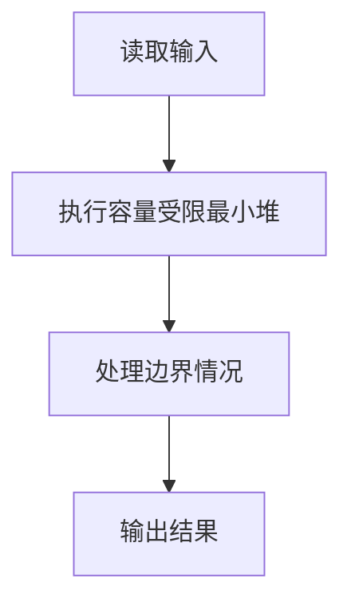
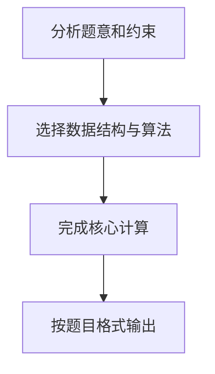

## 7-38 寻找大富翁

- **分值：** 25分

## 题目描述

胡润研究院的调查显示，截至2017年底，中国个人资产超过1亿元的高净值人群达15万人。假设给出N个人的个人资产值，请快速找出资产排前M位的大富翁。

## 输入格式

输入首先给出两个正整数N（\le 10^6）和M（\le 10），其中N为总人数，M为需要找出的大富翁数；接下来一行给出N个人的个人资产值，以百万元为单位，为不超过长整型范围的整数。数字间以空格分隔。

## 输出格式

在一行内按非递增顺序输出资产排前M位的大富翁的个人资产值。数字间以空格分隔，但结尾不得有多余空格。

## 输入样例
```text
8 3
8 12 7 3 20 9 5 18
```

## 输出样例
```text
20 18 12
```

## 解题思路

本题采用容量受限最小堆，围绕题目给出的数据结构和约束完成核心计算，并处理边界情况。

## 代码流程说明

1. 读取题目规定的输入数据。
2. 使用容量受限最小堆完成主要处理。
3. 处理边界情况并整理结果。
4. 按指定格式输出结果。

## 代码实现


```python
"""大小为 M 的最小堆保存当前 Top-M，整体复杂度 O(N log M)。"""


def main():
    import heapq
    import sys
    values = list(map(int, sys.stdin.buffer.read().split()))
    if not values:
        return
    n, m = values[:2]
    top = []
    for value in values[2:2 + n]:
        if len(top) < m:
            heapq.heappush(top, value)
        elif value > top[0]:
            heapq.heapreplace(top, value)
    print(" ".join(map(str, sorted(top, reverse=True))))


if __name__ == "__main__":
    main()
```

## 代码流程图



## 解题流程图


