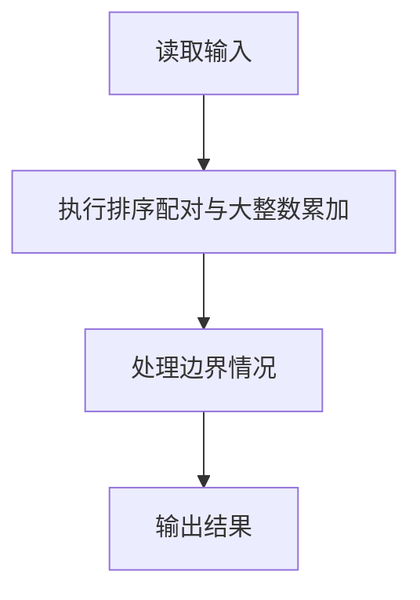
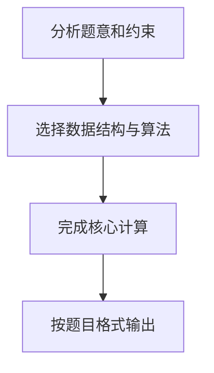

## 7-39 魔法优惠券

- **分值：** 25分

## 题目描述

在火星上有个魔法商店，提供魔法优惠券。每个优惠劵上印有一个整数面值K，表示若你在购买某商品时使用这张优惠劵，可以得到K倍该商品价值的回报！该商店还免费赠送一些有价值的商品，但是如果你在领取免费赠品的时候使用面值为正的优惠劵，则必须倒贴给商店K倍该商品价值的金额…… 但是不要紧，还有面值为负的优惠劵可以用！（真是神奇的火星）

例如，给定一组优惠劵，面值分别为1、2、4、-1；对应一组商品，价值为火星币M7、6、-2、-3，其中负的价值表示该商品是免费赠品。我们可以将优惠劵3用在商品1上，得到M28的回报；优惠劵2用在商品2上，得到M12的回报；优惠劵4用在商品4上，得到M3的回报。但是如果一不小心把优惠劵3用在商品4上，你必须倒贴给商店M12。同样，当你一不小心把优惠劵4用在商品1上，你必须倒贴给商店M7。

规定每张优惠券和每件商品都只能最多被使用一次，求你可以得到的最大回报。

## 输入格式

输入有两行。第一行首先给出优惠劵的个数N，随后给出N个优惠劵的整数面值。第二行首先给出商品的个数M，随后给出M个商品的整数价值。N和M在[1, 10^6]之间，所有的数据大小不超过2^{30}，数字间以空格分隔。

## 输出格式

输出可以得到的最大回报。

## 输入样例
```text
4 1 2 4 -1
4 7 6 -2 -3
```

## 输出样例
```text
43
```

## 解题思路

本题采用排序配对与大整数累加，围绕题目给出的数据结构和约束完成核心计算，并处理边界情况。

## 代码流程说明

1. 读取题目规定的输入数据。
2. 使用排序配对与大整数累加完成主要处理。
3. 处理边界情况并整理结果。
4. 按指定格式输出结果。

## 代码实现


```perl
# 正正、负负配对才产生正收益；排序后从两端贪心配对。
use strict;
use warnings;

my $input  = do { local $/; <STDIN> // '' };
my @values = grep { length } split /\s+/, $input;
exit unless @values;
my $pos          = 0;
my $coupon_count = $values[ $pos++ ];
my @coupons = sort { $a <=> $b } @values[ $pos .. $pos + $coupon_count - 1 ];
$pos += $coupon_count;
my $product_count = $values[ $pos++ ];
my @products = sort { $a <=> $b } @values[ $pos .. $pos + $product_count - 1 ];
my $answer   = 0;

while ( @coupons && @products && $coupons[-1] > 0 && $products[-1] > 0 ) {
    $answer += pop(@coupons) * pop(@products);
}
while ( @coupons && @products && $coupons[0] < 0 && $products[0] < 0 ) {
    $answer += shift(@coupons) * shift(@products);
}
print "$answer\n";
```

## 代码流程图



## 解题流程图


