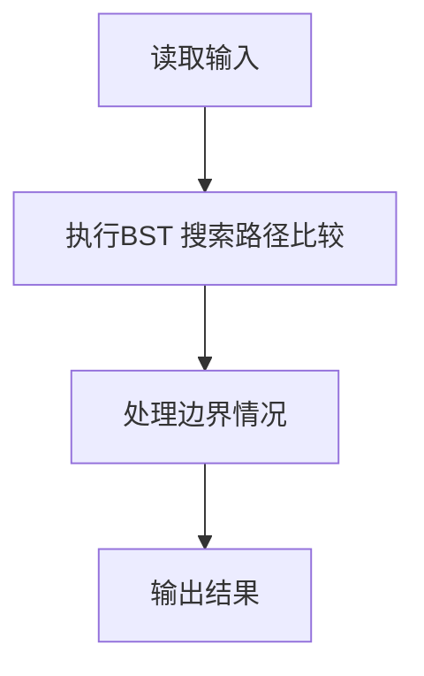
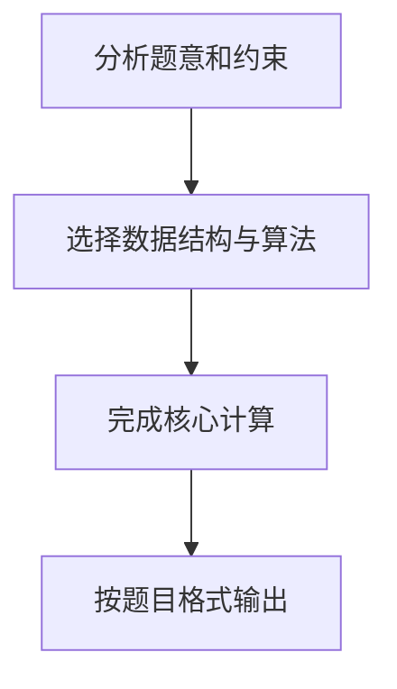

## 7-4 是否同一棵二叉搜索树

- **分值：** 25分

## 题目描述

给定一个插入序列就可以唯一确定一棵二叉搜索树。然而，一棵给定的二叉搜索树却可以由多种不同的插入序列得到。例如分别按照序列{2, 1, 3}和{2, 3, 1}插入初始为空的二叉搜索树，都得到一样的结果。于是对于输入的各种插入序列，你需要判断它们是否能生成一样的二叉搜索树。

## 输入格式

输入包含若干组测试数据。每组数据的第1行给出两个正整数N (\le 10)和L，分别是每个序列插入元素的个数和需要检查的序列个数。第2行给出N个以空格分隔的正整数，作为初始插入序列。随后L行，每行给出N个插入的元素，属于L个需要检查的序列。

简单起见，我们保证每个插入序列都是1到N的一个排列。当读到N为0时，标志输入结束，这组数据不要处理。

## 输出格式

对每一组需要检查的序列，如果其生成的二叉搜索树跟对应的初始序列生成的一样，输出“Yes”，否则输出“No”。

## 输入样例
```text
4 2
3 1 4 2
3 4 1 2
3 2 4 1
2 1
2 1
1 2
0
```

## 输出样例
```text
Yes
No
No
```

**鸣谢青岛大学周强老师补充测试数据！**

## 解题思路

本题采用BST 搜索路径比较，围绕题目给出的数据结构和约束完成核心计算，并处理边界情况。

## 代码流程说明

1. 读取题目规定的输入数据。
2. 使用BST 搜索路径比较完成主要处理。
3. 处理边界情况并整理结果。
4. 按指定格式输出结果。

## 代码实现


```python
"""按插入顺序建立 BST，再比较两棵树的结构和值。"""


class Node:
    def __init__(self, value):
        self.value = value
        self.left = self.right = None


def insert(root, value):
    if root is None:
        return Node(value)
    if value < root.value:
        root.left = insert(root.left, value)
    else:
        root.right = insert(root.right, value)
    return root


def same(first, second):
    if first is None or second is None:
        return first is second
    return (first.value == second.value
            and same(first.left, second.left)
            and same(first.right, second.right))


def main():
    import sys
    values = list(map(int, sys.stdin.buffer.read().split()))
    pos = 0
    answers = []
    while pos < len(values):
        if values[pos] == 0:
            break
        n, groups = values[pos:pos + 2]
        pos += 2
        if n == 0:
            break
        root = None
        for value in values[pos:pos + n]:
            root = insert(root, value)
        pos += n
        for _ in range(groups):
            candidate = None
            for value in values[pos:pos + n]:
                candidate = insert(candidate, value)
            pos += n
            answers.append("Yes" if same(root, candidate) else "No")
    print("\n".join(answers))


if __name__ == "__main__":
    main()
```

## 代码流程图



## 解题流程图


