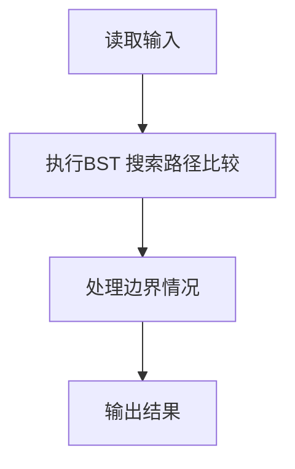
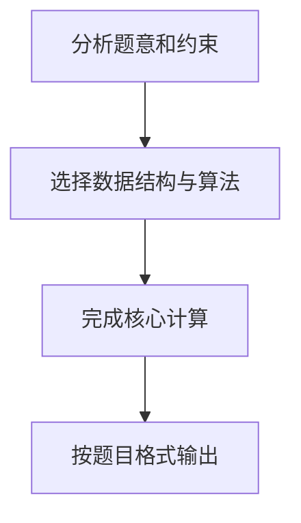

## 7-4 是否同一棵二叉搜索树

- **分值：** 25分

## 题目描述

给定一个插入序列就可以唯一确定一棵二叉搜索树。然而，一棵给定的二叉搜索树却可以由多种不同的插入序列得到。例如分别按照序列{2, 1, 3}和{2, 3, 1}插入初始为空的二叉搜索树，都得到一样的结果。于是对于输入的各种插入序列，你需要判断它们是否能生成一样的二叉搜索树。

## 输入格式

输入包含若干组测试数据。每组数据的第1行给出两个正整数N (≤ 10)和L，分别是每个序列插入元素的个数和需要检查的序列个数。第2行给出N个以空格分隔的正整数，作为初始插入序列。随后L行，每行给出N个插入的元素，属于L个需要检查的序列。

简单起见，我们保证每个插入序列都是1到N的一个排列。当读到N为0时，标志输入结束，这组数据不要处理。

## 输出格式

对每一组需要检查的序列，如果其生成的二叉搜索树跟对应的初始序列生成的一样，输出“Yes”，否则输出“No”。

## 输入样例
```text
4 2
3 1 4 2
3 4 1 2
3 2 4 1
2 1
2 1
1 2
0
```

## 输出样例
```text
Yes
No
No
```

**鸣谢青岛大学周强老师补充测试数据！**

## 解题思路

本题采用BST 搜索路径比较，围绕题目给出的数据结构和约束完成核心计算，并处理边界情况。

## 代码流程说明

1. 读取题目规定的输入数据。
2. 使用BST 搜索路径比较完成主要处理。
3. 处理边界情况并整理结果。
4. 按指定格式输出结果。

## 代码实现


```perl
# 按插入序列建立 BST，再递归比较两棵树的结构和值。
use strict;
use warnings;

my $input  = do { local $/; <STDIN> // '' };
my @values = grep { length } split /\s+/, $input;
my $pos    = 0;
my @answers;

sub insert {
    my ( $root, $value ) = @_;
    return { value => $value, left => undef, right => undef } unless $root;
    if ( $value < $root->{value} ) {
        $root->{left} = insert( $root->{left}, $value );
    }
    else {
        $root->{right} = insert( $root->{right}, $value );
    }
    return $root;
}

sub same {
    my ( $a, $b ) = @_;
    return 1 if !$a && !$b;
    return 0 if !$a || !$b;
    return
         $a->{value} == $b->{value}
      && same( $a->{left},  $b->{left} )
      && same( $a->{right}, $b->{right} );
}

while ( $pos < @values && $values[$pos] ) {
    my ( $n, $groups ) = @values[ $pos, $pos + 1 ];
    $pos += 2;
    my $root;
    for ( 1 .. $n ) { $root = insert( $root, $values[ $pos++ ] ) }
    for ( 1 .. $groups ) {
        my $candidate;
        for ( 1 .. $n ) { $candidate = insert( $candidate, $values[ $pos++ ] ) }
        push @answers, same( $root, $candidate ) ? 'Yes' : 'No';
    }
}
print join( "\n", @answers ), "\n" if @answers;
```

## 代码流程图



## 解题流程图


