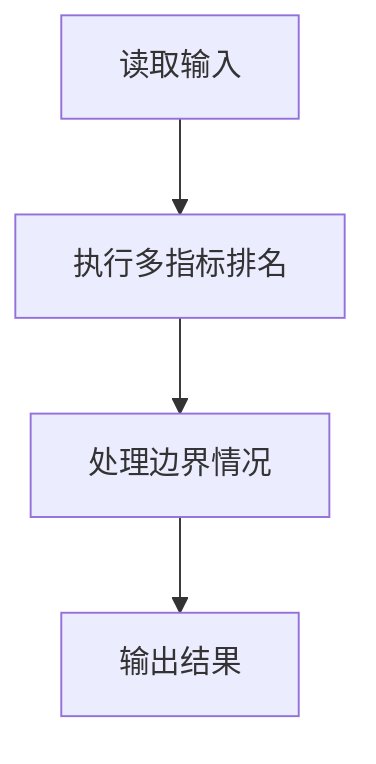
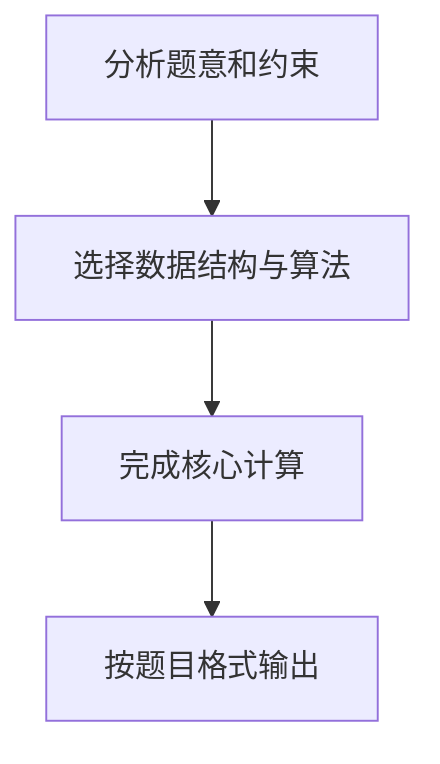

## 7-40 奥运排行榜

- **分值：** 25分

## 题目描述

每年奥运会各大媒体都会公布一个排行榜，但是细心的读者发现，不同国家的排行榜略有不同。比如中国金牌总数列第一的时候，中国媒体就公布“金牌榜”；而美国的奖牌总数第一，于是美国媒体就公布“奖牌榜”。如果人口少的国家公布一个“国民人均奖牌榜”，说不定非洲的国家会成为榜魁…… 现在就请你写一个程序，对每个前来咨询的国家按照对其最有利的方式计算它的排名。

## 输入格式

输入的第一行给出两个正整数N和M（≤ 224，因为世界上共有224个国家和地区），分别是参与排名的国家和地区的总个数、以及前来咨询的国家的个数。为简单起见，我们把国家从0 ~ N-1编号。之后有N行输入，第i行给出编号为i-1的国家的金牌数、奖牌数、国民人口数（单位为百万），数字均为[0,1000]区间内的整数，用空格分隔。最后面一行给出M个前来咨询的国家的编号，用空格分隔。

## 输出格式

在一行里顺序输出前来咨询的国家的`排名:计算方式编号`。其排名按照对该国家最有利的方式计算；计算方式编号为：金牌榜=1，奖牌榜=2，国民人均金牌榜=3，国民人均奖牌榜=4。输出间以空格分隔，输出结尾不能有多余空格。

若某国在不同排名方式下有相同名次，则输出编号最小的计算方式。

## 输入样例
```text
4 4
51 100 1000
36 110 300
6 14 32
5 18 40
0 1 2 3
```

## 输出样例
```text
1:1 1:2 1:3 1:4
```

## 解题思路

本题采用多指标排名，围绕题目给出的数据结构和约束完成核心计算，并处理边界情况。

## 代码流程说明

1. 读取题目规定的输入数据。
2. 使用多指标排名完成主要处理。
3. 处理边界情况并整理结果。
4. 按指定格式输出结果。

## 代码实现


```perl
# 分别建立四套排名，查询时选取名次最小的排名方式。
use strict;
use warnings;

my $input  = do { local $/; <STDIN> // '' };
my @values = grep { length } split /\s+/, $input;
exit unless @values;
my ( $n, $query_count ) = @values[ 0, 1 ];
my @countries;
my $pos = 2;
for ( 1 .. $n ) { push @countries, [ @values[ $pos .. $pos + 2 ] ]; $pos += 3 }
my @ranks = map { [ (0) x $n ] } 0 .. 3;

for my $method ( 0 .. 3 ) {
    my @order = sort {
        my $x =
            $method == 0 ? $countries[$a][0]
          : $method == 1 ? $countries[$a][1]
          : $method == 2 ? $countries[$a][0] / $countries[$a][2]
          :                $countries[$a][1] / $countries[$a][2];
        my $y =
            $method == 0 ? $countries[$b][0]
          : $method == 1 ? $countries[$b][1]
          : $method == 2 ? $countries[$b][0] / $countries[$b][2]
          :                $countries[$b][1] / $countries[$b][2];
        $y <=> $x
    } 0 .. $n - 1;
    my ( $previous, $current_rank );
    for my $rank ( 1 .. @order ) {
        my $i = $order[ $rank - 1 ];
        my $score =
            $method == 0 ? $countries[$i][0]
          : $method == 1 ? $countries[$i][1]
          : $method == 2 ? $countries[$i][0] / $countries[$i][2]
          :                $countries[$i][1] / $countries[$i][2];
        $current_rank = $rank if !defined($previous) || $score != $previous;
        $previous     = $score;
        $ranks[$method][$i] = $current_rank;
    }
}
my @output;
for ( 1 .. $query_count ) {
    my $country = $values[ $pos++ ];
    my ( $best_rank, $best_method ) = ( 10**18, 0 );
    for my $method ( 0 .. 3 ) {
        if ( $ranks[$method][$country] < $best_rank ) {
            ( $best_rank, $best_method ) =
              ( $ranks[$method][$country], $method + 1 );
        }
    }
    push @output, "$best_rank:$best_method";
}
print join( ' ', @output ), "\n";
```

## 代码流程图



## 解题流程图


