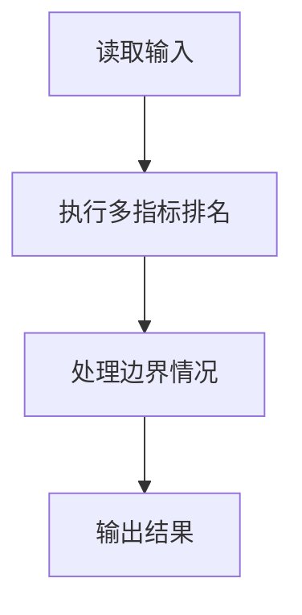
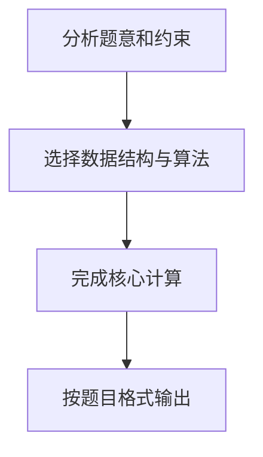

## 7-40 奥运排行榜

- **分值：** 25分

## 题目描述

每年奥运会各大媒体都会公布一个排行榜，但是细心的读者发现，不同国家的排行榜略有不同。比如中国金牌总数列第一的时候，中国媒体就公布“金牌榜”；而美国的奖牌总数第一，于是美国媒体就公布“奖牌榜”。如果人口少的国家公布一个“国民人均奖牌榜”，说不定非洲的国家会成为榜魁…… 现在就请你写一个程序，对每个前来咨询的国家按照对其最有利的方式计算它的排名。

## 输入格式

输入的第一行给出两个正整数N和M（\le 224，因为世界上共有224个国家和地区），分别是参与排名的国家和地区的总个数、以及前来咨询的国家的个数。为简单起见，我们把国家从0 ~ N-1编号。之后有N行输入，第i行给出编号为i-1的国家的金牌数、奖牌数、国民人口数（单位为百万），数字均为[0,1000]区间内的整数，用空格分隔。最后面一行给出M个前来咨询的国家的编号，用空格分隔。

## 输出格式

在一行里顺序输出前来咨询的国家的`排名:计算方式编号`。其排名按照对该国家最有利的方式计算；计算方式编号为：金牌榜=1，奖牌榜=2，国民人均金牌榜=3，国民人均奖牌榜=4。输出间以空格分隔，输出结尾不能有多余空格。

若某国在不同排名方式下有相同名次，则输出编号最小的计算方式。

## 输入样例
```text
4 4
51 100 1000
36 110 300
6 14 32
5 18 40
0 1 2 3
```

## 输出样例
```text
1:1 1:2 1:3 1:4
```

## 解题思路

本题采用多指标排名，围绕题目给出的数据结构和约束完成核心计算，并处理边界情况。

## 代码流程说明

1. 读取题目规定的输入数据。
2. 使用多指标排名完成主要处理。
3. 处理边界情况并整理结果。
4. 按指定格式输出结果。

## 代码实现


```python
"""分别建立四套排名，查询时取最有利（名次最小）的排名方式。"""


def main():
    import sys
    values = list(map(int, sys.stdin.buffer.read().split()))
    if not values:
        return
    n, query_count = values[:2]
    countries = []
    pos = 2
    for _ in range(n):
        countries.append(tuple(values[pos:pos + 3]))
        pos += 3

    ranks = [[0] * n for _ in range(4)]
    for method in range(4):
        if method == 0:
            score = lambda index: countries[index][0]
        elif method == 1:
            score = lambda index: countries[index][1]
        elif method == 2:
            score = lambda index: countries[index][0] / countries[index][2]
        else:
            score = lambda index: countries[index][1] / countries[index][2]
        order = sorted(range(n), key=score, reverse=True)
        previous_score = None
        for rank, index in enumerate(order, 1):
            current_score = score(index)
            if current_score != previous_score:
                current_rank = rank
                previous_score = current_score
            ranks[method][index] = current_rank

    answer = []
    for country in values[pos:pos + query_count]:
        best_rank, best_method = min(
            (ranks[method][country], method + 1) for method in range(4)
        )
        answer.append(f"{best_rank}:{best_method}")
    print(" ".join(answer))


if __name__ == "__main__":
    main()
```

## 代码流程图



## 解题流程图


