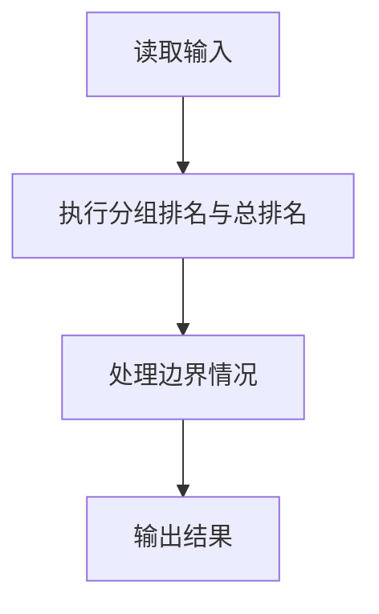
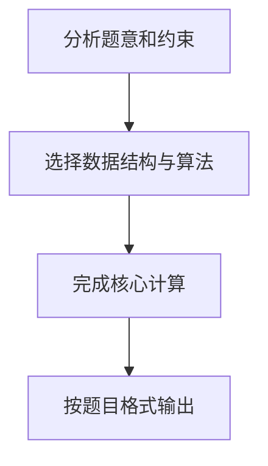

## 7-41 PAT排名汇总

- **分值：** 25分

## 题目描述

计算机程序设计能力考试（Programming Ability Test，简称PAT）旨在通过统一组织的在线考试及自动评测方法客观地评判考生的算法设计与程序设计实现能力，科学的评价计算机程序设计人才，为企业选拔人才提供参考标准（网址http://www.patest.cn）。

每次考试会在若干个不同的考点同时举行，每个考点用局域网，产生本考点的成绩。考试结束后，各个考点的成绩将即刻汇总成一张总的排名表。

现在就请你写一个程序自动归并各个考点的成绩并生成总排名表。

## 输入格式

输入的第一行给出一个正整数N（\le100），代表考点总数。随后给出N个考点的成绩，格式为：首先一行给出正整数K（\le300），代表该考点的考生总数；随后K行，每行给出1个考生的信息，包括考号（由13位整数字组成）和得分（为[0,100]区间内的整数），中间用空格分隔。

## 输出格式

首先在第一行里输出考生总数。随后输出汇总的排名表，每个考生的信息占一行，顺序为：考号、最终排名、考点编号、在该考点的排名。其中考点按输入给出的顺序从1到N编号。考生的输出须按最终排名的非递减顺序输出，获得相同分数的考生应有相同名次，并按考号的递增顺序输出。

## 输入样例
```text
2
5
1234567890001 95
1234567890005 100
1234567890033 95
1234567890002 77
1234567890004 85
4
1234567890013 95
1234567890011 25
1234567890014 100
1234567890042 95
```

## 输出样例
```text
9
1234567890005 1 1 1
1234567890014 1 2 1
1234567890001 3 1 2
1234567890013 3 2 2
1234567890033 3 1 2
1234567890042 3 2 2
1234567890004 7 1 4
1234567890002 8 1 5
1234567890011 9 2 4
```

**鸣谢厦门大学郑旭玲老师补充数据！**

## 解题思路

本题采用分组排名与总排名，围绕题目给出的数据结构和约束完成核心计算，并处理边界情况。

## 代码流程说明

1. 读取题目规定的输入数据。
2. 使用分组排名与总排名完成主要处理。
3. 处理边界情况并整理结果。
4. 按指定格式输出结果。

## 代码实现


```python
"""考点内先排名，再合并所有考生做总排名；相同成绩共享名次。"""


def main():
    import sys
    lines = sys.stdin.buffer.read().decode().splitlines()
    if not lines:
        return
    site_count = int(lines[0])
    all_students = []
    pos = 1
    for site in range(1, site_count + 1):
        count = int(lines[pos])
        pos += 1
        students = []
        for _ in range(count):
            number, score = lines[pos].split()
            pos += 1
            students.append((number, int(score)))
        students.sort(key=lambda item: (-item[1], item[0]))
        local_rank = 0
        for rank, (number, score) in enumerate(students, 1):
            if rank == 1 or score != students[rank - 2][1]:
                local_rank = rank
            all_students.append((number, score, site, local_rank))

    all_students.sort(key=lambda item: (-item[1], item[0]))
    output = [str(len(all_students))]
    global_rank = 0
    for rank, (number, score, site, local_rank) in enumerate(all_students, 1):
        if rank == 1 or score != all_students[rank - 2][1]:
            global_rank = rank
        output.append(f"{number} {global_rank} {site} {local_rank}")
    print("\n".join(output))


if __name__ == "__main__":
    main()
```

## 代码流程图



## 解题流程图


