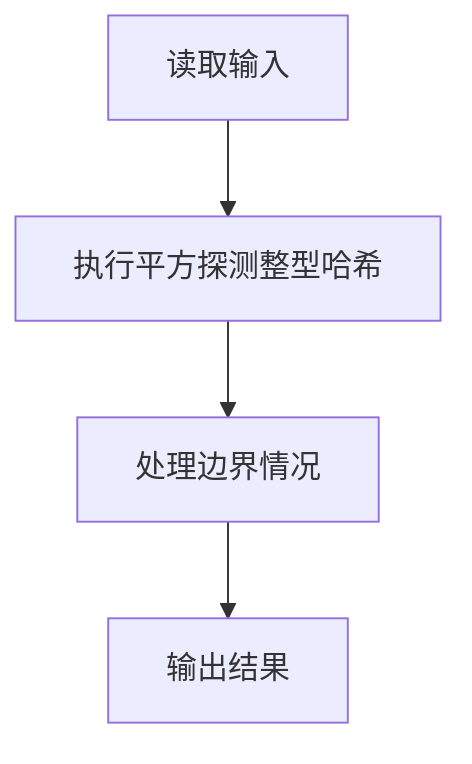
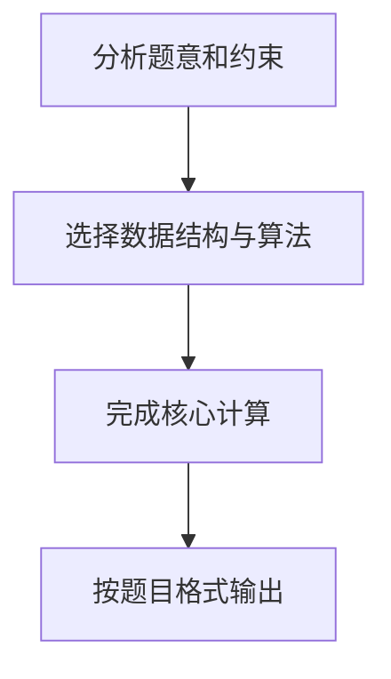

## 7-42 整型关键字的散列映射

- **分值：** 25分

## 题目描述

给定一系列整型关键字和素数 p，用除留余数法定义的散列函数 H(key) = key \% p 将关键字映射到长度为 p 的散列表中。用线性探测法解决冲突。

## 输入格式

输入第一行首先给出两个正整数 n（\le 1000）和 p（\ge n 的最小素数），分别为待插入的关键字总数、以及散列表的长度。第二行给出 n 个整型关键字。数字间以空格分隔。

## 输出格式

在一行内输出每个整型关键字在散列表中的位置。数字间以空格分隔，但行末尾不得有多余空格。

## 输入样例
```text
4 5
24 15 61 88
```

## 输出样例
```text
4 0 1 3
```

## 解题思路

本题采用平方探测整型哈希，围绕题目给出的数据结构和约束完成核心计算，并处理边界情况。

## 代码流程说明

1. 读取题目规定的输入数据。
2. 使用平方探测整型哈希完成主要处理。
3. 处理边界情况并整理结果。
4. 按指定格式输出结果。

## 代码实现


```python
"""除留余数法确定初址，线性探测解决冲突，并保留重复关键字的原位置。"""


def main():
    import sys
    values = list(map(int, sys.stdin.buffer.read().split()))
    if not values:
        return
    n, size = values[:2]
    table = [None] * size
    result = []
    for key in values[2:2 + n]:
        index = key % size
        while table[index] is not None and table[index] != key:
            index = (index + 1) % size
        table[index] = key
        result.append(str(index))
    print(" ".join(result))


if __name__ == "__main__":
    main()
```

## 代码流程图



## 解题流程图


