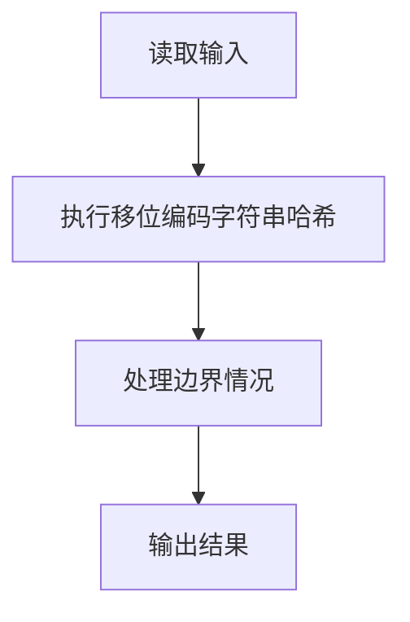
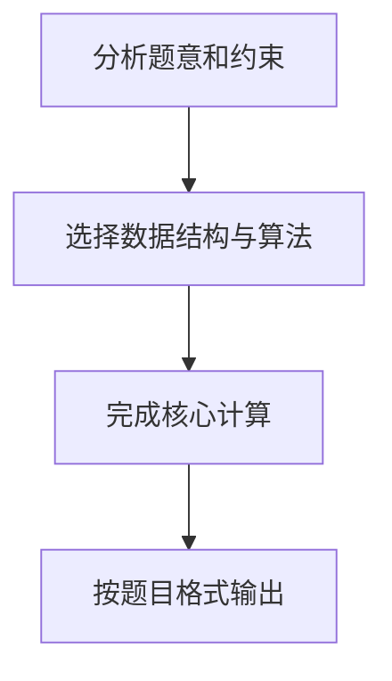

## 7-43 字符串关键字的散列映射

- **分值：** 25分

## 题目描述

给定一系列由大写英文字母组成的字符串关键字和素数P，用移位法定义的散列函数H(Key)将关键字Key中的最后3个字符映射为整数，每个字符占5位；再用除留余数法将整数映射到长度为P的散列表中。例如将字符串`AZDEG`插入长度为1009的散列表中，我们首先将26个大写英文字母顺序映射到整数0~25；再通过移位将其映射为3\times 32^2 + 4 \times 32 + 6 = 3206；然后根据表长得到3206 \% 1009 = 179，即是该字符串的散列映射位置。

发生冲突时请用平方探测法解决。

## 输入格式

输入第一行首先给出两个正整数N（\le 500）和P（\ge 2N的最小素数），分别为待插入的关键字总数、以及散列表的长度。第二行给出N个字符串关键字，每个长度不超过8位，其间以空格分隔。

## 输出格式

在一行内输出每个字符串关键字在散列表中的位置。数字间以空格分隔，但行末尾不得有多余空格。

## 输入样例1
```text
4 11
HELLO ANNK ZOE LOLI
```

## 输出样例1
```text
3 10 4 0
```

## 输入样例2
```text
6 11
LLO ANNA NNK ZOJ INNK AAA
```

## 输出样例2
```text
3 0 10 9 6 1
```

## 样例说明

以样例 1 中的 HELLO 为例：
- HELLO 长度为 5，取最后 3 个字符 LLO
- L=11, L=11, O=14
- 移位计算：11×32² + 11×32 + 14 = 11630
- 除留余数：11630 % 11 = 3，即位置为 3

## 解题思路

本题采用移位编码字符串哈希，围绕题目给出的数据结构和约束完成核心计算，并处理边界情况。

## 代码流程说明

1. 读取题目规定的输入数据。
2. 使用移位编码字符串哈希完成主要处理。
3. 处理边界情况并整理结果。
4. 按指定格式输出结果。

## 代码实现


```perl
# 取最后三个字母按 32 进制计算初址，再按双向平方探测寻找位置。
use strict;
use warnings;

my $input  = do { local $/; <STDIN> // '' };
my @tokens = grep { length } split /\s+/, $input;
exit unless @tokens;
my ( $count, $size ) = @tokens[ 0, 1 ];
my @table;
my @result;

sub hash_key {
    my ($key) = @_;
    my $value = 0;
    for my $char ( split //, substr( $key, -3 ) ) {
        $value = $value * 32 + ord($char) - ord('A');
    }
    return $value;
}
for my $key ( @tokens[ 2 .. $count + 1 ] ) {
    my $home  = hash_key($key) % $size;
    my $index = $home;
    my $step  = 0;
    while ( defined $table[$index] && $table[$index] ne $key ) {
        ++$step;
        my $distance = int( ( $step + 1 ) / 2 );
        my $offset   = $distance * $distance;
        $index =
            ( $step % 2 )
          ? ( $home + $offset ) % $size
          : ( $home - $offset ) % $size;
        $index += $size if $index < 0;
    }
    $table[$index] = $key;
    push @result, $index;
}
print join( ' ', @result ), "\n";
```

## 代码流程图



## 解题流程图


