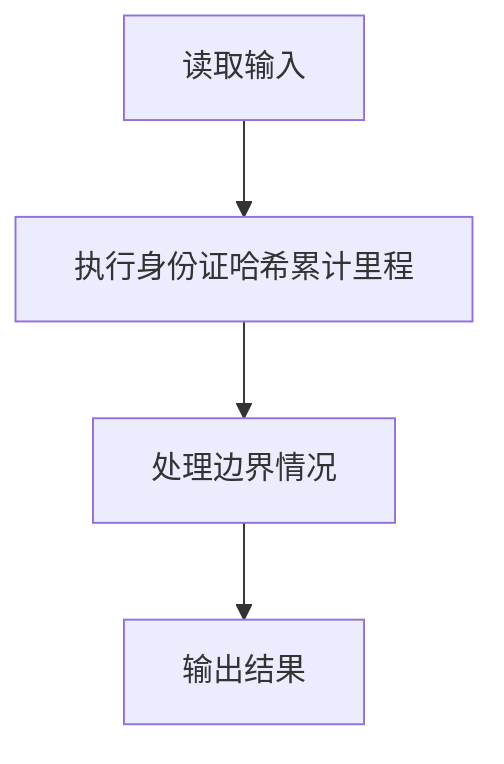
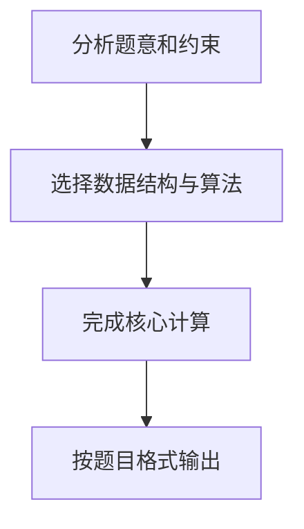

## 7-45 航空公司VIP客户查询

- **分值：** 25分

## 题目描述

不少航空公司都会提供优惠的会员服务，当某顾客飞行里程累积达到一定数量后，可以使用里程积分直接兑换奖励机票或奖励升舱等服务。现给定某航空公司全体会员的飞行记录，要求实现根据身份证号码快速查询会员里程积分的功能。

## 输入格式

输入首先给出两个正整数N（\le 10^5）和K（\le 500）。其中K是最低里程，即为照顾乘坐短程航班的会员,航空公司还会将航程低于K公里的航班也按K公里累积。随后N行，每行给出一条飞行记录。飞行记录的输入格式为：`18位身份证号码（空格）飞行里程`。其中身份证号码由17位数字加最后一位校验码组成，校验码的取值范围为0~9和x共11个符号；飞行里程单位为公里，是(0, 15 000]区间内的整数。然后给出一个正整数M（\le 10^5），随后给出M行查询人的身份证号码。

## 输出格式

对每个查询人，给出其当前的里程累积值。如果该人不是会员，则输出`No Info`。每个查询结果占一行。

## 输入样例
```text
4 500
330106199010080419 499
110108198403100012 15000
120104195510156021 800
330106199010080419 1
4
120104195510156021
110108198403100012
330106199010080419
33010619901008041x
```

## 输出样例
```text
800
15000
1000
No Info
```

## 样例说明

- 会员 `330106199010080419` 的两次飞行记录：
  - 第一次飞行 499 公里，低于 K=500，按 500 公里累积
  - 第二次飞行 1 公里，低于 K=500，按 500 公里累积
  - 总计：500 + 500 = 1000 公里
- 会员 `110108198403100012` 飞行 15000 公里，直接累积 15000 公里
- 会员 `120104195510156021` 飞行 800 公里，高于 K=500，直接累积 800 公里
- 查询 `33010619901008041x` 不存在于会员记录中，输出 `No Info`

## 解题思路

本题采用身份证哈希累计里程，围绕题目给出的数据结构和约束完成核心计算，并处理边界情况。

## 代码流程说明

1. 读取题目规定的输入数据。
2. 使用身份证哈希累计里程完成主要处理。
3. 处理边界情况并整理结果。
4. 按指定格式输出结果。

## 代码实现


```python
"""字典累计身份证号里程，单次飞行低于 K 公里时按 K 计入。"""


def main():
    import sys
    lines = sys.stdin.buffer.read().decode().splitlines()
    if not lines:
        return
    record_count, minimum = map(int, lines[0].split())
    miles = {}
    for line in lines[1:1 + record_count]:
        identity, distance = line.split()
        miles[identity] = miles.get(identity, 0) + max(minimum, int(distance))
    query_count = int(lines[1 + record_count])
    output = [
        str(miles.get(identity, "No Info"))
        for identity in lines[2 + record_count:2 + record_count + query_count]
    ]
    print("\n".join(output))


if __name__ == "__main__":
    main()
```

## 代码流程图



## 解题流程图


