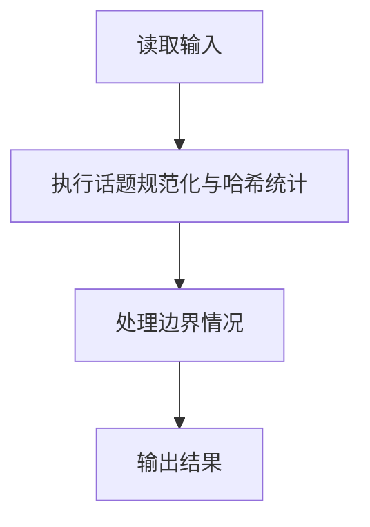
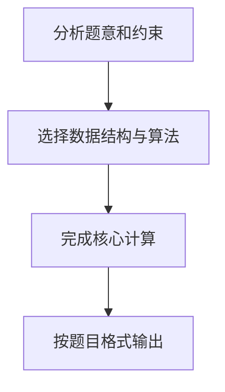

## 7-46 新浪微博热门话题

- **分值：** 30分

## 题目描述

新浪微博可以在发言中嵌入“话题”，即将发言中的话题文字写在一对“#”之间，就可以生成话题链接，点击链接可以看到有多少人在跟自己讨论相同或者相似的话题。新浪微博还会随时更新热门话题列表，并将最热门的话题放在醒目的位置推荐大家关注。

本题目要求实现一个简化的热门话题推荐功能，从大量英文（因为中文分词处理比较麻烦）微博中解析出话题，找出被最多条微博提到的话题。

## 输入格式

输入说明：输入首先给出一个正整数 n（\le 10^5），随后 n 行，每行给出一条英文微博，其长度不超过 140 个字符。任何包含在一对最近的“#”中的内容均被认为是一个话题，如果长度超过40个字符，则只保留前40个字符。输入保证“#”成对出现。

## 输出格式

第一行输出被最多条微博提到的话题，第二行输出其被提到的微博条数。如果这样的话题不唯一，则输出按字母序最小的话题，并在第三行输出 `And k more ...`，其中 `k` 是另外几条热门话题的条数。输入保证至少存在一条话题。

注意：两条话题被认为是相同的，如果在去掉所有非英文字母和数字的符号、并忽略大小写区别后，它们是相同的字符串；同时它们有完全相同的分词。输出时除首字母大写外，只保留小写英文字母和数字，并用一个空格分隔原文中的单词。

## 输入样例
```text
4
This is a #test of topic#.
Another #Test of topic.#
This is a #Hot# #Hot# topic
Another #hot!# #Hot# topic
```

## 输出样例
```text
Hot
2
And 1 more ...
```

## 注意事项

两条话题被认为是相同的，如果在去掉所有非英文字母和数字的符号、并忽略大小写区别后，它们是相同的字符串；同时它们有完全相同的分词。输出时除首字母大写外，只保留小写英文字母和数字，并用一个空格分隔原文中的单词。

## 解题思路

本题采用话题规范化与哈希统计，围绕题目给出的数据结构和约束完成核心计算，并处理边界情况。

## 代码流程说明

1. 读取题目规定的输入数据。
2. 使用话题规范化与哈希统计完成主要处理。
3. 处理边界情况并整理结果。
4. 按指定格式输出结果。

## 代码实现


```python
"""主题先截断 40 字符，再规范化；同一微博内重复主题只计一次。"""


def normalize(topic):
    import re
    return " ".join(re.findall(r"[A-Za-z0-9]+", topic.lower()))


def main():
    import re
    import sys
    from collections import Counter
    lines = sys.stdin.read().splitlines()
    if not lines:
        return
    count = Counter()
    for line in lines[1:1 + int(lines[0])]:
        topics = {normalize(raw[:40]) for raw in re.findall(r"#(.*?)#", line)}
        for topic in topics:
            if topic:
                count[topic] += 1
    maximum = max(count.values())
    winners = sorted(topic for topic, value in count.items() if value == maximum)
    output = [winners[0][0].upper() + winners[0][1:], str(maximum)]
    if len(winners) > 1:
        output.append(f"And {len(winners) - 1} more ...")
    print("\n".join(output))


if __name__ == "__main__":
    main()
```

## 代码流程图



## 解题流程图


