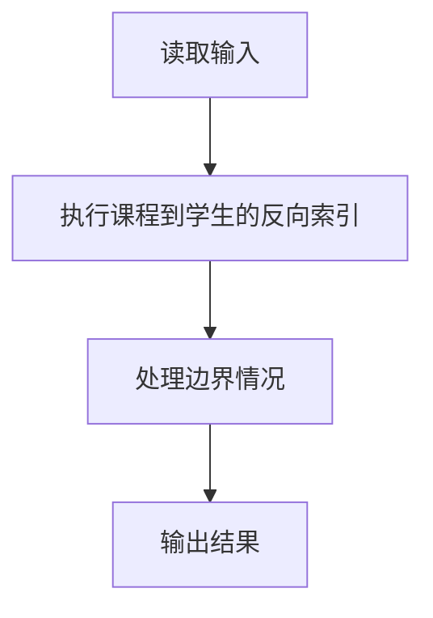
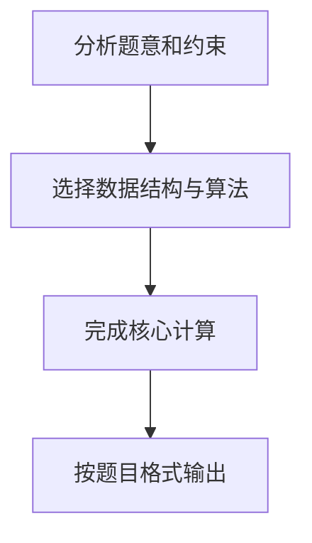

## 7-47 打印选课学生名单

- **分值：** 25分

## 题目描述

假设全校有最多40000名学生和最多2500门课程。现给出每个学生的选课清单，要求输出每门课的选课学生名单。

## 输入格式

输入的第一行是两个正整数：N（\le40000），为全校学生总数；K（\le2500），为总课程数。此后N行，每行包括一个学生姓名（3个大写英文字母+1位数字）、一个正整数C（\le20）代表该生所选的课程门数、随后是C个课程编号。简单起见，课程从1到K编号。

## 输出格式

顺序输出课程1到K的选课学生名单。格式为：对每一门课，首先在一行中输出课程编号和选课学生总数（之间用空格分隔），之后在第二行按字典序输出学生名单，每个学生名字占一行。

## 输入样例
```text
10 5
ZOE1 2 4 5
ANN0 3 5 2 1
BOB5 5 3 4 2 1 5
JOE4 1 2
JAY9 4 1 2 5 4
FRA8 3 4 2 5
DON2 2 4 5
AMY7 1 5
KAT3 3 5 4 2
LOR6 4 2 4 1 5
```

## 输出样例
```text
1 4
ANN0
BOB5
JAY9
LOR6
2 7
ANN0
BOB5
FRA8
JAY9
JOE4
KAT3
LOR6
3 1
BOB5
4 7
BOB5
DON2
FRA8
JAY9
KAT3
LOR6
ZOE1
5 9
AMY7
ANN0
BOB5
DON2
FRA8
JAY9
KAT3
LOR6
ZOE1
```

## 样例说明

以课程 1 为例：
- 选课学生：ANN0、BOB5、JAY9、LOR6（共 4 人）
- 按字典序排序后输出

## 解题思路

本题采用课程到学生的反向索引，围绕题目给出的数据结构和约束完成核心计算，并处理边界情况。

## 代码流程说明

1. 读取题目规定的输入数据。
2. 使用课程到学生的反向索引完成主要处理。
3. 处理边界情况并整理结果。
4. 按指定格式输出结果。

## 代码实现


```python
"""课程号映射到学生列表，最后对每门课的名单排序输出。"""


def main():
    import sys
    tokens = sys.stdin.buffer.read().decode().split()
    if not tokens:
        return
    student_count, course_count = map(int, tokens[:2])
    courses = [[] for _ in range(course_count + 1)]
    pos = 2
    for _ in range(student_count):
        name = tokens[pos]
        selected_count = int(tokens[pos + 1])
        pos += 2
        for course in map(int, tokens[pos:pos + selected_count]):
            courses[course].append(name)
        pos += selected_count

    output = []
    for course in range(1, course_count + 1):
        students = sorted(courses[course])
        output.append(f"{course} {len(students)}")
        output.extend(students)
    print("\n".join(output))


if __name__ == "__main__":
    main()
```

## 代码流程图



## 解题流程图



以课程 5 为例：
- 选课学生：AMY7、ANN0、BOB5、DON2、FRA8、JAY9、KAT3、LOR6、ZOE1（共 9 人）
- 按字典序排序后输出
