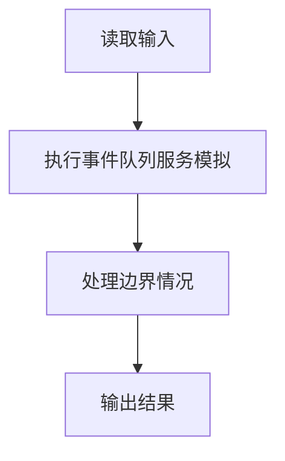
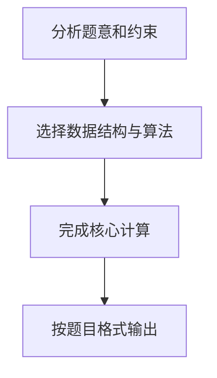

## 7-48 银行排队问题之单窗口“夹塞”版

- **分值：** 30分

## 题目描述

排队“夹塞”是引起大家强烈不满的行为，但是这种现象时常存在。在银行的单窗口排队问题中，假设银行只有1个窗口提供服务，所有顾客按到达时间排成一条长龙。当窗口空闲时，下一位顾客即去该窗口处理事务。此时如果已知第i位顾客与排在后面的第j位顾客是好朋友，并且愿意替朋友办理事务的话，那么第i位顾客的事务处理时间就是自己的事务加朋友的事务所耗时间的总和。在这种情况下，顾客的等待时间就可能被影响。假设所有人到达银行时，若没有空窗口，都会请求排在最前面的朋友帮忙（包括正在窗口接受服务的朋友）；当有不止一位朋友请求某位顾客帮忙时，该顾客会根据自己朋友请求的顺序来依次处理事务。试编写程序模拟这种现象，并计算顾客的平均等待时间。

## 输入格式

输入的第一行是两个整数：1\le N \le 10000，为顾客总数；0 \le M \le 100，为彼此不相交的朋友圈子个数。若M非0，则此后M行，每行先给出正整数2\le L \le 100，代表该圈子里朋友的总数，随后给出该朋友圈里的L位朋友的名字。名字由3个大写英文字母组成，名字间用1个空格分隔。最后N行给出N位顾客的姓名、到达时间T和事务处理时间P（以分钟为单位），之间用1个空格分隔。简单起见，这里假设顾客信息是按照到达时间先后顺序给出的（有并列时间的按照给出顺序排队），并且假设每个事务最多占用窗口服务60分钟（如果超过则按60分钟计算）。

## 输出格式

按顾客接受服务的顺序输出顾客名字，每个名字占1行。最后一行输出所有顾客的平均等待时间，保留到小数点后1位。

## 输入样例
```text
6 2
3 ANN BOB JOE
2 JIM ZOE
JIM 0 20
BOB 0 15
ANN 0 30
AMY 0 2
ZOE 1 61
JOE 3 10

```

## 输出样例
```text
JIM
ZOE
BOB
ANN
JOE
AMY
75.2

```

**鸣谢用户 陈君伟 补充数据！**

## 夹塞规则

当顾客到达银行时，若窗口非空闲，会触发以下规则：

1. **朋友帮忙请求**：顾客会请求排在队列最前面的朋友帮忙（包括正在窗口接受服务的朋友）
2. **顺序处理**：当有多位朋友请求某位顾客帮忙时，该顾客会根据朋友请求的顺序依次处理事务
3. **合并处理**：如果第 i 位顾客愿意替朋友 j 办理事务，那么顾客 i 的事务处理时间就是自己的事务加朋友 j 的事务所耗时间的总和

## 样例说明

## 朋友圈信息

- 朋友圈 1：ANN、BOB、JOE
- 朋友圈 2：JIM、ZOE

## 模拟过程

| 时间 | 事件 | 队列状态 | 窗口状态 |
|------|------|----------|----------|
| T=0 | JIM、BOB、ANN、AMY 到达 | [BOB, ANN, AMY] | JIM 开始服务（需 20 分钟） |
| T=1 | ZOE 到达，发现朋友 JIM 在窗口 | [BOB, ANN, AMY] | JIM 继续服务，ZOE 请求帮忙 |
| T=20 | JIM 服务结束，ZOE 夹塞开始服务（61→60 分钟） | [BOB, ANN, AMY] | ZOE 服务中（需 60 分钟） |
| T=3 | JOE 到达，发现朋友 BOB 在队列最前 | [BOB, ANN, AMY] | ZOE 继续服务，JOE 请求 BOB 帮忙 |
| T=80 | ZOE 服务结束 | [BOB, ANN, AMY] | BOB 开始服务（需 15 分钟） |
| T=95 | BOB 服务结束，JOE 夹塞开始服务（需 10 分钟） | [ANN, AMY] | JOE 服务中（需 10 分钟） |
| T=105 | JOE 服务结束 | [ANN, AMY] | ANN 开始服务（需 30 分钟） |
| T=135 | ANN 服务结束 | [AMY] | AMY 开始服务（需 2 分钟） |
| T=137 | AMY 服务结束 | [] | 窗口空闲 |

## 等待时间计算

| 顾客 | 到达时间 | 开始服务时间 | 等待时间 |
|------|----------|--------------|----------|
| JIM | 0 | 0 | 0 |
| ZOE | 1 | 20 | 19 |
| BOB | 0 | 80 | 80 |
| ANN | 0 | 105 | 105 |
| JOE | 3 | 95 | 92 |
| AMY | 0 | 135 | 135 |

平均等待时间 = (0 + 19 + 80 + 105 + 92 + 135) / 6 = 431 / 6 ≈ 75.2

## 朋友圈信息

- 朋友圈 1：ANN、BOB、JOE
- 朋友圈 2：JIM、ZOE

## 模拟过程

| 时间 | 事件 | 队列状态 | 窗口状态 |
|------|------|----------|----------|
| T=0 | JIM、BOB、ANN、AMY 到达 | [BOB, ANN, AMY] | JIM 开始服务（需 20 分钟） |
| T=1 | ZOE 到达，发现朋友 JIM 在窗口 | [BOB, ANN, AMY] | JIM 继续服务，ZOE 请求帮忙 |
| T=20 | JIM 服务结束，ZOE 夹塞开始服务（61→60 分钟） | [BOB, ANN, AMY] | ZOE 服务中（需 60 分钟） |
| T=3 | JOE 到达，发现朋友 BOB 在队列最前 | [BOB, ANN, AMY] | ZOE 继续服务，JOE 请求 BOB 帮忙 |
| T=80 | ZOE 服务结束 | [BOB, ANN, AMY] | BOB 开始服务（需 15 分钟） |
| T=95 | BOB 服务结束，JOE 夹塞开始服务（需 10 分钟） | [ANN, AMY] | JOE 服务中（需 10 分钟） |
| T=105 | JOE 服务结束 | [ANN, AMY] | ANN 开始服务（需 30 分钟） |
| T=135 | ANN 服务结束 | [AMY] | AMY 开始服务（需 2 分钟） |
| T=137 | AMY 服务结束 | [] | 窗口空闲 |

## 等待时间计算

| 顾客 | 到达时间 | 开始服务时间 | 等待时间 |
|------|----------|--------------|----------|
| JIM | 0 | 0 | 0 |
| ZOE | 1 | 20 | 19 |
| BOB | 0 | 80 | 80 |
| ANN | 0 | 105 | 105 |
| JOE | 3 | 95 | 92 |
| AMY | 0 | 135 | 135 |

平均等待时间 = (0 + 19 + 80 + 105 + 92 + 135) / 6 = 431 / 6 ≈ 75.2

## 解题思路

本题采用事件队列服务模拟，围绕题目给出的数据结构和约束完成核心计算，并处理边界情况。

## 代码流程说明

1. 读取题目规定的输入数据。
2. 使用事件队列服务模拟完成主要处理。
3. 处理边界情况并整理结果。
4. 按指定格式输出结果。

## 代码实现


```python
"""服务结束时优先选择已到达的同朋友圈顾客，否则选择全局最早未服务顾客。"""


def main():
    import sys
    from collections import defaultdict, deque
    lines = sys.stdin.read().splitlines()
    if not lines:
        return
    customer_count, group_count = map(int, lines[0].split())
    position = 1
    group_of = {}
    for group in range(group_count):
        members = lines[position].split()
        position += 1
        for name in members[1:]:
            group_of[name] = group

    customers = []
    for _ in range(customer_count):
        name, arrival, process = lines[position].split()
        position += 1
        customers.append((name, int(arrival), min(60, int(process))))

    members_by_group = defaultdict(deque)
    for index, (name, _, _) in enumerate(customers):
        if name in group_of:
            members_by_group[group_of[name]].append(index)

    served = [False] * customer_count
    served[0] = True
    next_normal = 0
    current = 0
    current_time = 0
    total_wait = 0
    order = []
    while True:
        name, arrival, process = customers[current]
        current_time = max(current_time, arrival)
        total_wait += current_time - arrival
        current_time += process
        order.append(name)

        group = group_of.get(name, -1)
        chosen = -1
        if group != -1:
            queue = members_by_group[group]
            while queue and served[queue[0]]:
                queue.popleft()
            if queue and customers[queue[0]][1] <= current_time:
                chosen = queue.popleft()
        if chosen == -1:
            while next_normal < customer_count and served[next_normal]:
                next_normal += 1
            if next_normal == customer_count:
                break
            chosen, next_normal = next_normal, next_normal + 1
        served[chosen] = True
        current = chosen

    print("\n".join(order))
    print(f"{total_wait / customer_count:.1f}")


if __name__ == "__main__":
    main()
```

## 代码流程图



## 解题流程图


