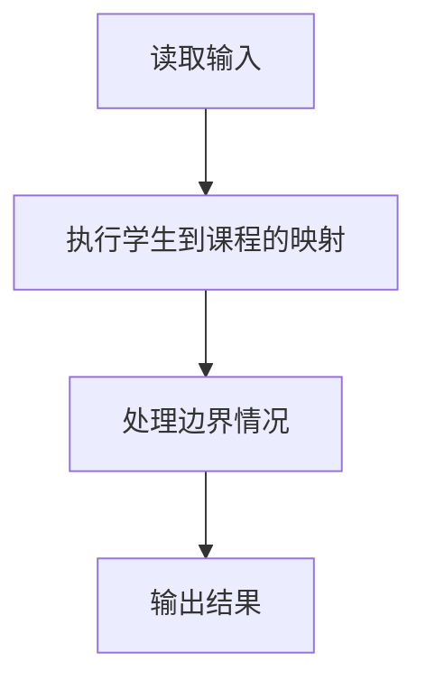
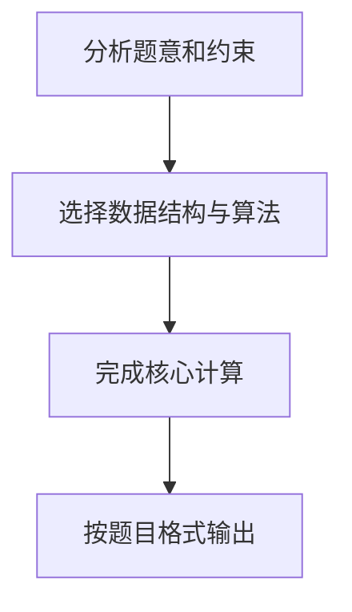

## 7-49 打印学生选课清单

- **分值：** 25分

## 题目描述

假设全校有最多40000名学生和最多2500门课程。现给出每门课的选课学生名单，要求输出每个前来查询的学生的选课清单。注意：每门课程的选课人数不可超过 200 人。

## 输入格式

输入的第一行是两个正整数：N（≤40000），为前来查询课表的学生总数；K（≤2500），为总课程数。此后顺序给出课程1到K的选课学生名单。格式为：对每一门课，首先在一行中输出课程编号（简单起见，课程从1到K编号）和选课学生总数（之间用空格分隔），之后在第二行给出学生名单，相邻两个学生名字用1个空格分隔。学生姓名由3个大写英文字母+1位数字组成。选课信息之后，在一行内给出了N个前来查询课表的学生的名字，相邻两个学生名字用1个空格分隔。

## 输出格式

对每位前来查询课表的学生，首先输出其名字，随后在同一行中输出一个正整数C，代表该生所选的课程门数，随后按递增顺序输出C个课程的编号。相邻数据用1个空格分隔，注意行末不能输出多余空格。

## 输入样例
```text
10 5
1 4
ANN0 BOB5 JAY9 LOR6
2 7
ANN0 BOB5 FRA8 JAY9 JOE4 KAT3 LOR6
3 1
BOB5
4 7
BOB5 DON2 FRA8 JAY9 KAT3 LOR6 ZOE1
5 9
AMY7 ANN0 BOB5 DON2 FRA8 JAY9 KAT3 LOR6 ZOE1
ZOE1 ANN0 BOB5 JOE4 JAY9 FRA8 DON2 AMY7 KAT3 LOR6
```

## 输出样例
```text
ZOE1 2 4 5
ANN0 3 1 2 5
BOB5 5 1 2 3 4 5
JOE4 1 2
JAY9 4 1 2 4 5
FRA8 3 2 4 5
DON2 2 4 5
AMY7 1 5
KAT3 3 2 4 5
LOR6 4 1 2 4 5
```

## 解题思路

本题采用学生到课程的映射，围绕题目给出的数据结构和约束完成核心计算，并处理边界情况。

## 代码流程说明

1. 读取题目规定的输入数据。
2. 使用学生到课程的映射完成主要处理。
3. 处理边界情况并整理结果。
4. 按指定格式输出结果。

## 代码实现


```perl
# 哈希按学生聚合课程，查询时对课程号排序并按题目格式输出。
use strict;
use warnings;

my $input  = do { local $/; <STDIN> // '' };
my @tokens = grep { length } split /\s+/, $input;
exit unless @tokens;
my ( $query_count, $course_count ) = @tokens[ 0, 1 ];
my %selected;
my $pos = 2;
for ( 1 .. $course_count ) {
    my ( $course, $count ) = @tokens[ $pos, $pos + 1 ];
    $pos += 2;
    push @{ $selected{$_} }, $course for @tokens[ $pos .. $pos + $count - 1 ];
    $pos += $count;
}
my @output;
for ( 1 .. $query_count ) {
    my $name    = $tokens[ $pos++ ];
    my @courses = sort { $a <=> $b } @{ $selected{$name} // [] };
    push @output, join( ' ', $name, scalar(@courses), @courses );
}
print join( "\n", @output ), "\n";
```

## 代码流程图



## 解题流程图


