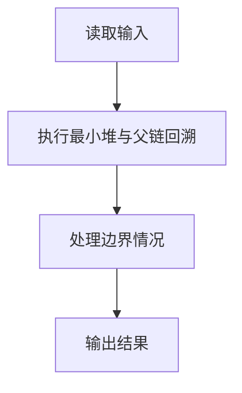
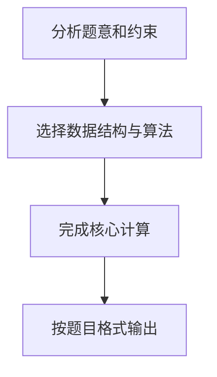

## 7-5 堆中的路径

- **分值：** 25分

## 题目描述

将一系列给定数字插入一个初始为空的最小堆 h。随后对任意给定的下标 i，打印从第 i 个结点到根结点的路径。

## 输入格式

每组测试第 1 行包含 2 个正整数 n 和 m (\le 10^3)，分别是插入元素的个数、以及需要打印的路径条数。下一行给出区间 [-10^4, 10^4] 内的 n 个要被插入一个初始为空的小顶堆的整数。最后一行给出 m 个下标。

## 输出格式

对输入中给出的每个下标 i，在一行中输出从第 i 个结点到根结点的路径上的数据。数字间以 1 个空格分隔，行末不得有多余空格。

## 输入样例
```text
5 3
46 23 26 24 10
5 4 3
```

## 输出样例
```text
24 23 10
46 23 10
26 10
```

## 解题思路

本题采用最小堆与父链回溯，围绕题目给出的数据结构和约束完成核心计算，并处理边界情况。

## 代码流程说明

1. 读取题目规定的输入数据。
2. 使用最小堆与父链回溯完成主要处理。
3. 处理边界情况并整理结果。
4. 按指定格式输出结果。

## 代码实现


```perl
# 最小堆插入时上浮；查询位置时不断取父结点下标 int(i / 2)。
use strict;
use warnings;

my $input  = do { local $/; <STDIN> // '' };
my @values = grep { length } split /\s+/, $input;
exit unless @values;
my ( $n, $m ) = @values[ 0, 1 ];
my @heap = (0);
my $pos  = 2;
for ( 1 .. $n ) {
    push @heap, $values[ $pos++ ];
    my $i = $#heap;
    while ( $i > 1 && $heap[$i] < $heap[ int( $i / 2 ) ] ) {
        @heap[ $i, int( $i / 2 ) ] = @heap[ int( $i / 2 ), $i ];
        $i = int( $i / 2 );
    }
}
my @output;
for ( 1 .. $m ) {
    my $i = $values[ $pos++ ];
    my @path;
    while ($i) { push @path, $heap[$i]; $i = int( $i / 2 ) }
    push @output, join( ' ', @path );
}
print join( "\n", @output ), "\n";
```

## 代码流程图



## 解题流程图


