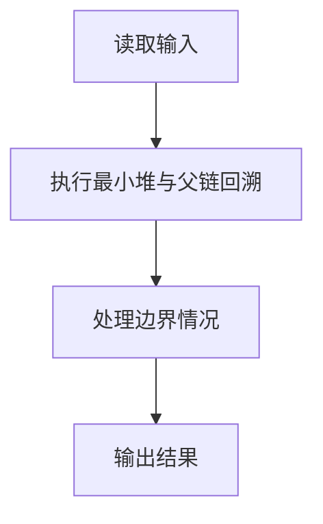
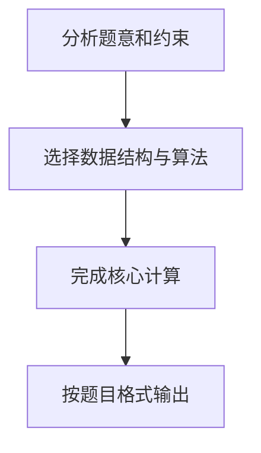

## 7-5 堆中的路径

- **分值：** 25分

## 题目描述

将一系列给定数字插入一个初始为空的最小堆 h。随后对任意给定的下标 i，打印从第 i 个结点到根结点的路径。

## 输入格式

每组测试第 1 行包含 2 个正整数 n 和 m (\le 10^3)，分别是插入元素的个数、以及需要打印的路径条数。下一行给出区间 [-10^4, 10^4] 内的 n 个要被插入一个初始为空的小顶堆的整数。最后一行给出 m 个下标。

## 输出格式

对输入中给出的每个下标 i，在一行中输出从第 i 个结点到根结点的路径上的数据。数字间以 1 个空格分隔，行末不得有多余空格。

## 输入样例
```text
5 3
46 23 26 24 10
5 4 3
```

## 输出样例
```text
24 23 10
46 23 10
26 10
```

## 解题思路

本题采用最小堆与父链回溯，围绕题目给出的数据结构和约束完成核心计算，并处理边界情况。

## 代码流程说明

1. 读取题目规定的输入数据。
2. 使用最小堆与父链回溯完成主要处理。
3. 处理边界情况并整理结果。
4. 按指定格式输出结果。

## 代码实现


```python
"""最小堆插入使用上浮；查询时反复取父下标 i // 2。"""


def main():
    import sys
    values = list(map(int, sys.stdin.buffer.read().split()))
    if not values:
        return
    n, m = values[:2]
    heap = [0]
    pos = 2
    for value in values[pos:pos + n]:
        pos += 1
        heap.append(value)
        index = len(heap) - 1
        while index > 1 and heap[index] < heap[index // 2]:
            heap[index], heap[index // 2] = heap[index // 2], heap[index]
            index //= 2
    paths = []
    for index in values[pos:pos + m]:
        path = []
        while index:
            path.append(str(heap[index]))
            index //= 2
        paths.append(" ".join(path))
    print("\n".join(paths))


if __name__ == "__main__":
    main()
```

## 代码流程图



## 解题流程图


